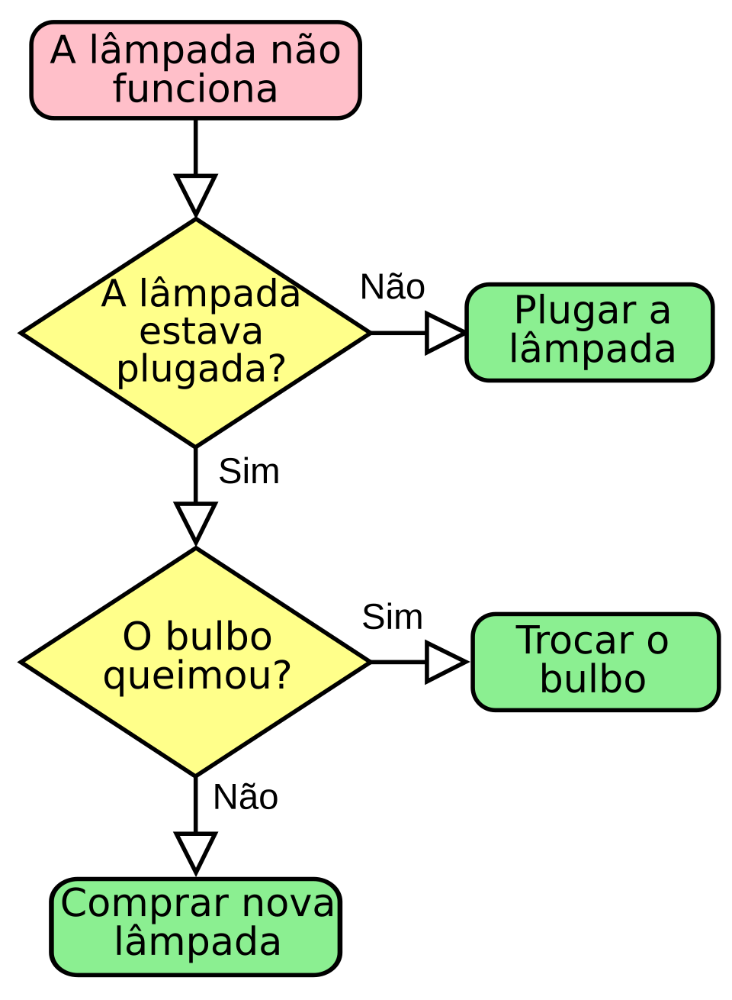
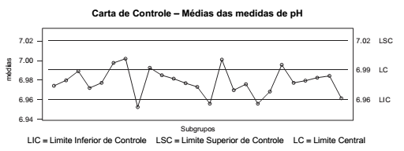
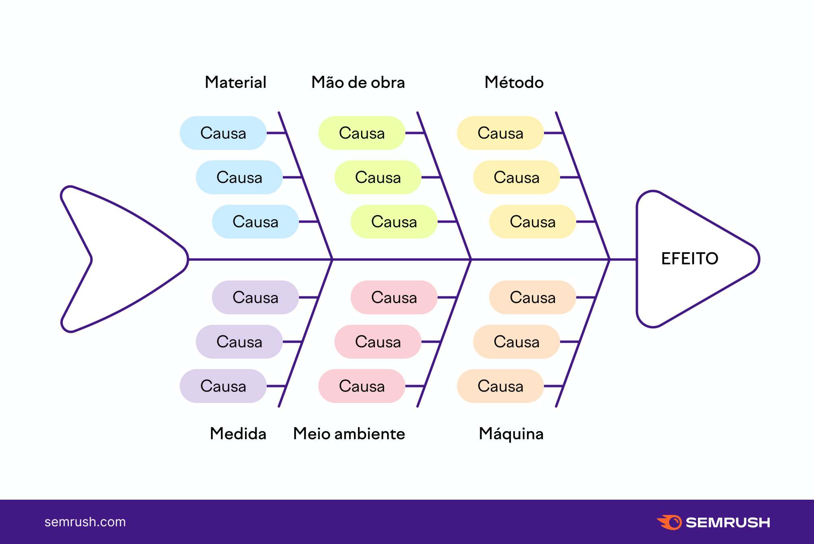
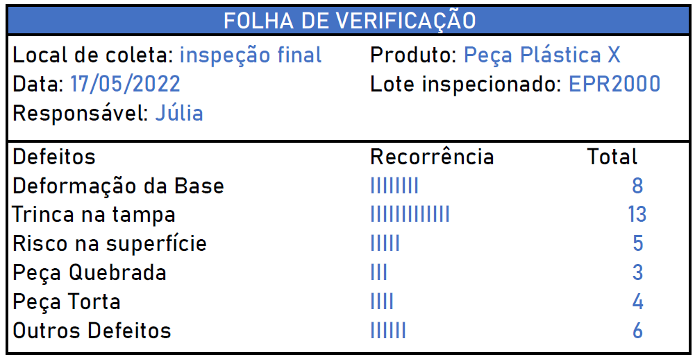
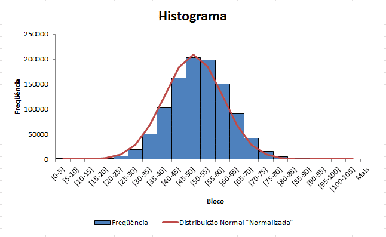
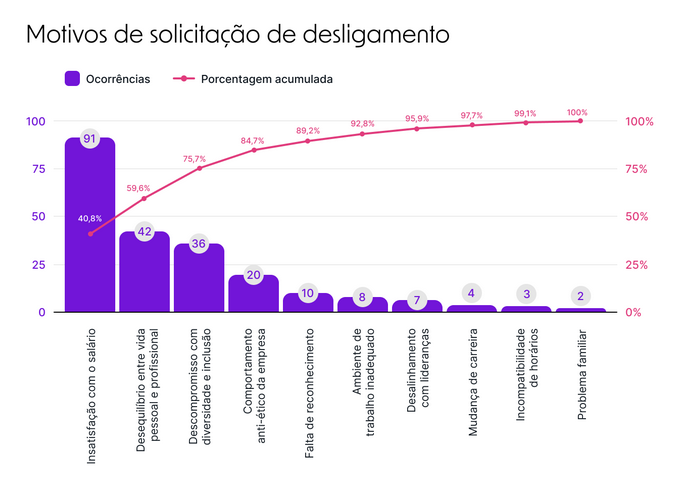

# AS 7 FERRAMENTAS (gráficas) DE QUALIDADE

- São 7 gráficos amplamente reconhecidos por serem os que mais trazem valor ao negócio
- Cada um cobre uma área importante

## 1: Fluxograma
- Para algoritmos ou fluxo de ações
- Descrever processos

## 2: Carta de controle
- Monitora processos ao longo do tempo (eixo X é sempre o tempo)
- Serve para ver se uma ação/processo tá funcionando como esperado
- Tem uma linha de limite superior e inferior e uma central (média)
- As linhas são 3 desvios padrões pra cima/baixo da média
- Medidas dentro das linhas é considerado ok
- 1 medida fora ñ é necessariamente um problema, mas deve ser investigado
- A **média** pode ser a **meta** caso não tenhamos dados anteriores pra calcular
- Funciona se o comportamento da ação/processo seguir uma distribuição normal
- Quando muitas ações acontecem próximo dos limites ou fora dos limites aceitáveis, vc deve parar seu processo e rever oq tá acontecendo
- ISO 8258 indica quando uma série de medidas é considerada fora do padrão e deve ser investigada

## 3: Diagramas de causa-efeito (espinha de peixe)
- Organiza o raciocínio sobre um problema
- Lista as **POSSÍVEIS** causas de um problema
- Tudo no diagrama são **HIPÓTESES** a serem investigadas
- É usado no início do processo de investigação/compreensão de um problema/situação
- A cabeça do peixe é o problema principal a ser investigado
- O eixo principal ñ representa nada, só liga as espinhas ao problema
- As espinhas (linhas diagonais) são as categorias das possíveis causas. Agrupam possíveis causas
- Normalmente usa-se 6 espinhas (categorias) pra listar as causas do problema, chamado metodologia 6M
    - Método: processo, documentação, gestão...
    - Material: matéria prima, fornecedores...
    - Mão-de-obra: procedimento inadequado, pressa, imprudência, falta de treinamento, falta de motivação...
    - Máquina: equipamentos...
    - Medida:  indicadores, instrumentos de medida, calibração, frequencia em que são medidos...
    - Meio ambiente: local físico, espaço, temperatura, sujeira, dimensionamento errado dos materiais, layout...
- Em cada espinha são listados as causas (hipóteses) do problema
- Pode-se listar tudo que pode causar/impactar naquele problema ligado aquela categoria pra mapear todas as fragilidades tbm

## 4: Folhas de verificação
- É um checklist 
- Coleta dados de forma organizada
- Registro sistemático de itens ou defeitos 
- Usado para encontrar padrões de problemas e identificar falhas sistemáticas
- Usado para encontrar bugs e falhas pontuais
- Ex: teste automatizado, observabilidade, error tracking

## 5: Histogramas
- Gráfico de barras
- Usado para mostrar dados

## 6: Gráficos de dispersão
- Gráfico onde cada medida é um ponto desenhado
- Pode ter uma linha (média) desenhada ou uma faixa (2 linhas com área pintada) onde os valores são aceitos
- Bom para encontrar agrupamentos e relações entre os eixos
- Quando há mais de 2 vars, plotar todas as combinações e ver em quais há relações (lembrando que correlação ñ é causalidade)
- **Ver se há outros meios de verificar causalidad melhores e que considerem mais de 2 vars**
- Usado em regressões pra definir qual regresão representa melhor a relação entre as medidas

## 7: Diagrama de Pareto
- Histograma aonde as barras são ordenadas da maior pra menor
- Evidenciar a lei de pareto (80-20)
- Identificar as principais causas de problemas ou problemas mais sérios
- Ver frequência que algo acontece
- Priorizar oq é mais importante
- Plotar uma linha com a soma das linhas até aquele momento
- **Pode ser um gráfico de barras empilhado tbm, com os maiores na base**
