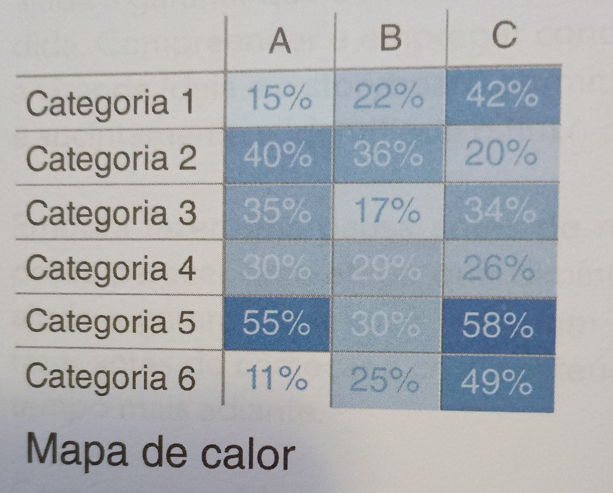
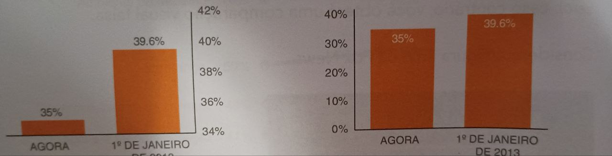
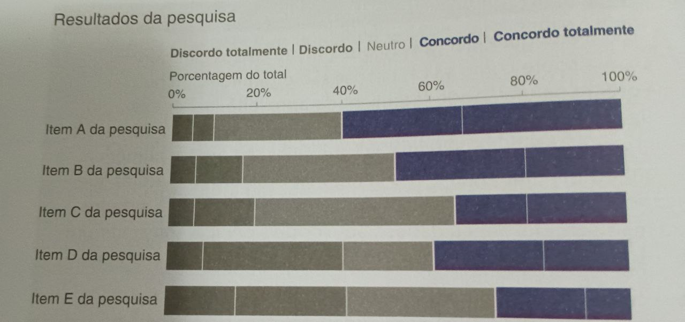
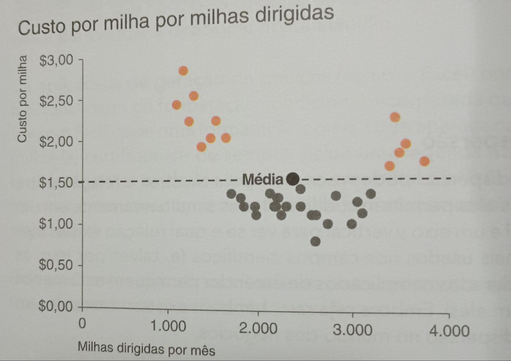
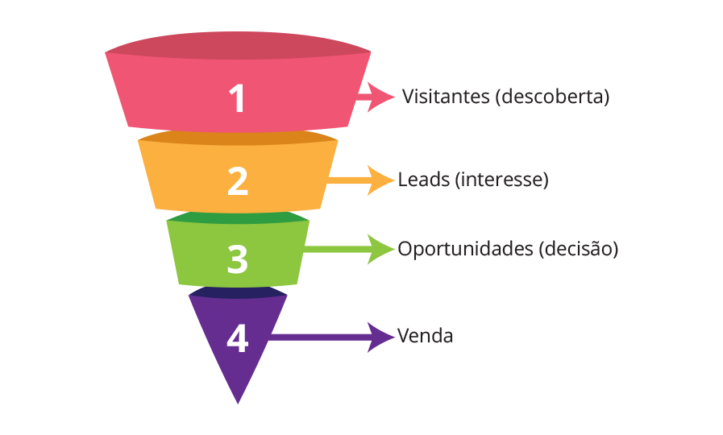
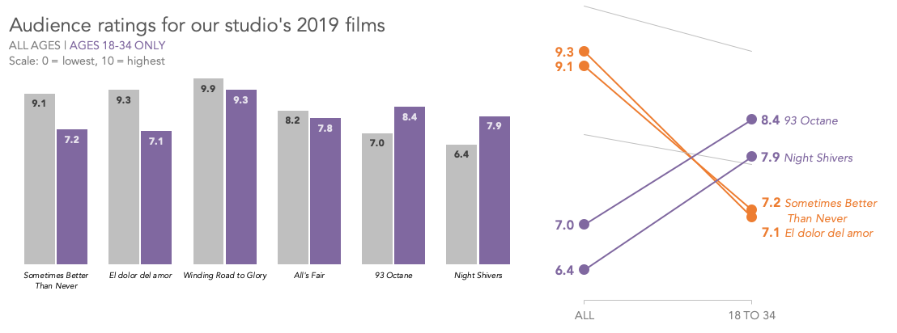
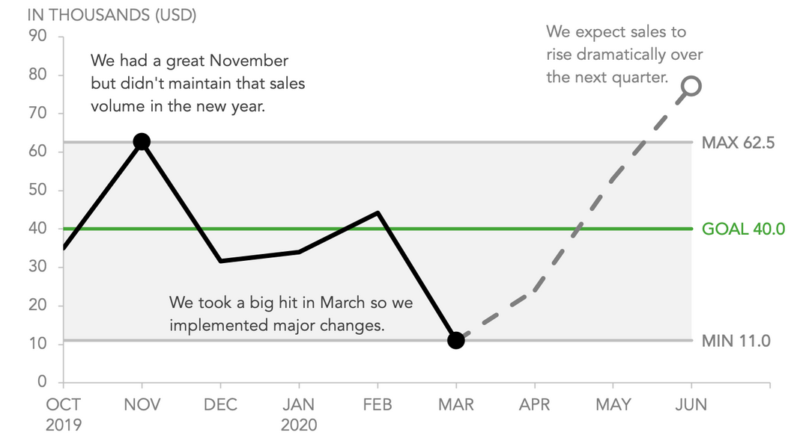
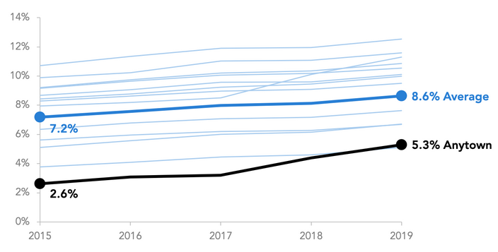
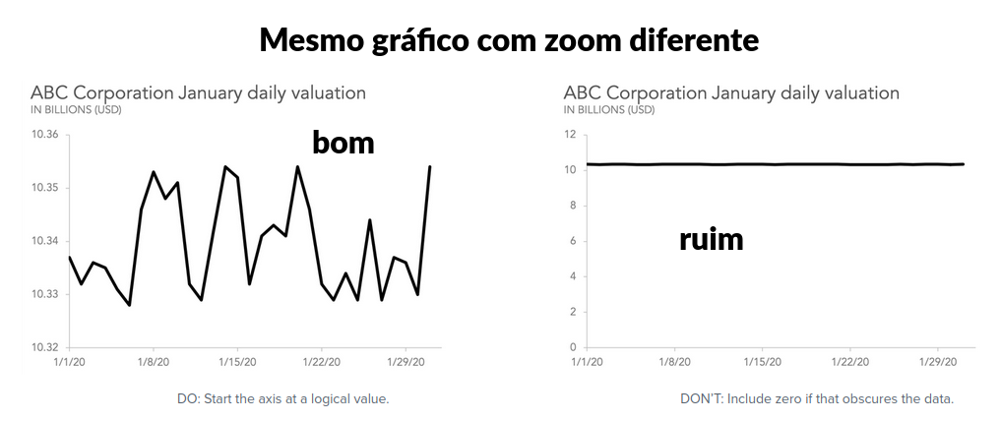
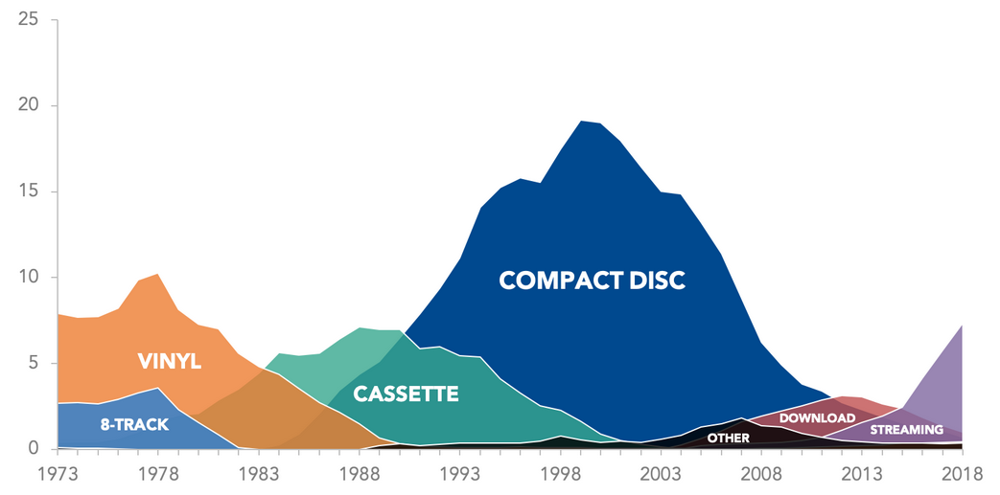

# Gráficos

- Alguns gráficos funcionam melhor para dados qualitativas, outros para dados discretos e outros para contínuos
- Alguns servem para mais de um tipo de dado
- A seguir descrevemos quais gráficos usar para cada tipo de dado

[OBS: Página com guias para dezenas de gráficos](https://www.storytellingwithdata.com/chart-guide)

## Para dados QUALITATIVOS
- Tabela
- Mapa de calor (se for rankeado)
- Gráfico de barra 
- Gráfico de pizza

#### Tabela
- Organiza todos os dados de forma intuitiva e bem conhecida
- Lista todos os resultados da mesma variável numa coluna só para serem comparados

#### Mapa de Calor
- Pode ser uma tabela evidenciando os maiores valores (mais interessante quando quer destacar algumas células da coluna)
- **Sempre** deve ter a legenda com oq quer dizer cada extremo de cores
- Comum ser usado com mapas para mostrar distribuição espacial do dados
- Funciona melhor com **porcentagem ou valores per capita**

Possui um problema com relação as cores usadas:
- Se o gradiente de cores for sutil, perde todo o valor
- Se houver **muitos valores e uma alta amplitude, haverá problemas**
- Valores muito próximos pode ser contornado se só houverem eles

#### Gráfico de Barras
- Chamado **Histograma**
- Foco deve ser no **número** (frequência absoluta)
- **Devem** começar no 0 (do contrário vai tá induzindo o leitor ao erro)
    - No exemplo abaixo os dois gráficos são o mesmo, mas o primeiro por não começar no 0 faz parecer que a diferença é muito maior
- Se as categorias não tiverem uma ordem específica (ex: cores de carro), ordene do maior pro menor ou vice versa
    - De acordo com oq é mais significativo, se é maior ou menor

- Use barras horizontais quando tem muitos valores **OU** texto é muito grande. 
- Para poucos valores **E** textos pequenos, vai no vertical
- Pode ter a versão dupla, com 2 barras pra cada valor (ex: valor da inflação em cada mes de 2024 e 2025, mostrando os meses de cada ano lado a lado)

- Nunca coloque os textos na diagonal, não é bom pra ler
- A largura é sempre a mesma (barras mais largas podem causar a sensação errônea no leitor que o valor é maior)

##### Barras Empilhadas
- Também pode ser horizontal ou vertical
- Só faz sentido se vc quiser somar os valores empilhados (o tamanho total da barra) e mostrar o valor de algum parcial no meio desse total
- Só consegue comparar além do total o valor de 1 das partes que o compõe (o primeiro) então coloque esse que quer comparar na base
- Evite botar todas as parciais, já que não dá pra comparar todos os parciais, deixe só o q vc quer comparar e a soma de todos os demais. Mais divisões irá tirar a atenção do leitor e o confundir

#### Gráfico de Pizza
- O foco são nas porcentagens (frequência relativa)
    - É o oposto dos gráficos de barras
- É uma boa prática ter no máximo 3 ou 4 valores só. Mais que isso fica difícil ler

Quando usar:
- Quando for poucos valores **E** quando tiver uma diferença considerável nos valores (bote sempre as % em cada fatia)
- Quando quiser ressaltar um valor específico (mais fácil ver 25% ou 51% numa pizza que numa barra)
- Quando quer mostrar a relevância (%) de um valor para o todo, use pizza
    - No exemplo abaixo é mais fácil reconhecer que o valor é 25% ou maior que 50% na pizza que na barra

Quando não usar:
- Se tiver 2 valores muito próximos e quer mostrar a diferença entre eles (use barras)
    - Ex: quando uma valor é 34 e outro 31, é mais perceptível a diferença numa barra que numa pizza

**NUNCA USE PIZZA 3D**, ela só tira a atenção com design sem adicionar nada de informativo.

## Para dados QUANTITATIVOS DISCRETOS
- Tabela
- Mapa de calor
- Histograma
- Boxplot (serve pra ambos os tipos de quantitativo)
- Gráfico de dispersão
- Funil
- Gráfico de inclinação

#### Gráfico de Barras
- Mostra a frequência para valores **agrupados** (de 0 a 18, de 18 a 25, 25 a 34...)
- no eixo Y pode mostrar tanto o valor em si quanto sua porcentagem
- Não precisa começar o 0 (uma vez que os valores são agrupados)

Útil para avaliar a distribuição
- Bom pra visualizar a curtose e encontrar onde traçar limites de outliers
    - Quanto maior a curtose, menor a "cauda", mais rápido os valores caem (mais concentrados no centro)
    - Histograma por si só não informa se tem, só dá pistas de que pode ter
- Pode ter vários picos (moda), se todas as barras tem aproximadamente o mesmo tamanho é chamado de UNIFORME
- Bom de ver se os dados são simétricos ou não

#### Boxplot
- Mostra a distribuição dos dados (quão espaçados estão)
- Ótimo pra detectar outliers
- Ótimo pra detectar assimetrias e caudas

- Divide os dados em 4 grupos: 
    - Do menor aceitável (min) ao Q1
    - Q1 até a mediana
    - Mediana até o Q3
    - Q3 até o maior aceitável (max)

**Menor e maior** aceitável não são o maior e menor valor existentes, são os limites de até onde não é outlier, **além deles é tudo outlier**

Como construir um boxplot:
1. Ordenar os dados
2. Achar a mediana
3. Q1 e Q3 são as medianas de cada metade
OBS: caso o conjunto tenha nº par, a mediana é a média dos 2 valores do meio
4. Calcula o Intervalo Inter Quartil (IIQ ou IQR em ingles) IIQ = Q3 - Q1
5. Calcula os limites aceitáveis min = Q1 - 1,5*IIQ  max = Q3 + 1,5*IIQ

- Os limites aceitáveis (min e max) serão o menor/maior valor **existentes** dentro dos limites
    - Ex: menor valor que existe é 6 e o min deu -27, min será 6. ex2: max deu 69 mas os valores existentes são 58 e 71, o max será 58
- Q1 e Q3 formam a caixa do boxplot e representam 50% dos dados.

##### Sobre os Outliers
- Esse 1,5 do cálculo vem do z-score (tabela usada para calcular a dsitribuição normal), para que os limites aceitos fiquem até 2,698 na tabela z (próximo a 3 desvios padrões de distância)
- Portanto, olhar uma curva normal de cima é como olhar um boxplot, aonde o limite de 3 desvios padrões (aproximadamente 99% dos dados) são as caudas do boxplot
- Usa mediana ao invés de média pq mediana não é enviesada por outliers e como esse gráfico é usado para detectá-los, a média os encobriria.

OBS: alguns softwares consideram a mediana como parte dos subconjuntos pra calcular Q1 e Q3, dando valores diferentes. Porém pra grandes conjuntos isso se torna irrelevante, isso só afeta de verdade em bases pequenas

#### Gráfico de Dispersão
- Mostra cada valor medido como um ponto no gráfico
- Pode ter um **ponto especial para a média** (maior ou de outra cor)
- Pode ou não traçar uma linha dividindo os valores ou formando a equação da distribuição
- Bom quando puder traçar uma linha divisória pra mostrar algo relevante
- Bom quando quer comparar duas variáveis
- Só deve ser usado se as medições formarem algum padrão
    - Através de regressão e testes de hipótese sabemos se os pontos formam alguma distribuição conhecida

**NÃO usar em apresentações para público leigo!** Não é um gráfico fácil de se tirar conclusões
- adicionar uma linha mostrando a curva e outras 2 com o desvio padrão e pintando a área interna fica apresentável, porém tem formas melhores
    - Ex1: Um gráfico de linha com a curva formada pelos dados
    - Ex2: Simplesmente apresentar o número de quantos dados entram no desvio é mais rápido e fácil de ler

#### Funil
- Gráfico de funil serve para mostrar dados que passam por uma sequência de passos

#### Gráfico de Inclinação
- Usado em eleições para intenções de voto
- Objetivo é mostrar o quanto algo subiu ou caiu e qual está acima de outro
- O valor final importa mais que os intermediários
- Dados são em relação ao tempo
- É uma variação do gráfico de barras duplo

Regras:
- Eixo X sempre deve ser o tempo
- Deve ser usado quando não há muitos cruzamentos, do contrário fica confuso
- Evitar deixar os pontos iniciais ou finais de 2 linhas muito colados (expandir o zoom se preciso)
- Pode ser pintado os que mais caíram e os que mais subiram (com cores diferentes) para destacar

## Para dados QUANTITATIVOS CONTÍNUOS
- Gráfico de linha
- Gráfico de área
- Boxplot (serve pra ambos os tipos de quantitativo)

#### Gráfico de Linha
- **Não** precisa começar do 0 no eixo y
- Cada eixo pode estar numa unidade e magnitude diferente
- A distância entre os marcadores no mesmo eixo não pode mudar
    - Ex: começar marcando décadas 1970-1980... e no meio mudar pra anual 1981-1982...)
    - `Mudar é outra forma de mentir com estatistica`

Quando usar:
- Mostrar como algo varia ao longo do tempo
    - **Pensou "ao longo do tempo", considere este gráfico**
- Mostrar como uma variável que depende de outra
- Mostrar um intervalo, usando 2 linhas e pintando entre eles (quem sabe plotando a média dentro dele). 
    - Isso é especialmente bom pra intervalo de confiança (figura 2.9)

Quando **não** usar:
- Tiver dados espaçados
- Dados forem categóricos
- Precisar mostrar quantidades de coisas
- Quando os dados (eixos) não tem qualquer relação significativa

Como usar:
- Use linhas contínuas e pontilhadas para passar mensagens diferentes
- Nem sempre os números serão o mais importante, as vezes add textos e passar a mensagem vale mais

- Cada linha deve ter uma cor
- Nem todo ponto deve ter seu valor mostrado. Considere o contexto e mostre os principais

- **Use no máximo 4 ou 5 linhas**, mais que isso fica poluído
- Mude a cor ou a espessura das linhas caso precise usar mais ou queira enfatizar alguma

- Cuidado com valores muito acima do resto, que quebram a escala. Os demais dados podem desaparecer por conta dele
- O espaço entre o maior e o menor valor do gráfico deve ocupar por volta de 80% dele, com o restante como respiro

#### Gráfico de Área
- Serve para mostrar a **mudança relativa** de um dado com outros ao longo do tempo
- Transmite a noção de grandeza e de diferença muito melhor que o gráfico de linha
- **São o gráfico de barras ao longo do tempo**

Regras:
- **Precisa começar no 0**
- Eixo X sempre deve ser o tempo
- Pinte cada área cores bem diferentes
- Use com poucas linhas (Fica confuso e difícil de ler com mais)
- **Não use** se os valores forem muito próximos, vai ser dificil ver onde cada um começa e termina
- Não funciona se as diferenças entre as áreas forem pequenas
- Coloque um pouco de transparência para ver como os gráficos atrás estão variando

Quando usar:
- Tiver poucos dados a mostrar
- Quer mostrar a ascensão e queda de várias séries de dados ao longo do tempo
- Enfatizar uma relação parte-todo ao longo do tempo quando uma parte é muito grande **ou** muda drasticamente
- Diferenças são significativas
