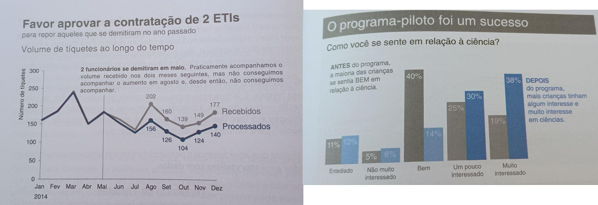
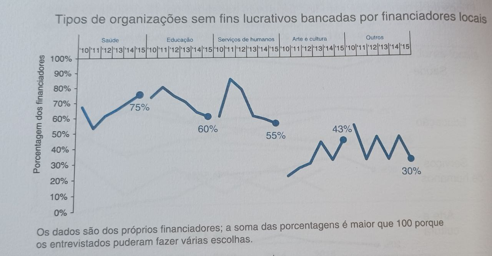
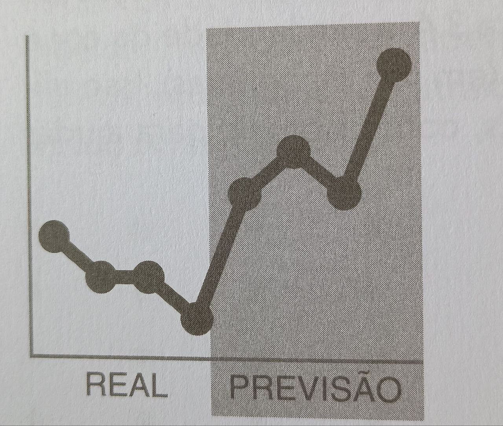
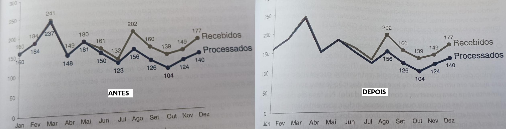
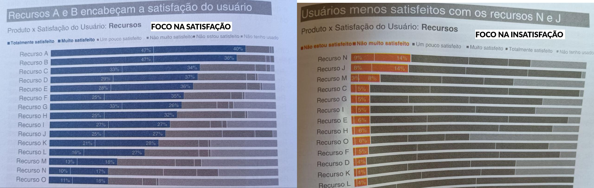

# Storytelling com Dados

- O gráfco deve contar uma história
- Simples vence o sexy (menos é mais)
- Use legendas, títulos e nomeie os eixos. Faça do gráfico auto explicativo. Se preciso add texto nos espaços vagos guiando como deve compreender a imagem
Exemplos:

- Só os gráficos que vc vai mostrar para os outros precisam sem bem montados (os usados em análise exploratória podem ser mais brutos)

Passos para contar uma história com dados
1. Entenda o contexto 
2. Escolha a apresentação adequada 
3. Elimina a saturação 
4. Foque a atenção no que deseja
5. Conte uma história

## CONTEXTO

Serve para apresentações de todo tipo, não só gráficos

- Saiba para QUEM, COMO e O QUE vc mostrará o dado
- Seu gráfico, discurso e apresentação devem mudar de acordo com o público (desenvolvedores, diretoria ou marketing...)
- Cada um quer ver coisas diferentes e se importam com coisas diferentes

QUEM
- Qual o nível de conhecimento do público (100% leigo, curiosos sem profundidade no assunto, outros especialistas, estudantes a fim de aprender a fundo...)
- Pense nisso para saber quais pressupostos sua apresentação assume (oq o público precisa saber de antemão)

COMO
- Como seu público terá acesso ao gráfico? (apresentação ao vivo, vídeo, documento, TV...)
- Se seu público terá acesso sem vc do lado explicando, deixe a apresentação auto explicativa
- Se seu público terá o gráfico sem o documento explicando tudo, tente deixar o gráfico auto explicativo
- Se o público verá na TV, deixe tudo auto explicativa pois a atenção pode ser parcial
- Se o público ver numa apresentação ao vivo (palestra) vc pode deixar mais enxuto, com menos explicação
- Se o seu material é um material de estudos, deixe tudo muito destrinchado e aut-explicativo

O QUE
- Quais dados reforçam a tese que quer mostrar? Quais refutam? 
- Saber disso ajuda a definir quais dados mostrar (considerando que a análise já foi feita e oq tinha pra levantar de dados ja foi levantado)
- Nunca add dados só pq cabe, add dados apenas com uma finalidade pensada e específica

Dê **SUGESTÕES**, não ordens! e deixe claro pq essa sugestão é uma ótima ideia

**Se vc pudesse falar só 1 frase pro seu público, qual seria?**

Saiba como transformar sua apresentação em um pitch de 3 minutos (o mais direto e conciso possível)

--- 

**Saiba identificar quem toma as decisões e oq importa pra ele**

**Saiba exatamente oq vc quer que seu público saiba, pense ou faça ao ver a apresentação**

**Tenha um resultado desejado claro com sua apresentação/gráfico**

## APRESENTAÇÃO ADEQUADA

#### Números soltos
- Se vc tiver só 1 ou 2 números, só colocar o nº com 1 frase é o suficiente

#### Tabela
- É útil quando só uma das linhas ou colunas é importante para cada público (ex: % de imposto em cada faixa de renda)
- Em apresentações ao vivo são péssimas, o ouvinte vai parar de te ouvir pra ler e nem tudo ali o interessará
- Simplicidade e bordas finas deixa menos poluído (foco nos nºs, ñ na estrutura da tabela)
-  Tabelas são lentas de ler

#### Gráfico
- Quando tiver um gráfico espaguete (gráfico de linha com várias linhas se sobrepondo) vc pode melhorar o gráfico 
- Colorindo só 1 linha e focar nela
- Separando espacialmente as linhas no eixo X

## ELIMINE A SATURAÇÃO

- Menos é mais
- Retire tudo que for desnecessário para entender a mensagem principal (textos inúteis, fundo colorido, bordas, barras grossas na tabela)
- Dependendo do contexto, podemos remover até os eixos e suas legendas caso eles sejam desnecessários e o gráfico ainda passar a info essencial e der a entender quais componentes são ligados a qual

#### Associação entre componentes
- Associar os componentes entre si via linhas os interligando, cores, formas ou cercando é essencial para passar a mensagem
- Nesses casos, add linhas ou cor de fundo ñ é um problema, pois tem uma finalidade

- Usar formas e cores diferentes para dados diferentes para ao bater o olho saber que pertencem ao msm grupo e os demais não 
	ex: num gráfico de dispersão * são do grupo A e . são do grupo B
	ex2: num gráfico de dispersão azuis são do grupo A e vermelhos do grupo B

#### Texto
- Evite textos na diagonais (mesmo legenda do eixo)
- Alinhe o texto (nunca deixe centralizado, parece mais solto e desconexo)
- Os elementos no gráfico (títulos, textos, eixos...) devem estar alinhados 
- Preserve as margens e use espaços vazios para dar respiro

#### Cores
- Use cores pra enfatizar oq quer que o leitor foque
- Se de todos os objetos plotados, só 1 for destacado (ex: sua empresa comparado com outras 5), pinte só a sua e deixe todas as outras com a mesma cor, pois o importante ñ é o valor das demais, é o valor da sua comparada com a deles)

#### Legenda
- Bote a legenda do que aquela linha/barra/objeto significa do lado do objeto em si, não embaixo (próximo é melhor) e com a mesma cor

#### Valores
- Remover os valores do gráfico pode ser uma forma de limpar APENAS se oq importa é a desproporção entre os valores
- Add valores no gráfico somente quando esses valores forem significativos

- Encher o gráfico de números que não são importantes só poluirá

## FOQUE A ATENÇÃO NO QUE DESEJA

Alguns atributos são percebidos pelo cérebro antes dele entender oq tá sendo mostrado
- Cor
- **Negrito**
- Forma
- Tamanho
- `Contorno`
- <ins>Sublinhar</ins>
- Posição na Página

Use esses atributos pra guiar o olhar do leitor
- Eles tbm são ótimos pra criar hierarquia visuais
- Use com moderação, senão vira um carnaval e o leitor não sabe pra onde olhar
- No máximo **10% deve ser destacado**

#### Hierarquia da atenção
- **Maior atenção**: Cor, Tamanho, Forma e **Negrito**
- Média atenção: `Contorno` e Espaçamento
- Menos atenção: <ins>Sublinhado</ins> e _Itálico_
- Mínima atenção: normal

O msm atributo pode ter mais ou menos efeito, chamando menos atenção que outros do mesmo tipo (um texto grande chama mais atenção que um texto reduzido, um texto com vermelho escuro, vermelho claro e cinza pra mostrar maior, média e menor importância)

#### Menos é Mais
- A história que vc está contando deve ser oq mantém a atenção do seu público, não detalhes de design do gráfico!!
- Tirar coisas vale mais do que add/realçar

#### Cores
Use as mesmas cores em todos os gráficos da apresentação e sempre com os mesmos significados

Dicas: 
- Vermelho para queda considerável e verde para subida considerável
- Vc pode trocar por laranja e azul caso queira fazer a prova de daltônicos
- Vc tbm pode usar uma ou duas cores da empresa que julgar ser útil pro objetivo de destacar. Senão não use
- Use cores de acordo com a sensação que quer causar (vivas para algo alegre ou declaração ousada ou marcante) e sóbrias para algo mais sério. 
- Use cores de acordo com seu contexto (ex: gráfico rosa-choque e azul esverdeado sobre apps de namoro)

Dicas de texto:
- Use negrito no título, subtítulo, legendas e em trechos de textos curtos (apenas)
- Marca texto chama bastante atenção mas add ruído, então use com moderação 
- Itálico é oq menos chama atenção (apesar de ñ add ruído) então use, porém menos que o marca texto
- Sublinhado add ruído portanto deve ser evitado ao máximo
- Use sempre a msm fonte (trocar fonte pra chamar atenção ñ é tão chamativo como outras opções)
- Use a palavra toda em maiúscula só pra palavras chaves e legendas

#### Hierarquia de posição
- As pessoas passam o olho em formato de Z, portanto Coloque as informações mais importante no topo e na esquerda, depois no topo direito e depois da parte inferior esquerda. 
- O que for menos importante coloque no canto inferior direito
- Isso vale para quais gráficos forem mais importantes (vc pode deixar os mais importantes maiores na página/slide tbm) quanto para os textos mais improvável (títulos, legendas, textos complementares)

#### Hierarquia de componentes
1. Coloridos (com cores mais vivas), letras maiores e negrito
2. Objetos contornados
3. Coloridos (com cores mais apagadas ou sóbrias) e formatos diferentes
4. Textos espaçados
5. Sublinhados
6. Itálico
7. Componentes normais
8. componentes menores que o habitual

#### Como definir o que retirar
- Defina o objetvo desse gráfico
- Quais itens são essenciais para esse objetivo (oq tem mais valor q tudo)
- Deixe em segundo plano oq for importante mas ñ impactar na mensagem que quer passar
- Elimine tudo que ñ for essencial ou diretamente complementar
- Resuma tudo que for detalhe

## Conte uma história

#### Oq sempre ter em mente
- Queremos **provocar emoção** no público. Isso o ajuda a se lembrar dos dados e da sua mensagem
- Conflito e tensão (PROBLEMA E SOLUÇÃO) são peças chaves pra criar um storytelling
- Simplifique, seja direto e claro, diga oq realmente quer dizer sem dificultar o entendimento
- **Não comunique para si mesmo, comunique para o público** (as coisas tem q tá na linguagem do teu público e claras para eles, não pra você)
- Apresente para alguém 100% leigo e veja o que ele entendeu e o que ficou vago

#### Storytelling deve ter
1. Prólogo
- Deixar claro o que espera do interlocutor (objetivo final e se quer que ele aprenda ou faça algo) 
- Como espera que ele se comporte (sobre perguntas e evitar desvios de trajetória)
- Explicar como estruturou a apresentação (objetivo, o que irá apresentar (como chegaram a conclusão)...)
- Se pretende pedir algo e o que e quando abrirá pra perguntas
- Índice
2. Início
- Apresentação da situação, contexto, dos envolvidos e do problema
- Usar senso de urgência
3. Meio
- Convence o público da necessidade de ação, mostra as consequências (oq acontecerá se nada for feito)
- Mostra como resolvê-lo, as vantagens da solução
- Traz contextos externos e pontos de comparação
- Traz exemplos q ilustram a situação e dados que confirmam o problema
4. Fim
- Criar um clímax
- Se possível criar uma reviravolta (mostrar que há uma solução/dados q mudam tudo) 
- Solução final
- Compreensão sobre o assunto é expandida
- Usar senso de urgência novamente
- Tem de ter uma **call to action**
- *Opcional*: voltar ao problema para dar uma conclusão sem pontas soltas e mais clara

Resumo: Na introdução diga o que abordará, no meio detalhe e no final revise.

#### Passos para criar sua história
- Primeiro passo: ter um objetivo e contexto da apresentação. 
- Segundo passo: Saber quem é o público alvo e oq queremos que ele faça 
- Terceiro passo: resumir a apresentação em 1 frase e fazer um pitch de 3 minutos dela
- Quarto passo: montar uma história q mexa o emocional da plateia (com início, meio e fim)
- Quinto passo: definir os bullet points e fazer o titulo de cada slide
- Sexto passo: escolher os dados e fazer os gráficos que melhor contém essa história

#### Técnicas para um bom storytelling

1: Títulos
- Pense nos títulos dos slides antes de produzir o conteúdo deles (fazer os bulltet points antes de fazer gráficos e como apresentá-los)
- Os títulos devem ser **títulos de ação**, não descritivos
- O título deve informar bem oq significa ou oq fazer com aquela informação.
- A apresentação deve ter um índice com todos os títulos pro público ter uma ideia do que esperar

2: Repetição
- Faça uso da repetição pra reforçar a mensagem
- Frases curtas e simples para repetir até o público absorver

3: Conheça seu público
- O público se importa com seu processo? Quer conhecer outras opções de solução? Ou só quer ir direto pra resposta?
	- Isso é essencial pra saber como montar sua história
- Pense no que importa pro seu público pra escolher os dados e fazer exemplos que façam sentido pra eles

4: Coesão do slide
- Cada página ou trecho do doc deve ser atômico, coeso e acoplado
- Tudo naquele slide deve tratar do mesmo assunto e se complementar
- Se o mesmo assunto vai e volta na apresentação é sinal que a coesão não tá boa e o público pode ficar confuso

#### Formas de organizar sua apresentação
1: Cronológica
- Identifica o problema
- Reune dados pra entender oq tá acontecendo
- Análise dos dados
- Liga os dados com outros pra ver até onde vão os impactos
- Mostra oq foi descoberto
- Oferece uma solução
- Mostra como a solução resolve
- CTA
**Essa forma é boa quando precisa estabelecer credibilidade ou seu público se importa com o processo**

2: Começar pelo fim
- CTA e oq o público precisa saber ou fazer
- Mostre pq isso é importante
- Respalde com dados que justificam isso
- Mostra as consequências de não fazer nada
- Mostre oq acontece ao fazer oq sugere
- Conclua com o CTA
**Essa forma é boa quando o público é mais direto ao ponto e só quer saber o resultado final e quando vc já tem credibilidade**

#### Apresentação a partir de 1 único gráfico
- Dividir um gráfico em vários, montando ele aos poucos ou realçando partes diferentes para que a atenção esteja onde eu quero e ir criando expectativa
- Montar um gráfico todo cinza sem focar em nada inicialmente e ir realçando só oq vc quer mostrar naquele momento
- Os mesmos dados podem contar histórias diferentes a depender de onde vc foca

- Quando a atenção é fortemente atraída para um fato destacado é mais difícil do público tirar outras conclusões (**como mentir com estatística: esconder outras verdades**)
