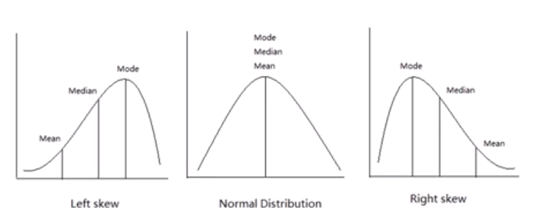

# ÍNDICE
- Conceitos Gerais
	- Variável
	- Variável aleatória
	- Frequência
	- Outlier
	- População
	- Amostra
- Medidas de Centro
	- Média
	- Mediana
	- Moda
	- Esperança
- Relações entre variáveis
	- Associação
	- Correlação
	- Regressão
- Medidas de Dispersão
	- Amplitude
	- Variância
	- Desvio Padrão
	- Coeficiente de variação
	- Erro padrão
- Outros
	- Curva Normal
	- Intervalo de Confiança

# ########## Conceitos Gerais

## CONCEITO: VARIÁVEL

- Variável é tudo que vamos medir e coletar de dados.
- Só coletamos o que ACREDITAMOS que mude (ex: ñ faz sentido coletar se todas as pessoas são seres humanos)
- Ao fazer isso a gente define nosso ESCOPO
- Ter um escopo é necessário pq ñ dá pra coletar e processar infinitas variáveis

OBS: ao ter um escopo definimos e aceitamos q certas infos não olharemos por ñ considerar relevante. Em raros casos eles podem ser cruciais pra análise ser precisa e só descobrimos tarde demais. Quando lascar tudo ou a análise ñ fizer sentido, olhe para novas variáveis

- Pode ser **qualitativas** ou **quantitativas** 
- As quantitativas podem ser **discretas** ou quantitativas **contínuas**
- Cada tipo tem de ser tratado de forma diferente, por métodos diferentes e mostrados em gráfico próprios pro seu tipo
- Desenhar gráficos pra cada um (barra pra qualitativo, barra com média pra discreto e normal pra continuo) 
	- Ex: sobremesa favorita, renda por nº filhos e altura

OBS: descartar variáveis valiosas e gerar análises falsas é **cherry picking**

- Duas variáveis podem ser **dependentes** quando uma afeta o valor da outra
	- Ex: Fumar e ter câncer
- Quando uma não afeta a outra são **independentes**
	- Ex: Quantidade de chuvas e chances de ganhar o Oscar

### Variáveis qualitativas 
- Aquelas que o conceito de média não faz sentido
	- Ex: cor de carros, sobremesa favorita, dias da semana
- Vars binárias são qualitativas (comprou ou não, fez ou não fez empréstimo)
- Vars qualitativas não dá pra separar por número/média
- Datas é **sempre** qualitativa 
	- Não faz sentido tirar média do dia que a pessoa fez algo pq isso só daria info errada. Melhor um gráfico q mostre a distribuição de cada opção
- Um conjunto finito e pré-definido de valores tbm é qualitativo

### Variáveis quantitativas
- São números
- Horario é quantitativo
- Discretos são números finitos, que saltam de um pro outro 
	- Ex: nº de pessoas numa casa, nº votos 
	- Pode ter nºs racionais, mas entre um e outro não tem os intermediários (ex: 0, 0.5, 1, 1.5...)
- Contínuos são números infinitos (ex: temepratura, altura)
	- Não precisa ser números racionais

## CONCEITO: VARIÁVEL ALEATORIA

- Uma variável **quantitativa** cujo valor depende de algo aleatório (ex: jogar um dado)
- Pode ser discreto ou contínuo
- A var tem um conjunto de valores que pode ter 
	- Sempre FINITO para DISCRETO 
	- Sempre INFINITO para CONTÍNUO
- Usado em probabilidade
- O mesmo conceito de variável normal, porém no mundo das probabilidades tem algumas características inusitadas

## CONCEITO: FREQUÊNCIA

- Quão comum é cada valor daquela variável (com que frequência aquele valor é encontrado)
	- Ex: num grupo de 10 pessoas 3 preferem chocolate, 5 preferem coxinha e 2 preferem sorvete. Esses números são a frequência do lanche preferido
- frequência pode ser absoluta (3, 5 e 2) e relativa (30%, 50% e 20%)

Quando se tem muitas medidas pra uma var contínua (ex: altura, horário, peso...) mostrar a frequência

### Frequência  acumulada
- Caso a var seja quantitativo ainda tem as frequencias acumuladas absolutas e relativas (3, 8 e 10 / 30%, 80% e 100%)
- Frequência acumulada é a soma da linha atual com todas as anteriores 
	- Ex, quantos preferem chocolate, quantos preferem chocolate ou coxinha e quantos preferem chocolate, coxinha e sorvete
- Só faz sentido para vars quantitativas (numéricas)
- Faz sentido quando está medindo tempo/espaço. 
	- Ex: "quantas pessoas completaram a corrida até certo tempo"

Podemos agrupar as frequências para facilitar a visualização e compreensão dos mesmos (explicado na sessão frequência)

## CONCEITO: OUTLIER

- Dado muito fora da curva
- Pode ser um erro de medição ou um dado real que foge a regra
- Podem distorcer suas análises, dando resultados errados ou só deixa-la meno precisa
- Em geral se deve MANTER os outliers

Só exclua os outliers nestes casos:
- Se houve erro de digitação ou de input de algum modo
- Se houve erro de medição ou alguém q mentiu na entrevista
- Se a pessoa/objeto ñ faz parte do escopo estudado
- Se aconteceu algo incomum durante a medição
- Se a base de dados for grande (quanto menor mais cada valor é representativo)
- Cheque se erros do tipo são comuns

Como encontrar outlier
- Boxplot
- Z-score (para curva normal)
- Curtose

Algumas análises não são afetadas por outliers, podendo ser usadas sem retirá-los:
- Testes não paramétricos
- Regressão
- Bootstrap 

É possível passar os dados por uma transformação (ex: transformação logaritmica) para remover a influência dos outliers
OQ SÃO ESSAS TRANSFORMAÇÕES E COMO ELAS REMOVEM A INFLUENCIA???

## CONCEITO: POPULAÇÃO
- É todo o grupo/objeto estudado
- Todas as pessoas, unidades ou ocorrências daquilo que se está estudando
- Pode ser todo seu conjunto de dados caso você possua tudo que existe sobre o assunto estudado
	- Ex: registros no banco de dados
- Geralmente não se tem a população toda, aí é preciso trabalhar só com a amostra que se tem e fazer inferências

## CONCEITO: AMOSTRA

- Uma parcela da população/grupo/objeto estudado
- Geralmente todo seu conjunto de dados
- Quando não se pode analisar todos os membros dum grupo, pega um pedaço dele e a partir desse pedaço estima-se o todo
	- Ex: numa sala de aula tem 30 alunos. Faz um estudo com 5 deles
	- Ex2: numa loja passam 500 pessoas. Se entrevista 40 pra entender suas preferências
	- Ex3: a população do país é 200milhõs. Entrevista-se 20mil pra pesquisa

**Quando usar a população toda e não usar amostras?**
- Quando tiver a população toda ao alcance (ex: registros numa tabela do banco de dados, usuários em um sistema)
- Quando sua população é muito pequena e vc consegue perguntar/medir todo mundo (ex: uma sala de aula) e quer medir algo passado ou atual
	
`Mesmo se tiver toda a população mas quer medir um comportamento futuro, pode ser (a depender do contexto) melhor usar uma amostra` (ex: o facebook quer testar uma feature nossa e só libera pra um pequeno grupo pra estimar quantos vão aderir).

### Viés Estatístico
Alguns cálculos mudam quando usam amostras ou população (ex: variância e desvio padrão), pois a amostra traz um grau de incerteza que precisa ser corrigido

A amostra tende a subestimar a dispersão real, diminuindo o resultado. Isso é **viés estatístico**

O vies diz que a cada info que vc tira da amostra (dados incompletos), mais **graus de incerteza** vc adiciona. 
- Ao tirar a média tem grau 0 de incerteza
- Ao tirar a variância (que usa a média, q pode estar errada por vir de dados incompletos), tem grau 1 (por isso N-1). 
- Ao tirar o coeficiente de variação (que usa a variância que usa a média que vem de dados incompletos), tem grau 2 (por isso N-2)

OBS: se você tirar outra info que não dependa de outra info anterior já tirada, será grau 0 (N). Ex: média e amplitude são ambos grau 0, posso tirar os 2 sem usar N-1.

`Para amostras enormes, essa diferença se torna insignificante.`

# ########## Medidas de Centro

## CONCEITO: MÉDIA

- Use média quando os dados forem **simétricos** ou estiverem **mais concentrados no centro** (baixo desvio padrão)
- Use média quando os dados forem **uniformes**
- **É sensível a outliers**

## CONCEITO: MEDIANA

- **NÃO é sensível a outliers!**
- Metade dos valores estão acima dele e metade estão abaixo
- Ordena os valores e pega o do meio 
	- Caso tenham valores pares, tira a média dos 2 valores do meio

Use mediana quandos os dados forem **assimétricos** ou tiver **muitos outliers**

## CONCEITO: MODA

- Valor que mais se repete na amostra
- Pode ter várias modas (vários picos no histograma, vários valores que se sobressaem aos outros)
- Se os dados forem todos mais ou menos na mesma frequencia a moda é uniforme

- Faz mais sentido usar moda em dados **qualitativos** ao invés de quantitativos.
- Ajuda a entender a DISTRIBUIÇÃO dos dados ao invés de ser um valor central
- Moda **NÃO substitui** média e mediana

Exemplo de como média, moda e mediana variam de acordo com a distribuição

## CONCEITO: ESPERANÇA

- É o valor esperado caso um experimento seja repetido infinitas vezes
- **`esperança = valor esperado = média`**
- **É sensível a outliers**

Média ponderada de todos possíveis resultados vezes sua respectiva probabilidade

$$E(x) = \sum_{x=1}^n x_i p(x_i) $$

Se for uma distribuição contínua
$$E(x) =\int_{-\infty}^{\infty} xf(x) \,dx$$

	Onde f(x) é a equação da distribuição

Melhor descrita na sessão "centro"

# ########## Relações Entre Variáveis

## CONCEITO: ASSOCIAÇÃO

- Indica que as variáveis são **dependentes** (uma afeta o valor da outra)
- Costuma ser provado por algum teste
- Um dos tipos de associação é a `correlação` 
- Alguns descrevem associação para variáveis `categóricas` e correlação para `numéricas`
- Para efeitos práticos são a mesma coisa, apesar de na teoria não serem

## CONCEITO: CORRELAÇÃO

- É um tipo de associação (toda correlação é uma associação)
- Relação **linear** entre 2 variáveis, onde uma afeta o valor da outra
	- Se elas sobem e descem juntas ou de forma oposta
	- A força da relação (se é forte ou fraca)
- As variáveis precisam ser **dependentes** para ter uma correlação (uma precisa afetar a outra)
- As variáveis precisam ser quantitativas
- Não devem ter muitos outliers (sinal que talvez ñ sejam tão contínuas)
	- Ex: temperatura e pressão, nota e menção, volume e densidade

`Ao olhar uma correlação, devemos ver seu gráfico de dispersão e o coeficiente de correlação.`

Muito usado para:
- Recomendações de produtos
- Recomendações da netflix
- Encontrar produtos vendidos juntos frequentemente da amazon 
- Decidir quais produtos deixar juntos no mercado

OBS: estudar método Market Basket usado para venda casada????

## CONCEITO: REGRESSÃO

- Fórmulas e técnicas para prever o valor de uma variável a partir da outra
- Elas precisam ser **correlacionadas**
- Usa a correlação entre elas pra prever isso
- Tenta criar uma equação que seja a mais próxima possível das medidas reais

### Diferença entre correlação e regressão
- Correlação analisa os dados passados
- Regressão tenta prever o futuro (criando uma equação que melhor represente os dados)
- Correlação é a base para regressão

# ########## Medidas de Dispersão

## CONCEITO: AMPLITUDE

- É a diferença entre o maior e o menor valor da variável 
- Só faz sentido pra variáveis quantitativas

`amplitude = maior - menor`

- Método de calcular dispersão mais simples e pouco usado devido a só considerar 2 valores
- **Sensível a outliers**
- Preferível usar outros métodos de dispersão como variância, desvio padrão e coeficiente de variação

## CONCEITO: VARIÂNCIA

- Medida de dispersão baseada na média
- A distância que um valor está da média é seu desvio. 
	- Variância é a média dos desvios ao quadrado (para ignorar sinal)
- Média das distâncias do centro (média)

$$variancia = \frac{\sum_{i=1}^n (x_i - media)^2}{N}$$

Se for a variância da **população** divide por N e se for da **amostra** divide por N-1

`OBS: para amostrar enormes, N ou N-1 se torna insignificante`

Como eleva ao quadrado (pra eliminar o sinais) ele também acaba elevando demais o resultado final, ficando distorcido dos dados e `altera a unidade de medida`.
- Ex: se estou medindo a altura das pessoas na sala, a unidade final da variância é cm ao quadrado, não cm como o esperado

**NÃO pode** ser usado com mediana ou médias diferentes da aritimétca. Para mediana user o IQR (do boxplot). Para as outras médias usar tecnicas proprias listadas na sessão de médias.

## CONCEITO: DESVIO PADRÃO

- É a raiz quadrada da variância
- Também mede o quão os valores se distanciam da média, em geral
- Vem pra corrigir a unidade de medida que a variância altera e trazer o resultado de volta para mais próximo dos valores medidos

$$desvio = \sqrt{variancia}$$

## CONCEITO: COEFICIENTE DE VARIAÇÃO

- É o desvio padrão dividido pela média
- Serve pra comparar 2 desvios padrões com unidades de medidas diferentes (ex: cm e kg)

$$cv = \frac{desvio}{media}$$

Se for a variância da **população** divide por N e se for da **amostra** divide por N-1

## CONCEITO: ERRO PADRÃO
usado quando trabalhamos com inferência estatística

# ########## Outros

## CONCEITO: CURVA NORMAL

- Distribuição muito comum em diversos cenários em que muita coisa é facilmente calculável
- Mais amada pelos estatísticos
- Tem formato de sino
- Também chamadade curva Gaussiana
- Média mediana e moda são iguais (simétrica)

## CONCEITO: INTERVALO DE CONFIANÇA

Erros do Tipo I/II
medidas separatrizes, 
medidas de dispersão
medidas de assimetria
Testes de aderência de distribuições teóricas a dados empíricos (Chi-quadrado e kolmogorov-Smirnov)
Teoria da Confiabilidade Estrutural
OQ É UMA Variável Aleatória: Bidimensional???

