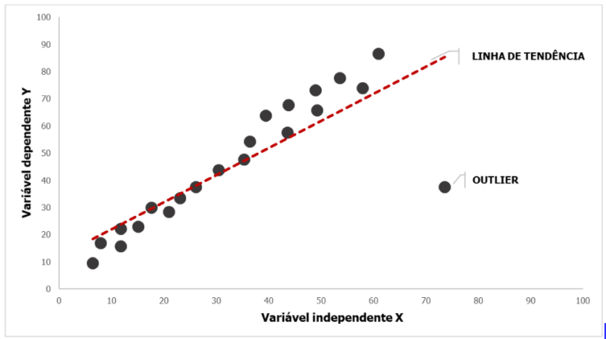
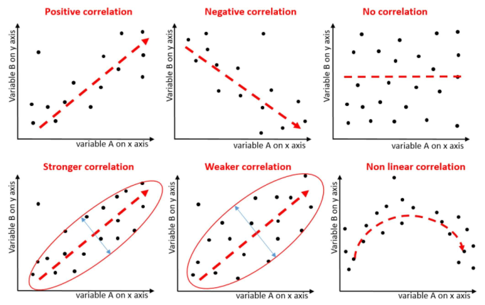

# CORRELAÇÃO

- Medida que **mostra como 2 variáveis se comportam em relação uma a outra**
- Indica a força entre elas (se uma influencia muito ou pouco a outra)
- Indica a direção entre elas (se as duas mudam juntas ou de forma inversa)

Para informar isso, **todo cálculo de correlação dá uma resposta entre -1 e 1**.

- É um tipo de associação (toda correlação é uma associação)
- Correlação é a base para regressão
- Pode ser uma relação **linear ou polinomial**
	- No caso da **regressão logística**, ele usa a linear como entrada para a função sigmoide e **não tem relação com log ou polinomial**
- Comparar vars AxB é a mesma coisa de comparar BxA. O resultado é o mesmo independente da ordem
- Não diz quem influencia quem, se A influencia B ou o contrário

`Ao olhar uma correlação, devemos ver seu gráfico de dispersão e calcular o coeficiente de correlação.`

Nessa área existem diversas medidas, cada uma medindo algo ligeiramente diferente. Para não confundir listaremos todas aqui:

- Correlação: mede como 2 vars se influcenciam, dando força e direção da relação
- Covariância: mede como 2 vars se influcenciam, dando **apenas direção** da relação
- Determinação: dá a porcentagem de quanto uma var influencia a outra

É representado como $R$.

### O QUE NÃO FAZ

Mostra como 2 variáveis se comportam em relação uma a outra, porém **não diz se são dependentes**. Caso fossem dependentes, uma afeta diretamente o valor da outra, causando essa mudança. Porém nem toda correlação significa causalidade.

Sempre deve-se lembrar que **correlação não é causalidade**. Duas vars podem ser correlacionadas por uma terceira var desconhecida ou por puro acaso. Por isso correlação apenas **dá uma suspeita para uma investigação**, mas não define nada.

### Como Saber Se É Correlação Ou Causalidade

1. Experimentos controlados randomizados

2. Diferenças em diferenças

3. Variáveis instrumentais (IV)

4. Pareamento de pontuação de propensão (Propensity score matching - PSM)

[Para se aprofundar, leia ele livro sobre o tema.](https://github.com/rdemarqui/python-causality-handbook-ptbr/blob/master/causal-inference-for-the-brave-and-true/00-Summary.ipynb)

### ONDE USAR

- Recomendações de produtos
- Recomendações da netflix
- Encontrar produtos vendidos juntos frequentemente da amazon 
- Decidir quais produtos deixar juntos no mercado

## GRÁFICO DE DISPERSÃO

É um gráfico onde cada valor é um ponto e pode ou não ter a linha de tendência desenhada. O gráfico mostra os dados reais como pontos espalhados no gráfico e uma linha que mostra a tendência desses dados (a média de seu comportamento). Essa linha de tendência é a regressão (linear ou polinomial).

Esse gráfico também ajuda a encontrar outliers ao ver pontos isolado longe da nuvem principal e da linha de tendência.

Os valores da primeira variável definem aonde no eixo X eles serão posicionados e a segunda variável define aonde no eixo Y o ponto estará. 

Para isso as variáveis não podem representar um gráfico (que tem um valor diferente para cada x), já que o valor de um deles será o próprio x. Caso esse seja o cenário a comparação dos 2 valores não é mostrado por gráfico de dispersão, mas por gráfico de linha com 2 linhas, cada uma representando as variáveis. O gráfico de linha também é usado quando os dados são contínuos.

# COEFICIENTE DE CORRELAÇÃO

Nada mais é do que o **resultado do cálculo da correlação**. A resposta da equação da correlação é o coeficiente. Existem várias formas de calcular a correlação, mas o resultado (coeficiente) será sempre entre -1 e 1 e significam a mesma coisa.

Características:

- Serve tanto para vars discretas (com gráficos de dispersão) como contínuas (com gráficos de linha)
- `Valor entre -1 e 1`
- Se for `= 0` não possui nenhuma correlação entre as vars
- Diz a direção (positivo se são diretamente proporcionais e negativo se são inversamente proporcionais) 
- Diz a intensidade do quanto elas tão relacionadas (mais proximo do 1 ou -1 mais intenso é)
- Correlação forte: os pontos tão menos dispersos (mais próximos da reta de tendência (regressão))
- O quanto já pode ser considerado forte varia a cada contexto. Alguns autores consideram **forte a partir de 0,5 enquanto outros a partir de 0,7**
	- O mesmo vale para correlações fracas. Alguns consideram **fraco de 0,1 a 0,3 enquanto outros vão de 0,1 a 0,4**

OBS: Posso **comparar 2 coeficientes** de correlação **independente da unidade usada**, pois o coeficiente (resposta da equação) não tem unidade de medida. No processo de cálculo ele elimina as unidades e ao botar tudo entre -1 e 1 normaliza a resposta, só importando a magnitude do efeito de uma em outra, não a unidade de seus valores orignais.

## COMO CALCULAR

Existem 4 formas de calcular:

- Pearson
	- Mais comum e default das ferramentas
	- Só serve para correlação **linear**
	- Sensível a outliers
- Spearman 
	- Não paramétrico (**dados categóricos**) 
	- Útil para vars discretas
	- Serve para correlações **não lineares**
	- Só mede se os dados crescem juntos (positivo ou negativo), não mede a intensidade
	- Mais usada para dados não paramétricos
- Kendall
	- Igual ao Spearman, mas mede a força (intensidade) entre as variáveis
	- Mais robusto para amostras pequenas
	- Usado no lugar do Spearman só quando temos poucas amostras ou tem muitos valores repetidos
- Bisserial
	- Usado quando uma var é contínua e a outra categórica com apenas 2 categorias
	- Ex: salário (contínuo) x gênero (categórico com 2 opções)

### CORRELAÇÃO DE PEARSON

É o mais comum. Serve para dados discretos e contínuos. `Os dados NÃO podem ter muitos outliers e devem ter uma relação linear`. 

Usa a covariância como base do cálculo, dividindo ela pelos desvios padrões de cada variável. Como usa muito desvio padrão acaba sendo influenciada por outliers.

$$r = \frac{covarianca}{desvioX * desvioY}$$

Aonde X e Y são minhas variáveis/dados (lista de valores).

Com isso, a correlação é a **soma das variâncias de X e Y multiplicados dividido pelo desvio de cada um**. Podemos representá-lo como: 

$$\frac{vari_{xy}}{desvio_x * desvio_y} = \frac{vari_{xy}}{\sqrt{vari_x*vari_y}}$$

### CORRELAÇÃO DE SPEARMAN

É a ideal para dados categóricos, ordinais (1º, 2º, 3º...) e quando não se tem uma relação linear. Também é menos sensíveis a outliers, pois faz uma transformação nos dados, aonde as diferenças entre eles são reduzidas a 1, independente do valor original.

Ex: eu tenho os dados 4, 5 e 250. Após transformar os dados fica 1, 2 e 3. A diferença entre 4 e 5 é a mesma entre 5 e 250. No final só o que vai nos importar é qual dado é maior que qual e quantos tem entre eles. A distância real é ignorada, assim outliers não afetam.

Por fazer esse ranking, variáveis discretas e ordinais (que já são naturalmente rankeadas) encaixam muito bem. Relações não lineares também encaixam bem pois as discrepâncias são eliminadas pelo ranking.

#### Passo 1: Rankear os valores das 2 variáveis

Para cada variável, mudamos o valor de cada dado para 1, 2, 3... do **menor para o maior**. Isso é feito de forma independente em cada variável, assim o ranking de um dado na variável X não interfere na variável Y.

$X$ vira $X_s$

#### Passo 2: Calcular o quadrado das diferenças entre X e Y

Fazemos a subtração de cada ponto, isso significa subtrair $X_s - Y_s$. Com isso reduzimos cada ponto a um único valor.

$d = X_s - Y_s$

Por fim, elevamos a diferença ao quadrado, deixando todos os valores positivos. Isso nos diz o quanto o ponto está alinhado ou não com uma linha reta, pois se em ambas as variáveis o ponto estiver no mesmo ranking o valor será 0. Ou seja, **ele varia igual nas duas variáveis**.

$d^2 = (X_s - Y_s)^2$

#### Passo 3: Exectuar a equação de Spearman com as diferenças rankeadas

A equação de Spearman é

$$r = 1 - \frac{6 * \sum_{i=1}^n d_i^2 }{n(n^2 - 1)}$$

Basicamente é a soma das diferenças multiplicada pelo fato de correção $\frac{6}{n(n^2-1)}$ que torna o valor entre 0 e 2 independente do resultado do somatório. Assim o valor final ao fazer $1 - resultado$ fica entre -1 e 1. 

O somatório de valores ao quadrado sempre será valores positivos. Encontramos o menor valor possível quando as 2 variáveis estão perfeitamente pareadas, dando 0 em todas as diferenças. Assim, o somatório é 0 e todo o cálculo fica 0. Como no final tem 1 - 0, alcançamos 1 com os dados perfeitamente pareados.

De forma semelhante, quando os dados estão inversamente pareados (maior com menor) encontramos o maior valor possível, pois teremos grandes valores nas pontas (n-1 e -(n-1)) e os demais pares também darão os maiores valores possíveis. Ao final de todos os cálculos dará o resultado 2, e ao fazer 1 - 2 teremos o coeficiente -1.

Essa equação é uma simplificação da de Pearson quando os dados são rankeados.

`Caso haja valores repetidos nas variáveis, tire a média dos rankings envolvidos e atribua a eles esse valor.` Ficará valores repetidos nos rankings mesmos.

#### Exemplo 1, sem dados repetidos

6 pessoas estudaram para uma prova e anotaram o tempo em horas dedicado aos estudos e a nota tirada. Com isso temos a variável tempo de estudo e a variável nota que queremos relacionar.

|tempo|nota|
|:--  |:-- |
| 5   | 8  |
| 10  | 6  |
| 6   | 10 |
| 12  | 15 |
| 18  | 21 |
| 25  | 20 |

Rankeamos as duas variáveis do menor ao maior, fazemos a diferença entre elas e elevamos ao quadrado.

|tempo|nota| rank tempo | rank nota | d = rank_tempo - rank_nota | d²  |
|:--  |:-- | :-- 				|  :--  		| :-- 											 | :-- |   
| 5   | 8  |  1					| 2					| -1												 | 1   |
| 10  | 6  |  3					| 1					| 2												 	 | 4   |
| 6   | 10 |  2					| 3					| -1												 | 1   |
| 12  | 15 |  4					| 4					| 0												   | 0   |
| 18  | 21 |  5					| 6					| -1												 | 1   |
| 25  | 20 |  6					| 5					| 1												 	 | 1   |

Jogando na equação:

$r = 1 - \frac{6 * (1+4+1+0+1+1) }{6(6^2 - 1)} = 1 - \frac{6*8}{6*35} = 1 - 0,229 = 0,771$

#### Exemplo 2, com dados repetidos

|tempo|nota|
|:--  |:-- |
| 2   | 50 |
| 4   | 70 |
| 4   | 80 |
| 6   | 70 |
| 8   | 90 |

2 será o menor rank (1), 4 e 4 empatam nas posições 2 e 3. Média = $\frac{2+3}{2}$ = 2,5. Damos para ambos o valor 2,5.

|tempo|nota| rank tempo | rank nota | d = rank_tempo - rank_nota | d²  |
|:--  |:-- | :-- 				|  :--  		| :-- 											 | :-- |   
| 2   | 50 |  1  				|  1   			|	0    											 | 0   |   
| 4   | 70 |  2,5				|  2,5 			|	0    											 | 0   |   
| 4   | 80 |  2,5				|  4   			|	-1,5 											 | 2,25|   
| 6   | 70 |  4  				|  2,5 			|	1,5  											 | 2,25|   
| 8   | 90 |  5  				|  5   			|	0    											 | 0   |   

Jogando na equação:

$r = 1 - \frac{6 * 4,5 }{5(5^2 - 1)} = 1 - \frac{27}{120} = 1 - 0,225 = 0,775$

### CORRELAÇÃO DE KENDALL

É outra correlação não paramétrica, porém menos usada que a Spearman. Ela serve bem apenas para **amostras pequenas** e não tem problemas com valores repetidos como Spearman.

**Ele compara todos os pontos com todos**, fazendo uma análise combinatória dos pontos, e **conta a quntidade de pares concordantes e discordantes**. 

Para cada par de pontos, verifico se ambos os valores de um ponto são maiores ou menores que do outro. Se sim, os pares são concordantes, se não, são discordantes. Um par de pontos é concordante quando ambos seus eixos são maiores/menores que do outro (está totalmente acima ou abaixo do outro). Isso indica que há uma sequência entre os pontos sem considerar proporção, distância ou forma dessa relação.

Outra forma de entender é que 2 pontos são **concordantes quando ambas as variáveis crescem ou diminuem juntas**. Da mesma forma 2 pontos são **discordantes quando as 2 variáveis estão indo para lados opostos (uma cresceu enquanto outra diminuiu)**.

Lembrando: um ponto é a união entre um valor da variável X e da variável Y pertencente ao mesmo dado. Funciona bem quando X e Y são categorias de um dado.

Se $(X_i > X_j e Y_i > Y_j) ou (X_i < X_j e Y_i < Y_j)$ então o par é concordante.

Se $(X_i > X_j e Y_i < Y_j) ou (X_i < X_j e Y_i > Y_j)$ então o par é discordante.

Se $X_i = X_j ou Y_i = Y_j$ então o par é neutro.

Um par **neutro é quando qualquer uma das variáveis se mantém constante**. Isso ocorre quando os 2 pontos são perfeitamente iguais (X e Y de ambos os pontos são iguais) ou quando apenas 1 das vars (X ou Y) é igual. Em ambos os casos não se cria nenhuma relação nem positiva nem inversa entre as variáveis por uma delas ou as duas terem ficado parado.

Ao final de todas as comparações par-a-par, subtrai a quantidade de pares concordantes dos dicordantes e divide pelo número de combinações. O resultado é a correlação final.

$$r = \frac{numParesConcordantes - numParesDiscordantes}{ \frac{n(n-1)}{2} }$$

Esse divisor é a quantidade de pares existentes e vem diretamente da análise combinatória. Se tenho N pontos e quero combinar todos com todos em pares, tenho $\binom{n}{2} = \frac{n!}{2!(n-2)!} = \frac{n(n-1)}{2}$.

`Os pares neutros são ignorados pro cálculo, porém não são retirados do divisor (total de combinações)`.

#### Exemplo

Dado os dados seguintes sobre idade e tempo livre, qual a correlação entre eles?

|Pessoa|idade|tempo|
|:--   |:--  |:-- |
| A    | 41  | 8  |
| B    | 39  | 5  |
| C    | 19  | 10 |
| D    | 36  | 6  |
| E    | 36  | 8  |

- A(41,8) e B(39,5): 41 > 39 e 8 > 5, concordantes
- A(41,8) e C(19,10): 41 > 19 e 8 < 10, discordantes
- A(41,8) e D(36,6): 41 > 36 e 8 > 6, concordantes
- A(41,8) e E(36,8): 41 > 36 e 8 = 8, neutro
- B(39,5) e C(19,10): 39 > 19 e 5 < 10, discordantes
- B(39,5) e D(36,6): 39 > 36 e 5 < 6, discordantes
- B(39,5) e E(36,8): 39 > 36 e 5 < 8, discordantes
- C(19,10) e D(36,6): 19 < 36 e 10 > 6, discordantes
- C(19,10) e E(36,8): 19 < 36 e 10 > 8, discordantes
- D(36,6) e E(36,8): 36 = 36 e 6 < 8, neutro

Total concordantes = 2, total discordantes = 6, neutro = 2, n = 5, total combinações = 10

$r = \frac{2 - 6}{ \frac{5(5-1)}{2} } = \frac{-4}{10} = -0,4$

### CORRELAÇÃO BISSERIAL

Analisa a correlação entre uma **var contínua e uma var categórica**, porém a **var categórica só pode ter 2 categorias**. Um exemplo claro é relação entre **salário e sexo** (homem e mulher).

A var categórica pode ser ainda acerto/erro, sucesso/falha, aprovado/reprovado, tomou remédio/tomou placebo...

Ela tem 2 formas, a bisserial e a ponto-bisserial.

- Ponto-Bisserial: quanto as 2 categorias da var categórica são naturais
	- Ex: cara/coroa, homem/mulher, tomou remédio/tomou placebo
	- Produz valores menores que a versão bisserial
- Bisserial: quando as 2 categorias da var categórica são artificiais, ou seja, a divisão entre um e outro é feita de forma arbitrária
	- Ex: passou/não passou, aprovado/reprovado
	- Acontece quando nós criamos o limite que separa o que cairá numa categoria ou em outra. Nós definimos o mínimo para passar num teste, poderia ser outro valor.
	- Com isso X é contínuo e nós o dividimos em 2 com uma linha arbitrária
	- A var contínua precisa **seguir uma distribuição normal**
		- Se a var contínua não for normal pode acabar ultrapassando o limite de 1

#### Ponto Bisserial

Considerando X a var contínua e Y a var categórica com as categorias $Y_1$ e $Y_2$. O cálculo do ponto bisserial é uma variação de Pearson, simplificada para esse caso.

$$r = \frac{media_1 - media_2}{desvio_x} * \sqrt{ \frac{n_1 * n_2}{n(n-1)} }$$

Aonde:

- $media_1 e media_2$ são as médias dos valores de cada categoria 
	- Valores de X inseridos dentro de cada categoria
- $Desvio_x$ é o desvio padrão de todos os valores de X 
	- Usando N para população e N-1 para amostra
- $n_1 e n_2$ são a quantidade de valores em cada categoria
- n é o tamanho da amostra
	- $N^2$ para população e $n(n-1)$ para amostra

#### Bisserial

$$r = \frac{media_1 - media_2}{desvio_x} * \frac{n_1 * n_2}{h}$$

Aonde

- h é o valor da normal padrão no ponto de corte que separa as 2 categorias

A bisserial usa obrigatoriamente a normal padrão, mesmo que a var contínua seja normal não padrão.

OBS: `lembrando que a bisserial pode ultrapassar o valor de 1 e -1`.

