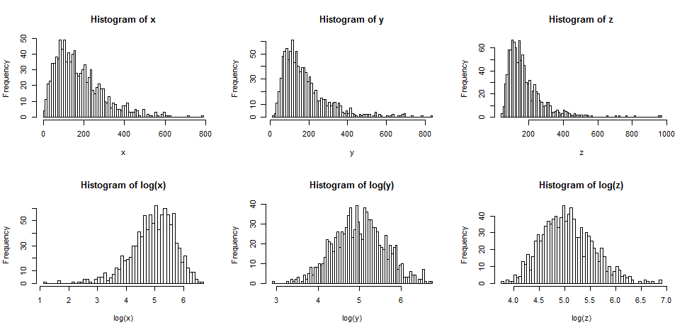

# USO DO LOG

Quando duas ou mais variáveis tem uma relação de log ou de raíz (formando um gráfico semelhante aos deles) nenhuma das regressões anteriores irá se encaixar. Devemos então fazer uma transformação nos dados (seja nos dados de X ou de Y ou em ambos) para converter essa relação em uma linear.

`Uma relação logaritmica então sempre será convertida em uma linear convertendo um ou mais de seus lados em log`.

Ao converter em log um dos lados estamos trabalhando por porcentagens ao invés de valores brutos. Assim uma mudança na var loggeada causa uma mudança A% na outra, tornando a relação entre eles de porcentagem.

Sempre que aplicar um log nos dados deve-se aplicar a função inversa (exponencial, seja $e^y$ ou $10^y$) na resposta final da regressão, voltando assim à unidade de medida original.

## QUAL BASE USAR

O normal é usar ou log na **base 10 ou ln** (na base e). Para análises de **correlação ou testes de hipóteses tanto faz** qual usará, ambos funcionam igualmente bem. A diferença vem quando vai usar para análise descritiva e apresentações.

- Use log10:
  - Engenharia
  - Acústica
  - Química
  - Ciências da terra
  - Relatórios gerenciais
  - Apresentar para público leigo
- Use ln:
  - Análise de derivada
  - Economia e finanças
  - Biologia

## TIPOS DE LOG

- Log-linear: executa log em Y
- Linear-log: executa log em X
- Log-log: executa log em ambas

## QUANDO USAR CADA LOG

1. Usar Log-linear (log em Y) quando:

- Tiver dados exponenciais 
  - Quanto mais x aumenta, mais y cresce
- Variância dos resíduos/erros varia muito, usa então para termos variância constante
- Tiver assimetria positiva (maiores valores a esquerda)

Isso significa que se x aumentar 1 y aumenta A%.

ex: y = 3x + 5. Se x aumena 1 y aumenta 300% (3x).

2. Usar Linear-log (log em X) quando:

- Tiver dados em formato de log ou raíz
  - Quanto mais x aumenta, menos y cresce

3. Usar Log-log (log em ambos) quando:

- Quer medir o impacto proporcional entre as variáveis
  - Quantos % Y muda para cada % de mudança em X

## QUANDO NÃO USAR LOGS

- Tentar transformar dados ruins (amostra mal coletada) em dados bons para análise (isso é uma forma de como mentir com estatística)
- Eliminar outliers (eles são dados reais e válidos e você estaria tentando escondê-los)
- Quando os dados tiverem assimetria negativa (maiores valores a direita)
  - Nesse caso deve-se usar **transformações de potência**

## PROVA DO LOG EM RELAÇÃO A ASSIMETRIA

Quando aplicamos um log nos dados ele tende a empurrar todos os dados para a direita. Assim uma distribuição muito à esquerda fica menos a esquerda, uma um pouco à esquerda fica próxima a normal e uma normal fica mais assimétrica à direita. Aplicar log em dados que já são concentrados à direita só aumentaria ainda mais a assimetria, deixando ainda mais à direita que antes.

Esse fenômeno acontece porque o log tende a aproximar os valores mais altos para próximo da mediana e os valores mais baixos para longe da mediana. Isso é facilmente visível no gráfico abaixo, aonde ao pegar a linha contínua (curva) e executar o log ela vira a reta tracejada. Ou seja, ela levanta os valores abaixo e acima da mediana.

## POR QUE NÃO USAR RAÍZ NO LUGAR DO LOG

Os logaritmos apresentam razões constantes. A diferença de aumentar 2 unidades em x quando ele é pequeno é proporcional a aumentar 2 unidades quando x é grande. Isso torna os logaritmos fáceis de interpretar, pois mudanças percentuais constantes se tornam uma mudança constante. 

Ele também diminui a variância, aproximando os dados da reta. Muitas vezes dados com menos variâncias são até mais valiosos que dados normais, então o log ganha força por esse ponto também.

## TRANSFORMAÇÃO DE POTÊNCIA

É o inverso do log, elevando o valor das variáveis que quer transformar (X ou Y) ao quadrado. Eleva-se ao quadrado por é o número inteiro mais próximo da base de ln (log mais usado).

Essa transformação é usada quando os dados tem assimetria negativa (maiores valores a direita).

Essa transformação também reduz a variância, aproximando os dados.