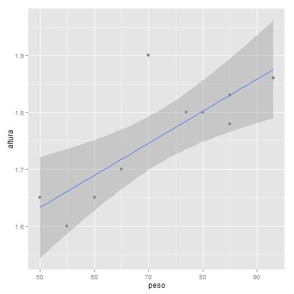
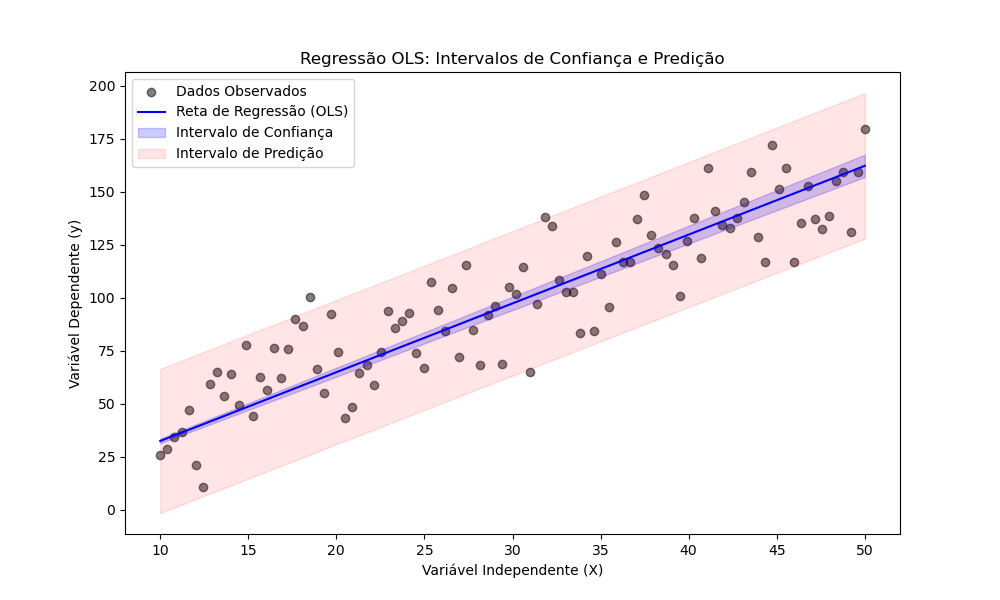

# COMO FAZER REGRESSÃO

## MÉTODOS DE CALCULAR

Existem 1 método principal e alguns mais específicos para casos especiais. Todos com a mesma base: coeficiente de correlação. O método principal, as vezes até confundido com a própria regressão linear é os **mínimos quadrados**. Ele é usado em todos os exemplos de regressão linear sem distinção de onde termina a regressão em si e começa os mínimos quadrados. Os métodos mais comuns são:

- Minimos quadrados (OLS)
  - Principal
- Mínimos quadrados ponderados (WLS)
  - Variação do original aonde cada ponto tem um peso
  - Dá peso a outliers, diminuindo sua influência no cálculo
  - Cada ponto tem um peso associado
  - Usado quando tem heteroscedasticidade (variância nos erros)
  - **Uso ideal**: quando conhecemos previamente as incertezas dos dados
    - Ex: medições feitas com instrumentos de diferentes precisões ou bases de dados com características diferentes, onde a incerteza de cada medição é previamente conhecida
-Mínimos quadrados Robustas (RLS)
  - Semelhante ao ponderado, também dá peso a outliers para diminuir sua influência
  - Faz de forma iterativa, recalcula a reta toda vez que encontra um ponto muito discrepante
  - Usado quando tem outliers muito fora da curva
  - Usado quando não cumpre as premissas (erros normais e homocedasticidade)
  - **Uso ideal**: quando não conhecemos previamente as incertezas dos dados
    - Ex: dados possuem erros de medição, de digitação ou outros que distorçam gravemente
- Gradiente descendente 
  - Usado quando tem muitos dados e muitas variáveis
  - Ideal para big data e treinamento em tempo real
  - Variações:
    - Em Lote (Batch)
    - Estocástico (SGD) 
    - Em Mini-Lotes
- Regularização
  - Usado quando as variáveis independentes são muito correlacionadas entre si 
  - Evita overfitting
  - Variações:
    - Ridge (L2)
    - Lasso (L1)
    - Elastic Net (combinação dos 2)

## ERRO

`Erro (ou resíduo) é a diferença entre o valor real e o valor da reta/estimado (valor da regressão). Ele mede a distância de cada ponto verdadeiro da reta.`

Já que a regressão define a melhor reta que descreve os pontos, a que melhor se aproxima, ela não é perfeita. Impossível passar em cima de todos os pontos sendo uma reta. Assim, alguns pontos podem passar exatamente em cima da reta, mas a maioria vai passar próximo. A distância do ponto (dado real usado para criar a reta) da reta para o mesmo X é o erro ou resíduo.

**O objetivo da regressão é definir a reta com menor erro médio possível**. Ou seja, a **dispersão dos pontos em volta da reta** tem de ser a mínima possível. Isso significa ter a menor variância dos resíduos/erros.

e = real - previsto = y - ŷ

## PREMISSAS

Para dizer que a regressão é confiável 3 condições tem de ser seguidas pelos resíduos:

- Erros serem normais
- Variância dos erros constante
- Erros independentes (para séries temporais)

### 1. Os resíduos devem seguir a distribuição normal

Como validar:

- Teste de Shapiro-Wilk ou Jarque-Bera
- QQ-Plot e Histograma dos resíduos

Caso não seja normal você pode fazer uma **transformação nos dados originais** (ex: log), **recalcular a regressão e tentar novamente**

### 2. Variância constante dos erros

**A dispersão dos erros deve ser aleatória**. Isso significa que não deve haver mais ou menos erro em alguma faixa de valores. A regressão deve errar igualmente para valores pequenos ou grandes. O gráfico abaixo mostra isso, pois para valores pequenos o erro é praticamente 0, para valores medianos o erro é pequeno (mas maior que zero) e para valores grandes o erro é enorme.

Para comparar fazemos um gráfico de dispersão entre Var Independente (x) e os erros. **Não deve existir nenhum padrão nesse gráfico VarX x Erro**.

A imagem abaixo mostra 3 exemplos desse gráfico, com a Var X no eixo x e os erros no eixo Y. No primeiro não há padrão, portanto os erros são igualmente dispersos. No segundo os erros são menores no início (mais próximos de 0) e maiores no final, indicando que a regressão acerta bem pra valores pequenos e erra muito para valores altos. No terceiro gráfico mostra uma dispersão em forma de polinômio, também longe de ser aleatório.

Como validar:

- Teste de Breusch-Pagan
  - Quando acreditamos que os erros seguem um padrão linear
  - É péssimo em identificar variâncias não lineares
  - P-valor > alfa para não rejeitar H0
  - **É mais restrito mas tem maior poder estatístico**
- Teste de White 
  - Quando não souber a forma da variância ou suspeitar de padrões não lineares
  - Mais geral, não supõe linearidade
  - Por ser mais geral, tem maior chance de erro tipo 2 (dizer que é constante quando não é)
    - Ou seja, menos preciso
  - Testa se os erros seguem um padrão não linear (polinomial ou log)
  - P-valor > alfa para não rejeitar H0
- Gráfico de dispersão VarX x Erro

OBS: Levene não é adequado para validar a regressão linear porque ele serve para comparar grupos discretos e na regressão linear só temos 1 grupo (os erros).

Caso os erros não sejam constantes você pode:

- Refazer a regressão com outros dados (trocar os valores da var X)
- Usar transformação nos dados originais, recalcular a regressão e tentar novamente
- Usar regressão polinomial ou logística
- Atribuir pesos menores às observações com maiores variâncias (mínimos quadrados ponderados)

### 3. Os erros devem ser independentes

Verificado quando temos variáveis temporais ou espaciais (**séries temporais**). Pois nesse cenário o valor anterior influencia o valor atual (ex: mercado de ações). Os erros devem ser aleatórios e não ser influenciado pelos erros próximos, mesmo que a natureza das séries temporais seja essa relação. Caso seus erros tenham 
dependência então **sua regressão fica enviesada a dar respostas erradas quando encontra certo padrão**.

Podemos plotar um gráfico dar var temporal (seja ela X ou Y) x os erros. A var temporal fica no eixo X (independente se ela era a var X ou Y) e no eixo Y nossos erros.

**A dispersão dos erros deve ser aleatória**. Não deve existir nenhum padrão nesse gráfico.

O gráfico abaixo mostra um exemplo de dados dependentes. Para valores pequenos (no início do gráfico) ele cresce (mostrando que há uma tendência de subida), no meio é aleatório (**queremos esse padrão de sobe e desce aleatório por todo o gráfico**), pois não há tendência clara nem de subida como descida e no final ele desce forte e depois sobe forte.

Como validar:

- Teste de Durbin-Watson
  - Testa se um erro está relacionado com o anteior e o próximo
  - Infelizmente só testa correlação com o dado imediatamente anterior/posterior
- Gráfico de linha VarTemporal x Erro

Caso encontre dependência você pode:

- Usar transformação nos dados originais, recalcular a regressão e tentar novamente
- Usar regressões específicas para séries temporais (ARIMA e regressão com erros defasados)

## INFERÊNCIA COM REGRESSÃO

Como estudamos, a inferência tem 2 técnicas, o intervalo de confiança e o teste de hipótese. Ambas funcionam como uma forma de testar se a correlação entre as variáveis é realmente significativa, mas medem coisas diferentes da correlação em si. Enquanto a correlação nos diz a força entre as variáveis, a inferência nos dá **uma faixa para essa relação e testa se essa relação é estatisticamente relevante**.

### INTERVALO DE CONFIANÇA

O intervalo nos diz quais os possíveis valores que o coeficiente A (que multiplica x) e B estão. Também podemos medir se X é realmente significativo em Y ou não (se podemos desconsiderar a correlação entre eles). Para isso verificamos se o intervalo é todo positivo ou todo negativo. Caso seja então o valor de X é significativo na definição do valor de Y.

Isso acontece pois, caso haja um 0 dentro desse intervalo (uma ponta do intervalo seja negativa e a outra positiva) então há a chance de multiplicarmos X por 0, portanto não haver relação nenhuma entre eles.

### TESTE DE HIPÓTESE

O teste de hipótese em cima da regressão (linear e polinomial) testa de A (que multiplica x) é significativamente diferente de 0. Pois se A=0 então x é cortado da equação e não afeta Y de nenhum modo. Ele **faz mais sentido em regressão múltipla ou um polinomial**.

$H0: todos os A = 0$, sem relação entre X e Y 

Portanto H0 diz que X **não é significativo** para prever Y.

$H1: pelo menos um A \ne 0$, com relação entre pelo menos 1 X e Y

Portanto H1 diz que X (ou o modelo de regressão como um todo no caso da Anova) é significativo para prever Y.

Portanto, queremos um **p-valor > alfa** para rejeitar H0 e validar o modelo. Usamos H0 como uma negação pois nossas opções são rejeitá-lo ou inconclusivo (não rejeitá-lo). Não rejeitar não prova o modelo, portanto não responde nossa pergunta.

Os testes usados para validar é o teste T e a **Anova/teste F**. O teste T é usado na regressão simples para ver se $A \ne 0$ e a Anova na múltipla para ver se ao menos algum X afeta Y (se algum $A_i é \ne 0$). Caso a Anova encontre relação é rodado o teste T para cada X para encontrar quais são relacionados (**teste T é o post hoc da Anova**).

A diferença para regressão polinomial é que ele mede os A que muliplicam $x^2$ em diante.

#### CHECKLIST DE TODOS OS TESTES A PASSAR

Juntando os testes das premissas com o da própria regressão, esta é a lista de testes a serem executadas para regressões simples ou múltiplas.

- Anova
  - Teste T como post hoc
- Jarque-Bera
- Breusch-Pagan
- Durbin-Watson (para séries temporais)

### INTERVALO DE PREDIÇÃO

Essa nova técnica de inferência nos diz o intervalo de valores que Y pode ter para um determinado valor de X. Ele é como um intervalo de confiança para cada valor de X, pois nos diz o intervalo que Y pode estar com um nível de confiança. 

Ex: em 95% das vezes Y vai estar nessa faixa para esse valor de X.

`O intervalo de confiança dá o intervalo para o coeficiente A, o intervalo de predição dá o intervalo para Y dado X = alguma coisa.`

Importante: o intervalo cresce conforme se distancia da média de X, onde ele tem variância mínima. Ele tem formato de ampulheta, sendo cada vez menos preciso conforme distanciamos do centro dos dados de treino.

O intervalo de predição só é preciso em caso de homocedasticidade.

Abaixo vemos um exemplo do intervalo de confiança e de predição com seus dados.

