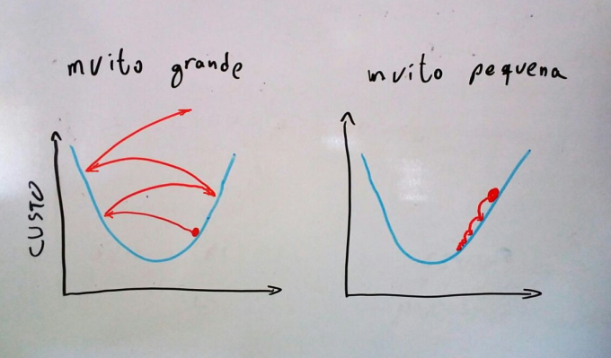
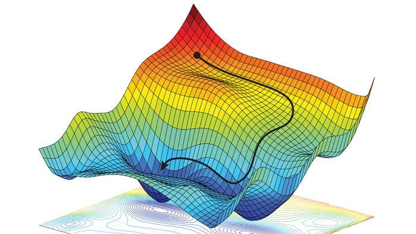
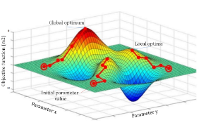
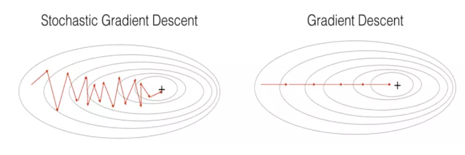
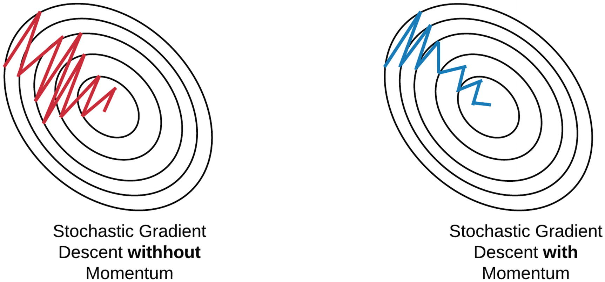

# GRADIENTE DESCENDENTE

É outra técnica de regressão, usada no lugar dos mínimos quadrados. Sua equação é

$$A_{novo} = A_{velho} - txAprendizado * \frac{\delta fnCusto}{\delta A}$$

Ou seja, é um algoritmo iterativo que vai atualizando os coeficientes até eles pararem de mudar ou mudarem muito pouco. E usa uma derivada para apontar o caminho para o caminho desejado.

O coeficiente inicial $A_{t0}$ é aleatório. Começamos com uma reta aleatória, medimos quão alto estão os erros e ajustamos os coeficientes para um novo valor $A_{t1}$. A taxa de aprendizado é o "tamanho do passo", a velocidade com que iremos nos aproximar/convergir para o resultado final. Porém uma taxa de aprendizado muito alta pode nos fazer não conseguir bater no valor ótimo. A taxa de aprendizado é uma constante. A função de custo mede quão longe estamos do mínimo local (valor ideal com menor erro quadrado possível) e para que direção devemos ir. Também influencia no tamanho do passo, pois quanto maior o erro, mais longe estamos do objetivo e maior o passo.

## SIGNIFICADO DE CADA PARTE

Por ser um método iterativo, ele sempre calcula sua nova posição a partir de onde você está agora (Estou aqui, para que lado irei dar o próximo passo?). Por isso ele usa o coeficiente anterior para incrementar a partir da posição atual (posição atual + passo em tal direção).

O fato de subtrair se deve a derivada parcial sempre apontar para a direção em que o valor cresce mais rápido. Como queremos diminuir então invertemos o sinal.

A taxa de aprendizado é uma constante que diz quão rápido iremos convergir para o vale. Ele também é chamado de **tamanho do passo**. Seu valor muitas vezes é descoberto por tentativa e erro ou algo empírico. Não há método para encontrar a melhor taxa. A taxa de aprendizado também tem o dever de trazer sua função de custo para a mesma escala de grandeza do coeficiente. Imagina que a derivada da função nos dá um valor na casa dos milhares e o coeficiente está na casa das dezenas. A inclinação da reta iria ficar mudando drasticamente sem nunca convergir, como se cada passo a gente atravessasse um país inteiro, passando reto por vales e montanhas. A taxa de aprendizado resolve isso colocando todo mundo na mesma escala de tamanho.

Uma forma de visualizar isso é com a imagem abaixo. Ela mostra o que acontece quando a taxa de aprendizado é muito alta ou muito baixa. Quando é muito alta ela dá saltos enormes, passando reto pelos vales e assim nunca encontrando o valor mínimo porque seu menor passo é muito grande para a escala do vale. Por outro lado quando ele é muito pequeno ele anda de forma extremamente lenta, dando passos minúsculos e demorando uma eternidade para convergir para o fundo do vale. Isso é especialmente demorado quando temos muitas variáveis, o que torna o tempo de cálculo grande.

A derivada da função de custo nos dá a direção para onde ela cresce mais rapidamente. Como a derivada igual a 0 nos dá os topos e mínimos, ao derivar a função que calcula o erro e igualá-la a zero encontramos quão longe e para que lado está o menor erro. Ela é a nossa bússola, dando a direção que devemos ir. Além disso ela também ajuda a ajustar o tamanho do passo, dando passos maiores quando estamos muito longe e menores quando estamos muito perto. Afinal não faz sentido darmos passos do mesmo tamanho sempre. Se estamos muito longe do mínimo podemos dar passos maiores e acelerar o processo. Quando o erro é pequeno a derivada também dá um valor pequeno e com isso o passo diminui. Claro que a taxa de aprendizado ainda tem a função de converter tudo para a mesma escala e ainda pode impedir de encontrar o fundo por não deixar o passo diminuir o suficiente.

## EXPLICAÇÃO DO NOME

Pense no gráfico de sua função de custo. Ela diz o quão alto está seu erro. Pontos altos (montanhas) indicam alto erro e pontos baixos (vales) indicam baixo erro. A melhor forma de visualizar é com uma regressão múltipla com 2 vars independentes, formando um gráfico 3D. Os eixos X e Y são as vars independentes e o eixo Z é a var dependente que estamos calculando. O objetivo portanto é encontrar o menor fundo possível (por isso descendente).

Para saber onde fica o ponto mínimo fazemos a derivada e igualamos a zero. Isso nos dá a equação aonde ela tem um valor mínimo (local ou global), onde todos os valores em volta são maiores que ele. Por isso o nome gradiente, pois para cada coeficiente calculamos uma derivada em relação a ele, e derivadas múltiplas são chamadas de gradiente.

## EXPLICAÇÃO VISUAL

Nós começamos em um ponto aleatório do gráfico, definido pelos coeficientes iniciais aleatórios. A função de custo nos diz o tamanho do erro (quão longe estamos dos pontos medidos). Derivando a função e igualando a zero temos o ponto onde a função que mede o erro é zero (ou seja, o ponto onde ela é maior ou menor possível).

`Usamos na equação a função que a derivada forma, não a função de custo original.`

Essa derivada pode ser entendida como um vetor que aponta para um lado. Entendendo a derivada como um vetor, vemos que ela aponta sempre para o topo (nos diz como seguir sempre crescendo). Esse apontamento se dá pelo sinal da equação, sendo positivo para o lado em que a equação original (não a derivada) segue crescendo. Como queremos o ponto mínimo, vamos para o lado oposto, por isso invertemos o sinal (subtraímos) a derivada. Isso nos faz descer no gráfico.

#### Nomes das regiões do gráfico

O gráfico pode ter diversas montanhas e vales, vários mínimos locais (onde ele é menor que todos os pontos vizinhos) e só 1 ponto onde ele é o menor de todo o gráfco (mínimo global). 

Chamamos de mínimo local o ponto em que qualquer mudança pequena fará o valor na equação original (não na derivada) aumentar. Todos os pontos ao redor são maiores. Também chamado de vale. Porém o mínimo local não é o menor ponto que existe, é o menor ponto daquela região só.

O mesmo vale para o máximo local. É o topo de uma montanha, aonde qualquer mínima mudança fará o valor original (não na derivada) diminuir.

Já o mínimo global é o vale mais profundo que existe. O máximo local é a maior montanha que existe no gráfico.

Por fim, o platô é uma região plana, aonde todos os valores em volta tem a mesma altura. Mudar para qualquer lado não altera em nada o valor e não há indicação para que lado ir. Esse é o pior cenário possível e é mostrado mais a frente como lidar com ele.

#### O MÉTODO NÃO DÁ O MELHOR RESULTADO SEMPRE

Como sempre começamos de um ponto aleatório, o ponto de partida nunca é o mesmo lugar. Isso faz que cada vez encontremos um vale diferente. Podemos iniciar na mesma montanha porém em lados diferentes, assim caindo para regiões diferentes. Podemos começar em outra montanha. Assim Executar o gradiente várias vezes e guardar o melhor resultado pode ser interessante.

Além disso, o algoritmo irá parar ao encontrar um mínimo local. Talvez (e provavelmente) haja um mínimo ainda menor, mas o algoritmo para no primeiro vale que encontra, pois ao tentar mudar para qualquer lado dará um resultado pior. Por isso a repetição do algoritmo várias vezes se torna interessante.

Isso tudo mostra que o **gradiente descendente não dá o melhor valor possível** (mínimo global). Mesmo repetindo nada garante que irá encontrar o mínimo global. Além de que **não há como saber que aquele vale é o mínimo global sem testar todos os mínimos**, o que é impossível.

Para a repetição do gradiente várias vezes, é preciso não só guardar os coeficientes do menor vale encontrado até o momento como todos os coeficientes já testados para garantir que não irá testar nenhum próximo a nenhum deles.

## EXPLICAÇÃO DO VETOR DO GRADIENTE

Como temos várias variáveis independentes (ao menos 2 para formar um gŕafico 3D) ao derivarmos a equação de erro em relação a cada variável temos uma lista de novas equações, cada uma referente a uma variável.

Ex: a equação $f(x,y) = x^2 + 2y^2$ resulta em 2 derivadas. A derivada em relação a x fica $\frac{\delta f}{\delta x} = 2x$ e em relação a y fica $\frac{\delta f}{\delta y} = 4y$. Podemos descrever o gradiente como $\nabla f(x,y) = (2x, 4y)$

Podemos visualizar isso como um vetor, cada variável independente (ou cada coeficiente, no caso da regressão) terá uma derivada e, por consequência, uma equação própria. 

Se a gente pensa só em um coeficiente não consegue pegar a ideia, pois está com o pensamento limitado a 1 dimensão. Mas ao pensar em juntar todas as equações da derivada em uma só temos um vetor e, portanto, uma direção. 

Essa direção aponta sempre para o topo, o ponto mais alto da montanha. Isso acontece porque a derivada é a inclinação da reta tangente e, quanto mais íngreme, maior seu valor. Ou seja, o vetor aponta para o rumo onde a tangente fica mais íngreme(onde a derivada cresce mais rapidamente).

No exemplo acima, se eu estiver no ponto x=1 e y=2 e quero saber para que lado a subida é mais íngreme (onde a equação cresce mais rápido), basta usar usar as equações das derivadas. f(1,2) = (2x, 4y) = (2 * 1, 4 * 2) = (2,8). Ou seja, o ponto vizinho mais alto é o ponto (2,8).

## EQUAÇÃO DO GRADIENTE PARA REGRESSÃO LINEAR

A equação de custo é a única parte que muda de acordo com o contexto. Entre uma regressão e uma rede neural a única coisa que muda é a função de custo implementada. No contexto de regressão linear a equação de custo é a variância dos erros.

$custo = \sum{e^2} = \sum{(y_i - ŷ_i)^2}$, a dispersão dos erros em relação a reta.

Como a regressão (ŷ) é $A_0 + A_1x_1 + A_2X_2 + ... + A_nx_n$ podemos reescrever a função de custo como:

$custo = \sum{(y_i - (A_0 + A_ix_i))^2} = \sum{ y_i^2 -2y_i(A_0 + A_ix_i) + (A_0 + A_ix_i)^2} = \sum{y_i^2 - 2A_0y_i - 2A_ix_iy_i +A_0^2 + 2A_0A_ix_i + A_i^2x_i^2}$

A partir daqui derivamos essa equação em relação a cada coeficiente. Como queremos descobrir o valor dos coeficientes é em relação a eles que devemos derivar e igualar a zero. A partir daqui teremos k equações, uma para cada coeficiente.

$\frac{\delta f}{\delta A_0} = \sum{-2y_i + 2A_0 + 2A_ix_i} = 2\sum{-y_i + A_0 + A_ix_i} = 2\sum{ŷ_i - y_i}$

$\frac{\delta f}{\delta A_i} = \sum{-2x_iy_i + 2A_0x_i + 2x_i^2A_i} = 2\sum{(-y_i + A_0 + x_iA_i)x_i} = 2\sum{(ŷ_i - y_i)x_i}$

Com isso a equação das nossas derivadas são

$$\delta A_0 = 2\sum{ŷ_i - y_i}$$

$$\delta A_i = 2\sum{(ŷ_i - y_i)x_i}$$

## COMO LIDAR COM PLATÔS

Para não ficar preso numa região aonde todos os valores vizinhos são iguais ao atual e não há um apontamento para onde ir, usa-se uma dessas 3 técnicas.

1. Otimizador do algoritmo

- Existem para **agilizar o algoritmo** (não atoa se chamam otimizadores), mas também servem para evitar platôs
- A equação passa por uma alteração (momentum) que continua movendo o algoritmo, mudando os coeficientes sempre um mínimo necessário para ele continuar andando
- É como se o modelo tivesse pego velocidade na descida e continua se movendo na inércia
- Algoritmos principais: estocástico (SGD) e Adam
  - Estocástico: adiciona um peso novo baseado no peso anterior
  - Adam: altera a taxa de aprendizado de acordo com o gradiente, tornando-o menor ou maior conforme a tangente muda
- O Adam é preferível, sendo mais rápido para convergir

O Adam usa a 1ª derivada para saber a direção em que deve empurrar o modelo e a segunda para saber a aceleração (o quão rápido a tangente está mudando), assim ajustar o valor da taxa de aprendizado para o melhor valor de acordo com a inclinação da região.

2. Redução da taxa de aprendizado

- Diminui a taxa de aprendizado a cada iteração, permitindo saltos grande no início e pequenos conforme o tempo passa para fazer ajuste fino
- Diminui a taxa de aprendizado somente quando o gradiente para de diminuir

3. Ruído

- Alterar levemente os valores originais de $X_i$ para "chacoalhar" o modelo e jogá-lo em outra região
- Faz o modelo dar saltos aleatórios, escapando de platôs
- Algoritmos principais: Dropout e Estocástico
  - Dropout: zera aleatoriamente alguns coeficientes para empurrar o modelo para algum lado
  - Estocástico: Ao invés de calcular todos os coeficientes toda iteração, calcula hora uns, hora outros, fazendo a descida ser em zigue-zague

## CRITÉRIOS DE PARADA

As iterações devem parar quando:

- Todos os coeficientes variarem menos que um limiar (chegou a um platô ou vale)
  - Isso também significa que o gradiente deu um resultado abaixo do limiar
- Quando atingir um limite máximo de iterações

Outro método de definir parada é no final de cada iteração executar os testes com os dados de teste e salvar a quantidade de acertos. Se a quantidade de acertos nos testes diminuir em relação a iteração anterior e o gradiente continua descendo significa que está tendo overfitting e deve parar.

## GRADIENTE ESTOCÁSTICO

Usado quando temos muitos dados (na casa de dezenas ou centenas de milhares). O processamento para calcular o gradiente de todos eles toda iteração é pesadíssimo, além do consumo de memória.

O grandiente estocástico atualiza um grupo reduzido de coeficientes a cada iteração. Todas são iniciadas com valores aleatórios e todas são usadas em todos os loops, mas só um grupo é atualizado. A quantidade de lotes (grupos) vai variar da sua memória, processador e tamanho dos dados.

`O estocástico demora muito mais passos para convergir, mas economiza muito tempo e processador e é ideal para quando tem dados massivos.`

O caminho feito acaba sendo muito mais errático, como se fizesse zigue-zague ou cambaleando.

O estocástico adiciona ruído naturalmente na sua descida, o que também o ajuda a não ficar preso em platôs, pois pode atualizar coeficientes diferentes e saltar. Ele também é muito usado junto com um momentum para tentar diminuir a oscilação e torná-lo ainda mais rápido. 

O **momento também faz ele saltar por mínimos locais muito pequenos**, ignorando vales pequenos. **Isso pode acabar aumentando o tempo de treino**, então é algo a se analisar a cada caso.

O cálculo do gradiente com momento fica

$A_{novo} = A_{velho} - txAprendizado * M_{novo}$, aonde M é o momento, o grandiente com peso.

O cálculo do momento é

$M_{novo} = \frac{\delta fnCusto}{\delta A} + M_{velho} * C$

Ou seja, o momento é calculado como um peso que leva seu peso anterior, acumulando velocidade como uma bola de boliche ganhando velocidade conforme desce o gráfico. O momento anterior é multiplicado por uma constrante C que varia entre 0 e 1.

`Como falado anteriormente, o peso e a velocidade podem fazer o modelo passar reto no mínimo local por estar muito rápido (dando saltos mais altos que a versão sem momento).`

