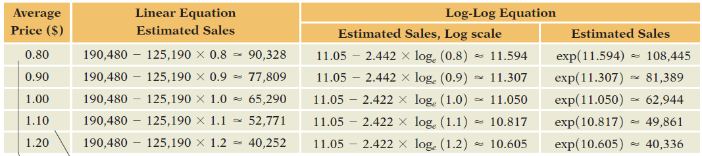

# CÁLCULO DE PREÇO IDEAL

Como encontrar o melhor preço para um produto considerando seu custo de produção e a quantidade de vendas conforme o preço muda. Quanto maior o preço, menos você vende, então você quer saber onde fica o ponto ótimo.

## Escala Log-Log

A transformação log-log (módulo 10) mostra como a mudança na porcentagem de uma variável muda a porcentagem de outra. Sendo mais específico, mostra como mudar 1% o preço afeta na porcentagem de vendas.

Precisamos também fazer uma regressão linear nos dados de venda (preço x quantidade de vendas) com ambos os eixos convertidos em log. Só então a partir da reta de regressão encontraremos o valor ideal.

Importante: **só podemos executar o cálculo se todas as premissas da regressão forem válidas** (os resíduos encaixarem em todas as regras). Também **não podemos fazer a regressão para os dados originais**, pois os dados originais não irão encontrar o ponto ideal. **Apenas a escala log-log é capaz de encontrar esse ponto ideal** devido sua característica de medir mudanças percentuais.

## Como Calcular

$$PI = custo * \frac{A}{A+1}$$

Aonde

- PI é o preço ideal, maximizado
- Custo é o custo de produção do produto
- A é a inclinação da reta de regressão (coeficiente angular)
  - É o coeficiente na escala log-log
  - Geralmente A é negativo

O coeficiente angular (A) é chamado de **elasticidade** e diz muito sobre o comportamento do preço.

Nosso coeficiente angular representa:

A = % variacao das vendas / % variacao do preco

## Efeito da Elasticidade

Esse efeito considera o valor absoluto de A, sem o sinal

**Elasticidade alta (|A| > 1)**

- As vendas variam muito com uma pequena mudança no preço
- Ex: produtos manufaturados e bens de consumo rápido

**Elasticidade baixa (|A| < 1)**

- As vendas variam pouco mesmo com grandes mudanças no preço
- Ex: produtos agrícolas sazonais ou terrenos à beira-mar

**Elasticidade nula (|A| = 1)**

- As vendas mudam perfeitamente proporcional à variação do preço

## Processo

#### Passo 1: testar em diversos valores

Defina datas e períodos iguais para a troca de preço do produto. Anote o preço e a quantidade de produtos vendido no período.

#### Passo 2: converta os preços e a quantidade de vendas para log

No caso, log é ln.

#### Passo 3: faça a regressão linear

Use o método dos mínimos quadrados.

#### Passo 4: valide os resíduos

Apenas se os resíduos passarem em todos os testes podemos executar nossa equação.

#### Passo 5: faça o cálculo

Execute o cálculo a partir do A mostrado no início do documento.

## Exemplo

A tabela abaixo mostra os diversos preços ao qual o produto foi vendido e na coluna final a quantidade de vendas para ele segundo a reta da regressão linear. O mercado trocou o preço toda semana por 2 anos.

Nela podemos ver que aumentar o preço de 0,80 para 0,90 centavos (só 0,10 centavos de diferença) ocasionou mais de 27mil vendas a menos. Porém aumentar de 1,10 para 1,20 (os mesmos 10 centavos) a mudança foi de apenas 9 mil.

Com preço de fabricação de 0,60 e A = -2,44, calculamos

$p = 0,6 * \frac{-2,44}{-1,44} = 1,02$