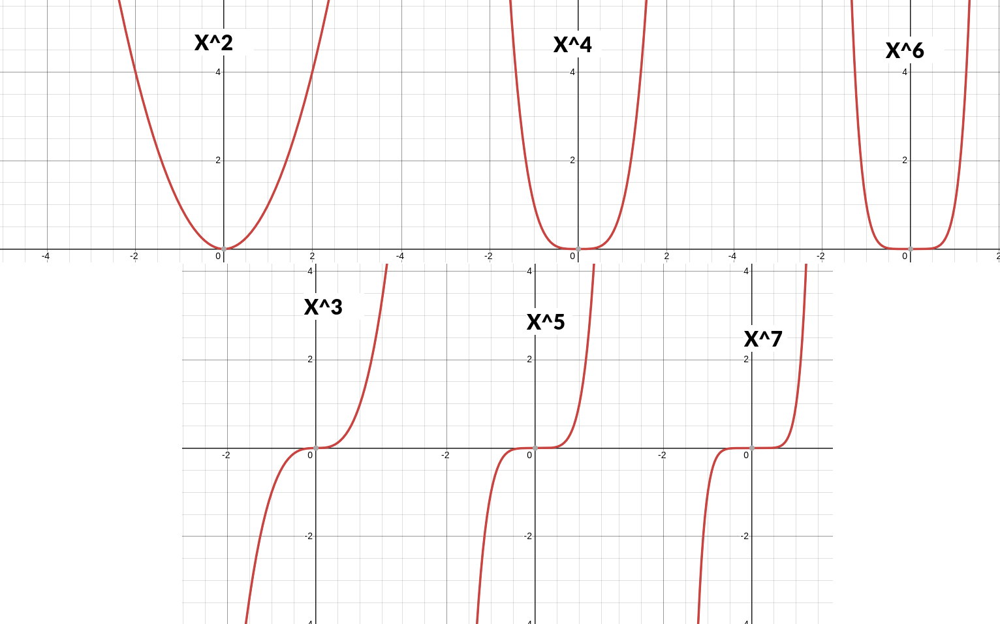

# REGRESSÃO POLINOMIAL

É a regressão linear múltipla quando temos expoentes nas variáveis. 

$$y = A_0 + A_1x_1 + A_2x_1^2 + A_3x_1^3 ... + A_kx_1^k$$

Repare que usamos a mesma variável em todos os expoentes. Como não sabemos qual expoente tá sendo usado (ou qual combinação deles é usada) colocamos todas as variáveis presentes em todos os expoentes e ainda um coeficiente multiplicando cada combinação de variáveis. Caso tivéssemos 2 variáveis independentes, as duas seriam usadas com todos os expoentes e ainda teríamos um coeficiente multiplicando $x_1x_2$.

No final a quantidade de coeficientes a serem definidos são 

Total Coeficientes = $mk + 1 + \frac{m!}{2!(m-2)!}$, aonde

- k é a quantidade de expoentes que usarei
- m é a quantidade de variáveis independentes que tenho

O ponto mais importante da regressão polinomial é que você `precisa definir até que potência usará de antemão! Não tem como testar a regressão para um número indefinido de graus.`

## FORMA DE CALCULAR

A regressão polinomial é igual a linear e usam os mesmos métodos. Será usado os mínimos quadrados ordinais ou outra variação, a única diferença é que tem muito mais coeficientes, já que usam as mesmas variáveis em k coeficientes.

Ao fim a regressão diz por qual coeficiente e por qual expoente você deve elevar cada variável (ou uma combinação de vários expoentes) para chegar mais próximo de alcançar esses valores.

As medidas de adequação também são as mesmas do linear (R², AIC/BIC, desvio dos erros).

## PROBLEMAS COM OVERFITTING

Quanto mais variáveis você usa maior a chance de overfitting. Portanto o **polinomial é muito mais propenso a overfitting** pois repete a mesma variável k vezes. Por isso não é usado regressão polinomial com muitos graus. Geralmente usa-se somente até o grau 3. Para decidir o total de graus é olhado o gráfico de dispersão.

Caso os pontos originais tenham um formato que pareça linear é feito a regressão linear normal. Se parecerem formar uma parábola é usado o polinomial com grau 2 e caso forme um S é usado o grau 3. Todos os graus pares tem um formato semelhante ao do grau 2 e todos os ímpares ao do grau 3, só mudando a inclinação do crescimento. A regressão tentará compensar o grau errado aumentando os coeficientes (uma fórmula que usa grau 6 mas teto aproximar de um grau 2).

Outra solução é começar testando com graus baixos (2 ou 3) e fazer uma nova regressão com 1 grau a mais e comparar as medidas de adequação (R², desvio dos erros e AIC/BIC) para ver se houve ganhou significativo ao incluir o grau extra. Caso haja continuamos aumentando até encontrar o maior grau que o seguinte descreva pior o grupo de dados. Devemos comparar também o resultado do teste T para o novo coeficiente e ver se é menor que alfa. Se for maior é sinal que ele é insignificante e devemos parar no grau atual.

Em resumo, siga o passo-a-passo abaixo:

- Comece com grau 2 ou 3 a depender do formato dos dados no gráfico de dispersão
  - Na dúvida comece com grau 2
- Verifique se os coeficientes passam no testes T e guarde o valor de r²
- Execute com 1 grau a mais
- Verifique se o novo coeficiente passa no teste T e compare o novo r² com o antigo
  - O novo deve ser significativamente maior e passar no teste T
- Continue enquanto os graus continuarem passando nos requisitos

## PROBLEMAS COM MULTICOLINEARIDADE

Por usar as mesmas variáveis em diversos coeficientes a regressão acaba caindo em alertas de multicolinearidade. Métodos de evitar multicolinearidade não funcionam tão bem neles por conta disso, pois vai dar que todas as variáveis são correlacionadas (afinal, são as mesmas).

Para diminuir a multicolinearidade temos 3 soluções.

**1. Usar a diferença da média** 

Ao invés de usar os dados X diretamente, usamos a diferença deles para a média $(x_i - media_x), (x_i - media_x)^2...$

**2. Padronizar os dados**

Colocamos todos os dados entre 0 e 1

$x_i = \frac{x_i - media_x}{desvio_x}$

**3. Usar técnicas de regularização**

Usar regressão com Ridge ou Lasso.
