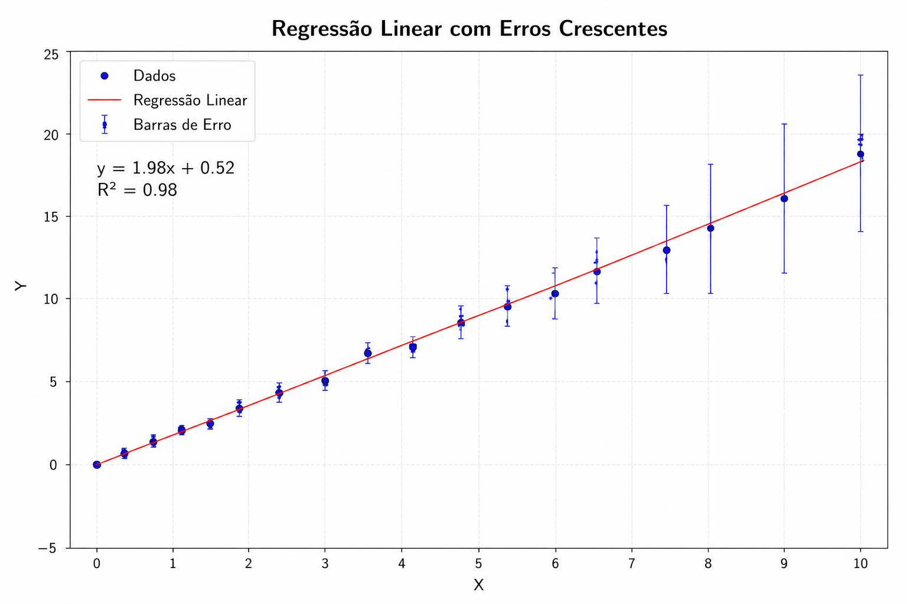
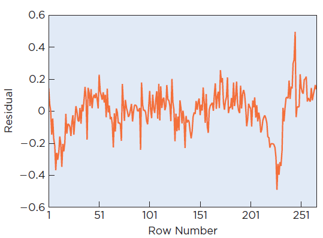

# REGRESSÃO LINEAR

- Assume que a relação entre as variáveis é linear (pode ser descrita por uma reta)
- A relação é constante (não explode como uma exponencial) ou vai diminuindo a força da relação (como um logaritmo)

A regressão linear simples vai formar uma equação de 1º grau

$y = a*x + b$

Aonde

- x é a variável (ou variáveis) independente
- y é a variável dependente
- a é o coeficiente angular (grau de inclinação da reta)
- b é o coeficiente linear (onde a reta corta o eixo Y ou o valor de Y quando x=0)

## SIGNIFICADO DOS COEFICIENTES

1. Coeficiente angular (a)

- Revela o quanto a var X influencia Y
- Quanto maior, mais forte é a influência
- Diz se a influência é proporcional ou inversa (positiva ou negativa)

2. Coeficiente linear (b)

- Também chamado de **intercepto**
- É um valor fixo
- Diz o valor de Y quando X=0 
  - Importante avaliar se faz sentido no seu cenário X ser 0 e o que isso pode significar
  - Nem todo contexto permite X=0, então alguns buscar entendê-lo não faz sentido
- Exemplos do que pode representar:
  - O custo base ou inical, que você sempre terá, independente de X
  - Seu ponto de partida, de onde os valores começam

## MÉTODOS DE CALCULAR

minimos quadrados

tem algum outro??

## INFERÊNCIA

A seguir mostro como calcular os intervalos e fazer teste de hipótese para a regressão linear simples.

### INTERVALO DE CONFIANÇA

???

### INTERVALO DE PREDIÇÃO

???

### TESTE DE HIPÓTESE 

???

## ANÁLISE DE RESÍDUOS

Precisamos verificar 3 coisas nos resíduos para dizer que a regressão é confiável

**1. Os resíduos devem seguir a distribuição normal**

Como validar:

- Teste de Shapiro-Wilk ou Kolmogorov-Smirnov
- QQ-Plot e Histograma dos resíduos

Caso não seja normal você pode fazer uma **transformação nos dados originais** (ex: log), **recalcular a regressão e tentar novamente**

**2. Variância constante** 

**A dispersão dos erros deve ser aleatória**. Isso significa que não deve haver mais ou menos erro em alguma faixa de valores. A regressão deve errar igualmente para valores pequenos ou grandes. O gráfico abaixo mostra isso, pois para valores pequenos o erro é praticamente 0, para valores medianos o erro é pequeno (mas maior que zero) e para valores grandes o erro é enorme.

Para comparar fazemos um gráfico de dispersão entre Var Independente (x) e os erros. **Não deve existir nenhum padrão nesse gráfico VarX x Erro**.

A imagem abaixo mostra 3 exemplos desse gráfico, com a Var X no eixo x e os erros no eixo Y. No primeiro não há padrão, portanto os erros são igualmente dispersos. No segundo os erros são menores no início (mais próximos de 0) e maiores no final, indicando que a regressão acerta bem pra valores pequenos e erra muito para valores altos. No terceiro gráfico mostra uma dispersão em forma de polinômio, também longe de ser aleatório.

Como validar:

- Teste de Breusch-Pagan
  - Quando acreditamos que os erros seguem um padrão linear
  - É péssimo em identificar variâncias não lineares
  - P-valor > alfa para não rejeitar H0
  - **É mais restrito mas tem maior poder estatístico**
- Teste de White 
  - Quando não souber a forma da variância ou suspeitar de padrões não lineares
  - Mais geral, não supõe linearidade
  - Por ser mais geral, tem maior chance de erro tipo 2 (dizer que é constante quando não é)
    - Ou seja, menos preciso
  - Testa se os erros seguem um padrão não linear (polinomial ou log)
  - P-valor > alfa para não rejeitar H0
- Gráfico de dispersão VarX x Erro

OBS: Levene não é adequado para validar a regressão linear porque ele serve para comparar grupos discretos e na regressão linear só temos 1 grupo (os erros).

Caso os erros não sejam constantes você pode:

- Refazer a regressão com outros dados (trocar os valores da var X)
- Usar transformação nos dados originais, recalcular a regressão e tentar novamente
- Usar regressão polinomial ou logística
- Atribuir pesos menores às observações com maiores variâncias (mínimos quadrados ponderados)

**3. Os erros devem ser independentes**

Verificado quando temos variáveis temporais ou espaciais (**séries temporais**). Pois nesse cenário o valor anterior influencia o valor atual (ex: mercado de ações). Os erros devem ser aleatórios e não ser influenciado pelos erros próximos, mesmo que a natureza das séries temporais seja essa relação. Caso seus erros tenham 
dependência então **sua regressão fica enviesada a dar respostas erradas quando encontra certo padrão**.

Podemos plotar um gráfico dar var temporal (seja ela X ou Y) x os erros. A var temporal fica no eixo X (independente se ela era a var X ou Y) e no eixo Y nossos erros.

**A dispersão dos erros deve ser aleatória**. Não deve existir nenhum padrão nesse gráfico.

O gráfico abaixo mostra um exemplo de dados dependentes. Para valores pequenos (no início do gráfico) ele cresce (mostrando que há uma tendência de subida), no meio é aleatório (**queremos esse padrão de sobe e desce aleatório por todo o gráfico**), pois não há tendência clara nem de subida como descida e no final ele desce forte e depois sobe forte.

Como validar:

- Teste de Durbin-Watson
  - Testa se um erro está relacionado com o anteior e o próximo
  - Infelizmente só testa correlação com o dado imediatamente anterior/posterior
- Gráfico de linha VarTemporal x Erro

Caso encontre dependência você pode:

- Usar transformação nos dados originais, recalcular a regressão e tentar novamente
- Usar regressões específicas para séries temporais (ARIMA e regressão com erros defasados)