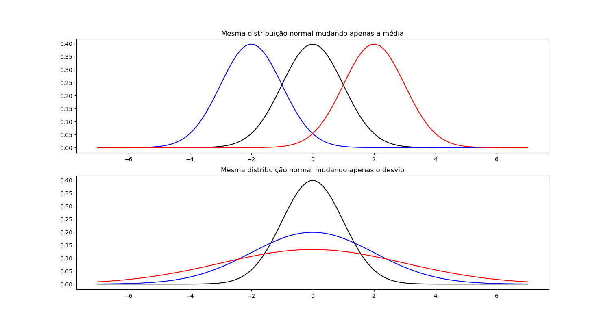

# VEROSSIMILHANÇA

Também chamada de **likelihood**. Mede o quão plausível é que os parâmetros de uma dada distribuição seja A considerando a amostra. Em suma, **calcula quais os parâmetros de uma dada distribuição definem melhor aquela amostra**.

Ela é muito usada em machine learning para encontrar quais coeficientes melhor descrevem uma regressão. Assim, mesmo não tendo uma distribuição propriamente dita, temos uma amostra (dados reais) e queremos encontrar os coeficientes (parâmetros) que os fazem melhor se encaixar naquela distribuição (regressão).

- Amostra = Dados
- Distribuição = Regressão
- Parâmetros = Coeficientes

### LIKELIHOOD

Em inglês tudo é traduzido como probabilidade, mas o melhor significado é verossimilhança. Significa se assemelhar a algo e é justamente o que essa parte da estatística faz, mede o quanto uma amostra se parece com uma distribuição hipotética e, com isso, encontrar sua distribuição.

## PARÂMETROS

A verossimilhança é descrita pela função $L(\theta)$.

Aonde:

- $\theta$ é o parâmetro que queremos descobrir o melhor valor

Quando a distribuição tem vários parâmetros (como a normal, que tem a média e o desvio) cada parâmetro é calculado de forma separada, mantendo um fixo em algum valor aleatório e variando o outro até encontrar o melhor resultado. Depois varia o que estava fixo usando o valor encontrado como valor fixo no parâmetro anterior. **A verossimilhança se baseia no conceito que o melhor resultado isolado também é o melhor em conjunto**.

## PREMISSAS

- Os dados são independentes
- O melhor resultado para um parâmetro isolado também é o melhor em conjunto com os demais

## DIFERENÇA DA PROBABILIDADE

A probabilidade calcula a chance de obter certos dados a partir de uma amostra e parâmetros conhecidos. A verossimilhança é o contrário: **a partir da amostra e de uma distribuição, quais parâmetros melhor se encaixam**.

- Probabilidade: distribuição + parâmetros = dados
- Verossimilhança: distribuição + dados = parâmetros

## MÁXIMA VEROSSIMILHANÇA

É o conceito de encontrar o parâmetro que melhor encaixa os dados (amostra) na distribuição. `Quanto mais os dados batem com a distribuição, mais a distribuição é verossímel para descrevê-los`. 

O objetivo portanto é diminuir o erro o mínimo possível. Podemos dizer que a máxima verossimilhança é o mesmo que menor erro médio.

## CÁLCULO

A verossimilhança é a multiplicação da probabilidade de cada dado da amostra se encaixar na distribuição.

$$L(\theta) = p(x_1) * p(x_2) ... p(x_ n) = \prod_{i=1}^n {p(x_i)}$$

Isso significa "assumindo que o parâmetro é tal, calculo a probabilidade de todos os dados baterem com essa distribuição com esse parâmetro".

Podemos também escrever da seguinte forma:

$$L(\theta | dados) = \prod_{i=1}^n {p(x_i)}$$

Como os dados são independentes então a probabilidade do dado x1 E x2 coincidirem com a distribuição é a multiplicação de ambos. Isso vem da probabilidade básica de intercessão.

Como estamos partindo de um pressuposto (o parâmetro que estamos testando ter o valor testado nesse momento) então é uma probabilidade condicional. Portanto podemos descrever da seguinte forma

$L(\theta) = f(x_1 | \theta) * f(x_2 | \theta) ... f(x_n | \theta) = \prod_{i=1}^n {f(x_i | \theta)}$

Mudar 1 parâmetro por vez ajusta a distribuição em uma dimensão por vez, encaixando-o em cima dos dados naquela dimensão específica. O exemplo abaixo com a distribuição normal ajuda a exemplificar. Primeiro ajusta a curva na horizontal, arrastando-a para ficar com a média alinhada com a média dos dados. Depois ajusta verticalmente, diminuindo e crescendo a curva até se alinhar com o desvio padrão dos dados.

Através de um monte de provas matemáticas é possível provar que os `parâmetros da distribuição devem ser os mesmos da amostra para o melhor encaixe` (máxima verossimilhança).

---

### EXEMPLO

**Para os dados x1 = 32 e x2 = 34, qual a verossimilhança da curva normal com média = 28 e desvio = 2?**

$L(media = 28, desvio = 2 | x_1 = 32 E x_2 = 34) = L(media = 28, desvio = 2 | x_1 = 32) * L(media = 28, desvio = 2 | x_2 = 34)$

A verosimilhança de 1 dado é igual a função da distribuição, só trocar os parâmetros e o x pelos valores.

$L(media = 28, desvio = 2 | x_1 = 32) = p(media = 28, desvio = 2, x = 32)$ 

Aonde $p()$ é a função normal.

p(media = 28, desvio = 2, x = 32)= $\frac{1}{\sqrt{2\pi*2^2}}e^{-(32-28)^2/2*2^2}$

Fazendo os cálculos todos chegamos a L = 0,000006. Ou seja, muito pouco provável esse ser os valores.