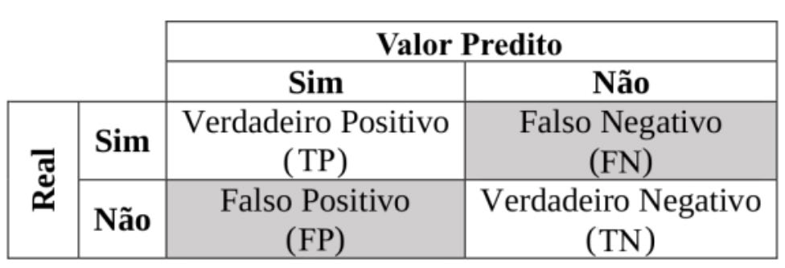
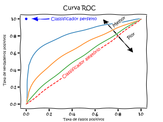
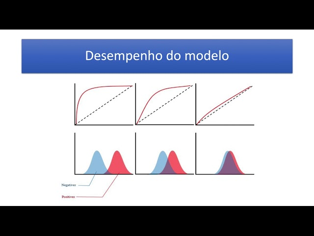

# TESTES DA REGRESSÃO LOGÍSTICA

Os testes a serem feitos na regressão logística são:

- Box-Tidwell
  - testa linearidade do logit
  - Nesse p-valor tem de ser maior que alfa
- Razão de verosimilhança (Likelihood Ratio)
  - Testa se o modelo como um todo é significativo
  - Substitui o teste F e **não tem test post-hoc**
- Teste de Wald
  - Testa cada variável se é significativa
  - Substitui o teste T

## BOX-TIDWELL

Para verificar a linearidade dos resíduos, ele verifica se as variáveis independentes (X) são lineares com relação ao logit, não ao valor Y de fato. Lembrando que o logit é o log da sigmoide.

O que ele faz é testar a qual expoente cada var independente X deve ser elevada para se aproximar do logit. No processo além de verificar a linearidade ainda retorna `qual deve ser o expoente usado em cada variável para encontrar a melhor aproximação`. Para isso você precisa passar as variáveis X elevadas aos expoentes que quer testar. Você pode passar os Xs elevados a expoentes inteiros, racionais (raíz quadrada) e ao próprio X (que resulta na mesma coisa que fazer X * ln(X), que é o que é usado nesse caso).

Para validar o logit da regressão logística passamos a var X * ln(X) ao invés de X para o Box-Tidwell.

### COMO FUNCIONA

Esse teste é feito através de uma regressão linear generalizada (usando os mínimos quadrados generalizados). Após a regressão é feita o teste T no coeficiente e checado se a linearidade com o expoente testado é válido. Na prática `o teste é uma regressão linear com a variável transformada em logit via X*ln(X)`. Por fazer a regressão linear o teste T é o teste feito por debaixo dos panos.

### HIPÓTESES

H0: A relação é linear. Passou no teste

H1: A relação não é linear. Não passou no teste. Os dados devem passar por uma transformação (serem elevados pelo expoente retornado pelo teste) e testado novamente que aí deve passar.

**Ou seja, queremos um p-valor maior que alfa nesse teste!**

### OBSERVAÇÃO

- Todos os valores de todos os Xs precisam ser obrigatoriamente > 0. Ele não funciona com valores negativos ou zero por usar log
- Não existe uma função pronta para ele no python, é preciso implementá-lo manualmente.

## RAZÃO DE VEROSSIMILHANÇA

`Usa o teste qui-quadrado para testar a divisão entre as verossimilhanças.`

### HIPÓTESES

H0: O modelo representa os dados tão bem quanto uma linha reta (só o intercepto)

H1: O modelo representa os dados melhor que uma linha reta

Ou seja, H0 zera todos os pesos/coeficientes e calcula o quão bem a regressão só com intercepto representa os dados (erro médio). 

### COMO CALCULAR

Para saber se o erro médio da nossa regressão é significativa ele faz o teste **qui-quadrado**, checando se os dados esperados (reais) e observados (previstos pela regressão logística) são significativamente distintos. 

O qui-quadrado serve perfeitamente para esse caso pois ele compara valores esperados e observados (independência) e serve para dados categóricos (que é o caso de uma regressão logística e classificadores no geral).

Nesse caso específico, o Q calculado é 

$Q = (\frac{L_{H1}}{L_{H0}})^2 = 2 * ln(\frac{L_{H1}}{L_{H0}})$, que pode ser descrito como

$$Q = 2 * [ln(L_{H1}) - ln(L_{H0})]$$

Aonde $L_{H1}$ e $L_{H0}$ são a função de máxima verossimilhança com os pesos finais de cada hipótese.

## WALD

Verifica se o coeficiente da variável X é significativamente diferente de zero. Ele usa a distribuição **Qui-Quadrado** para fazer o teste.

Importante ressaltar que ela diz se a variável X **sozinha** impacta na probabilidade de Y cair na categoria 1. `Se todas as outras variáveis forem constantes, essa variável influencia sozinha influencia o suficiente no valor de Y?` Essa é a pergunta respondida pelo p-valor de cada variável. Portanto podemos ter um modelo bom mesmo que todas as variáveis tenham p-valor abaixo de alfa, pois isso diz que nenhuma sozinha impacta significativamente na probabilidade de Y, mas em conjunto podem sim ser definitivas. Por isso o teste mais importante na regressão é o teste de razão de verossimilhança, que testa o modelo como um todo.

### HIPÓTESES

H0: O coeficiente é 0 (variável não tem efeito na regressão)

H1: O coeficiente é diferente de 0 (variável tem efeito na regressão)

### COMO CALCULAR

Ele calcula os erros da regressão (valor estimado - valor observado) como base. Ao pegar a soma dos erros e dividir pela variância definimos o valor do nosso teste calculado para comparar com o tabelado. O erro da regressão é a máxim verossimilhança com os pesos finais.

Ele se assemelha ao cálculo do T e ao teste T, mas não é igual e não podemos trocar um pelo outro. No teste T dividimos tudo pela raiz de N, o que não tem aqui.

$$T = \frac{(L - y)^2}{vari(L)}$$

Aonde

- L é a função de máxima verossimilhança
- vari(L) é a variância da máxima verossimilhança

# MEDIDAS DE ADEQUAÇÃO

Além dos testes de hipótese das premissas (que veem se os dados cumprem os requisitos do algoritmo) e do teste dos coeficientes (que testa se as variáveis afetam o resultado final de fato) podemos testar o **quão bem a sigmoide se ajusta aos dados**. Usada tanto para validar a regressão como para **comparar diferentes regressões**.

Importante perceber que uma reta bem ajustada aos dados **pode ser sinal de overfitting**! 

## Log-Verossimilhança

É a base para todos os demais métodos. Ele é a função de máxima verossimilhança com os pesos finais encontrados pela regressão.

Podemos também ter a log-verossimilhança da hipótese nula, aonde consideramos somente o peso do intercepto e todos os pesos/coeficientes das vars independentes são 0.

## PSEUDO R²

É uma variação do R² da regressão linear, mas como y é categórico a gente não pode usar correlação normalmente aqui. Ele também **não informa** quantos porcento da variância de Y é explicada pelo modelo. Porém **quanto maior, melhor**.

Existem diversas variações dele (McFadden, Cox-Snell, Nagelkerke), mas o mais comum é o McFadden.

O R² de McFadden é:

$$R_{mc} = 1 - \frac{ln(L_{reg})}{ln(L_{nulo})}$$

Aonde

- L é a função de máxima verossimilhança
- $L_{reg}$ é a máxima verossimilhança com os pesos finais da nossa regressão
- $L_{nulo}$ é a máxima verossimilhança com o peso final só do intercepto (com os pesos das vars independentes = 0)

Ou seja, é 1 menos a divisão das log-verossimilhanças. Por usar a log-verossimilhança da hipótese nula, podemos usá-lo para ter ideia de quão boa é a regressão mesmo sem comparar com outras.

#### VARIAÇÕES

Como dito antes, existem diversas variações como Cox-Snell e Nagelkerke. Cada um serve para um contexto diferente, por isso `use a versão padrão do seu contexto`.

**Cox-Snell** é uma variação que leva o tamanho da amostra em consideração, sendo usado para **avaliar se adicionar mais variáveis X melhora a precisão**. Porém ele não consegue nunca chegar a 1, por isso foi criado uma variação dele que é a de Nagelkerke.

**Nagelkerke** é calculado a partir do Cox-Snell e é o que o significado mais se aproxima do R² tradicional. Usado para **explicar quantos porcento da variância de Y é explicado pelo modelo**.

## AIC e BIC

$$AIC = -2ln(L_{reg}) + 2k$$

$$BIC = -2ln(L_{reg}) + k*ln(n)$$

Aonde

- L é a máxima verossimilhança da regresão com os pesos finais da nossa regressão
  - Representa a precisão da regressão
- k é o número de variáveis
  - Representa a complexidade da regressão
- n é o tamanho da amostra

Novamente, ambos usam a log-verossimilhança da regressão, porém não usam a da hipótese nula. Por não usarem a verossimilhança nula só servem para comparar com outra regressão.

## MATRIZ DE CONFUSÃO

Tabela que avalia o desempenho de um modelo de classificação (regressão, rede neural...). Tudo que for classificação pode usar matriz de confusão para avaliar. **Não serve para modelos de regressão e de séries temporais**.

Ela revela exatamente onde o algoritmo acerta e erra, e nos dá métricas como acurácia, precisão e sensibilidade.

A matriz nos mostra a quantiade de acertos, erros, falsos positivos e falsos negativos. Com isso podemos ver se os valores estão de fato dentro do nosso alfa e beta e em qual área nosso modelo é menos preciso.

A partir dele podemos calcular 4 métricas, sendo a última a mais interessante.

### Acurácia

Nos dá a **porcentagem de previsões corretas**. É quantos acertos tivemos dividido pela amostra (quantidade de testes)

acuracia = $\frac{TP + TN}{TP + TN + FP + FN} = \frac{TP + TN}{N}$

### Precisão

Nos dá a **proporção de positivos certos em relação ao total de previsões positivas** feitas pelo modelo. Em outras palavras é a **quantidade de positivos acertados pelo número de chutes no positivo**.

Nos dá o `grau de precisão no positivo` (não diz nada sobre o negativo). O complemento é o nosso alfa (erro tipo I). Soma a coluna do positivo.

precisao = $\frac{TP}{TP + FP}$

### Sensibilidade

Nos dá a **proporção de positivos certos em relação ao total de casos reais positivos**. É ligeiramente diferente da precisão. Enquanto a precisão nos diz quanto das previsões positivas tão certas, essa nos diz **quanto dos casos positivos foram detectados**.

Nos dá o `grau de assertividade no positivo` (não diz nada sobre o negativo). O complemento é o nosso beta (erro tipo II). Soma a linha do positivo.

sensibilidade = $\frac{TP}{TP + FN}$

### F1 Score

Mede o **equilíbrio entre a precisão e a sensibilidade**. É a média harmônica entre as 2 métricas, sendo 0 o pior desempenho possível (baixa precisão e baixa sensibilidade) e 1 o melhor desempenho possível (alta precisão e alta sensibilidade). 

O valor não diz qual das 2 métricas é maior ou a alta e pode até mascarar uma pequena se a outra for grande. Por isso ela não substitui as duas. Deve-se usar todas juntas.

F1 Score = $2 \frac{prec * sens}{prec + sens} = 2 \frac{TP}{2TP + FN + FP}$

Aonde

- prec = precisão
- sens = sensibilidade

### Falsos Positivos e Negativos

A matriz já dá quantos falsos positivos e negatvos temos, mas a taxa  costuma gerar confusão. O cálculo da taxa de falsos positivos é FP/todos os casos negativos (FP+TN). Ou seja, a taxa de falso positivo é calculado pela quantidade de casos **reais negativos** (pois um falso positivo é um caso negativo na verdade). O mesmo vale para o falso negativo.

Ou seja, **sempre usamos a linha dos valores reais para calcular a taxa**, nunca a coluna dos previstos ou o total de casos.

## CURVA ROC

A curva ROC é um gráfico que avalia classificadores binários (e apenas binários) variando o limiar de decisão. Ela nos diz até quando podemos aumentar nossos acertos sem aumentar os erros.

No eixo X temos a taxa de falsos positivos (FP). 

No eixo Y temos a sensibilidade (todos os positivos reais, TP + FN).

A linha diagonal mostra o desempenho dum modelo aleatório. Nosso modelo precisa estar sempre acima dele! Um modelo muito colado na diagonal significa ser muito próximo dum chute aleatório, portanto precisa ser consideravelmente acima da linha.

A imagem abaixo mostra como um valor alto de falsos positivos aparecem nos gráficos.

### AUC ROC

É a área embaixo da curva ROC. É a integral da capacidade do nosos modelo diferenciar positivos reais dos falsos positivos. Ele vai de 0 a 1, nos dando quão separados estão as curvas de acertos e falsos positivos (H0 e H1).

Em outras palavras, o AUC nos dá **quantos porcento as hipóteses estão separadas**. Valor 1 significa um modelo perfeito, sem nenhum falso positivo, enquanto 0,5 significa algo aleatório (péssimo modelo, igual a jogar uma moeda).

`Usado para testar qual o melhor threshold (limiar) para separar aonde dizer que é uma cateogria e onde é outra.`

Eixo X = $\frac{FP}{FP + TN}$

Eixo Y = $\frac{TP}{TP + FN}$

Ou seja, o a **curva ROC é a linha dos positivos x linha dos negativos da matriz de confusão**.