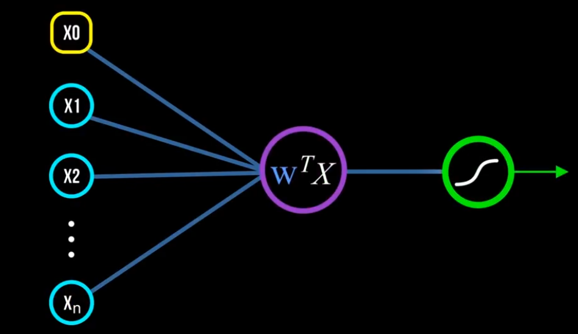

# RESUMO REGRESSÃO LOGÍSTICA BINÁRIA

- Precisamos encontrar os parâmetros (coeficientes) da função
- Usamos gradiente descendente para definir os coeficientes
- A função de custo é a máxima verossimilhança
  - A máxima verossimilhança já está derivada
- O $ŷ$ na função de máxima verossimilhança é a função sigmoide
- A função sigmoide usa a regressão linear com os parâmetros da rodada anterior
  - Só aqui que os coeficientes antigos são usados

$A_{novo} = A_{velho} - txAprendizado * \frac{\sum_{i=1}^N y_i * ln(ŷ_i) + (1 - y_i) * ln(1 - ŷ_i) }{N}$

Aonde

$ŷ = \frac{1}{1+e^{-a_0 - \sum{a_ix_i}}}$

Podemos juntar tudo numa equação só e ficar com essa equação para cada loop do gradiente:

$$A_{novo} = A_{velho} - txAprendizado * \frac{1}{N} * \sum_{i=1}^N y_i * ln(\frac{1}{1+e^{-a_0 - \sum{a_ix_i}}}) + (1 - y_i) * ln(\frac{e^{-a_0 - \sum{a_ix_i}}}{1+e^{-a_0 - \sum{a_ix_i}}})$$

Ou usando a escrita em matriz

$$A_{novo} = A_{velho} - txAprendizado * \frac{1}{N} * \sum_{i=1}^N Y * ln(\frac{1}{1+e^{-A^TX}}) + (1 - Y) * ln(\frac{e^{-A^TX}}{1+e^{-A^TX}})$$

## REGRESSÃO LOGÍSITICA E REDES NEURAIS

A regressão logística é um neurônio mais simples de uma rede neural. Temos várias entradas, fazemos uma média ponderada via regressão e passamos numa função de ativação (sigmoide) para dizer se o neurônio deve passar sinal pra frente ou não (se passa ou não passa). **O gradiente descendente recalculando os pesos é nosso backpropagation**. Podemos desenhar todo o processo da regressão logística conforme abaixo:

