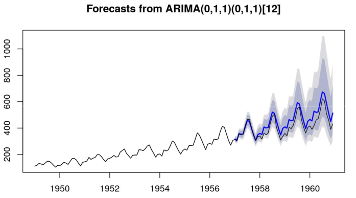

# SÉRIE TEMPORAL

**Conjunto de dados/observações ordenados no tempo em intervalos regulares**. Ou seja, medições de algo feitas ao longo do tempo, com intervalo regular. Esses dados devem variar ao longo do tempo e é essa variação que é analisada. Os dados precisam ser ordenados no tempo, pois nas séries temporais geralmente (embora não seja uma premissa) os valores anteriores influenciam o próximo.

Permite **compreender e prever comportamentos com base em dados históricos**. Não necessariamente a análise vai revelar o que causa a mudança, mas como ele muda ao longo do tempo sem olhar par ao que é sua causa.

Os dados devem ser numéricos, seja discretos ou contínuos. Dados categóricos não podem ser usados em séries temporais. Em inglês é chamado de TSA (temporal series analytics).

### Exemplos

- Finanças
- Economia (previsão de inflação, demanda por commodities...)
- Saúde
- Monitoramento de TI (uso de CPU, taxa de erros na infra, latência nas requisições...)
- Dados meteorológicos
- Vendas
- Natureza (registro de abalos sísmicos, crescimento populacional...)

Sempre que quisermos ver como `1 único dado varia ao longo do tempo` faz sentido usar série temporal.

## PRINCIPAIS COMPONENTES

A análise de dados temporais possui 4 principais características, ligadas ao fato de representarem o mesmo dado ao longo do tempo.

- Tendência
  - Movimento que indica se os dados estão subindo ou descendo
  - Dado pela média móvel
  - Pode inclusive ter médias móveis indicando tendências opostas, mostrando um sinal para curto prazo mas no longo prazo algo diferente
- Sazonalidade
  - Padrões regulares e previsíveis que se repetem em intervalos de tempo específicos
  - Ex: aumento nas vendas de sorvete todo verão, subida do preço do Bitcoin a cada 4 anos...
- Ciclos
  - Oscilações de longo prazo que não possuem uma frequência fixa 
  - Diferem da sazonalidade por não ter um intervalo fixo entre os acontecimentos
  - Ex: ciclos econômicos de expansão e recessão, variação do preço de commodities...
- Ruído (ou Aleatoriedade)
  - Variações imprevisíveis e irregulares que não seguem um padrão
  - Causadas por eventos aleatórios
  - É descartável, lixo que atrapalha na análise
  - **Tudo que não entra nem na tendência nem na sazonalidade e ciclo**

Em suma, ao analisar séries temporais queremos descobrir a tendência de algo, seus padrões fixos (sazonalidade) e esporádicos (ciclos) e o que é só variação aleatória descartável (ruído). Em muito lugares sazonalidade e ciclos serão tratados como a mesma coisa.

Ao começar a analisar uma série temporal a primeira coisa a se fazer é separar a série nesses 3 componentes (tendência, sazonalidade e ruído) e ver se elas existem e como são.

## TIPOS DE SÉRIES TEMPORAIS

Uma série temporal pode ser:

1. **Estacionário** ou não-estacionário: estacionário é quando a média, variância e covariância é constante e não possui tendência ou sazonalidade. Ela não tem autocorrelação. É muito fácil de prever o futuro pois os dados não mudam com o tempo. 

Pode-se testar se é estacionário com o **teste de Dickey Fuller Aumentado (ADF)**. Nesse teste H0 = não estacionário, logo busca-se rejeitar H0 para provar que é estacionário.

2. **Determinístico ou Estocástico**: determinístico não possui variação ou aleatoriedade. Estocástico por outro lado envolve probabilidade ou acaso.

3. **Autocorrelatos** ou não autocorrelatos: o valor atual depende dos últimos valores. Ou seja, o passado influencia o futuro. Caso uma série **não seja autocorrelata não faz sentido usar série temporal**. 

No mundo real as séries temporais quase sempre são não-estacionárias, estocásticas e autocorrelatos. Esses tipos são testados com testes de hipótese, servindo como premissas para uma análise.

## PREMISSAS

- Os dados devem ter a mesma distância no tempo um do outro (não pode 2 dados tere 1 dia de distância e outro 1 semana)
- Estarem ordenados no tempo
- Ser autocorrelato
  - Teste de Durbin-Watson ou Ljung-Box
- Ser estacionário (**em diversos cenários**)
  - Média, variância e a autocorrelação devem se manter constantes ao longo do tempo
  - Teste ADF ou KPSS
- Não deve haver pontos de ruptura no gráfico
  - Teste de Chow

## RELAÇÃO COM MÉDIA MÓVEL

A média móvel é a forma de calcular médias em séries temporais. Ela filtra ruído e suaviza os dados brutos, além de indicar a tendência. A média móvel também é usada no modelo Arima.

Em suma, usamos a média móvel para:

- Ter a média da série num determinado período
- Filtrar ruído
- Suavizar dados
- Definir tendência
- Prever valores futuros

## PREVISÃO

Existem 3 métodos para prever valores futuros.

- Médias móveis (MA)
  - Calcula a direção e magnitude da mudança entre o valor atual e o próximo
  - Usa a média dos últimos dados para isso
- Autorregressão (AR)
  - Calcula o valor estimado do próximo valor, considerando um erro (ruído)
  - O valor atual é definido por uma regressão linear em que cada X é um valor anterior
  - $X_i = A_0 + A_{i-1}X_{i-1} + A_{i-2}X_{i-2} + ... + A_{i-k}X_{i-k} + erro_i$
    - Considera o intercepto e um erro que muda para cada X
  - A diferença para a regressão linear normal é somar um erro aleatório para que não seja determinístico
  - O nome auto regressão vem de fazer uma regressão linear nos próprios dados, usando os K dados mais recentes.
  - **Usado quando o passado influencia o futuro**
- Arima
  - União dos 2 anteriores. Bom quando os dados tem tendência e autocorrelação
  - AR + I + MA (autorregressão integrado com média móvel)

`Para poder fazer previsão com métodos matemáticos mais robustos a série não pode ser muito estocástica (aleatória). Por isso Arima e outros métodos não são usados em mercado financeiro. Nesse caso é usado só médias móveis.`

Outro ponto importante é que quanto mais no futuro você analisa mais incerto é sua previsão, portanto a variabilidade aumenta conforme mostrado na imagem abaixo.

## COMPARANDO SÉRIES TEMPORAIS

Podemos usar AIC e BIC para definir qual série representa melhor os dados e quais faz melhores previsões. `Devemos escolher o com menor AIC/BIC.`

Ex: o Arima receber 3 parâmetros (p - autorregressão, d - grau de diferenciação, q - ordem da média móvel), podemos fazer diversos Arimas mudando esses valores e comparar o AIC e BIC deles.

## PASSO A PASSO DA ANÁLISE DE SÉRIES TEMPORAIS

### Pré-análise

1. Organizar os dados em intervalos regulares
2. Usar coluna de data/tempo como índice para facilitar pesquisa
3. Verificar e tratar outliers
4. Tratar valores ausentes

### Análise da série

1. Plotar gráfico de linha e ver o comportamento geral (identificar tendência e sazonalidade)
2. Escolher entre o modelo aditivo (quando a variação sazonal é constante) ou multiplicativo (quando a sazonalidade cresce junto com a série)
3. Decompõe a série de acordo com modelo escolhido e ver o comportamento de cada um
4. Testes de hipótese (se é autocorrelato, estacionário, tem pontos de ruptura e sazonalidade considerável)
5. Testa diferentes janelas (lags) e escolhe a com melhor métrica (AIC e BIC)

### Previsão

1. Aplicar métodos clássicos (Médias Móveis ou suavização exponencial - Holt-Winters)
2. Aplicar modelos estatísticos avançados como ARIMA ou SARIMA
3. Avaliar o erro do modelo utilizando métricas como o Erro Quadrático Médio (MSE) para garantir previsões confiáveis
4. Testa diferentes janelas (lags) e escolhe a com melhor métrica (AIC e BIC)