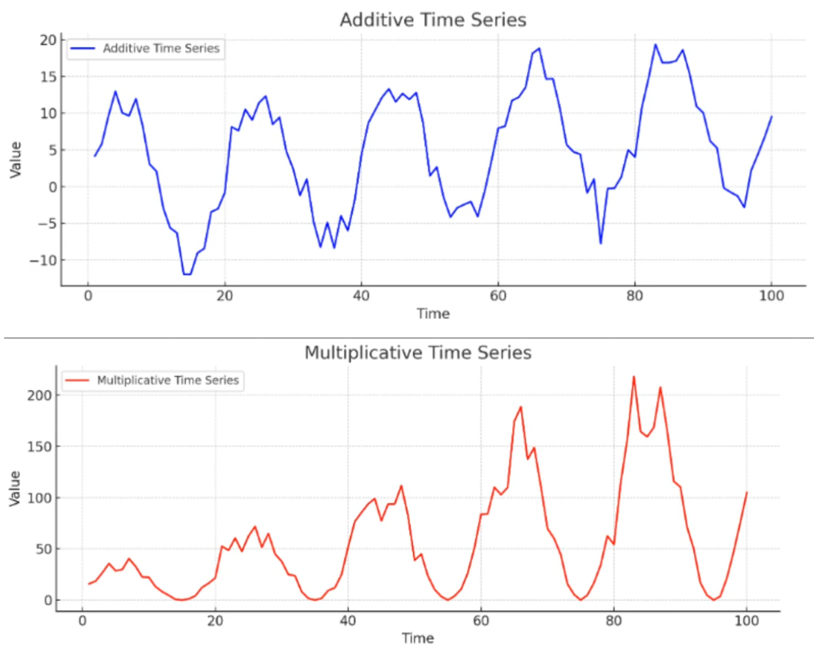

# DECOMPOSIÇÃO DA SÉRIE TEMPORAL

Decompor a série temporal nos permite enxergar como cada componente da série se comporta separadamente. A decomposição é essencial na hora de analisar a série. Os componentes que separamos para ver são a tendência (trend), a sazonalidade e o ruído/resíduo (noise/residual).

## SÉRIE TEMPORAL É A UNIÃO DE SUAS PARTES

Quando se fala em decompor a série é exatamente isso, igual como numa aula de cálculo 2 somando e separando séries. Ela não é diferente se uma série de Fourrier ou Laplace. 

Identificar qual porcentagem de cada valor vem de cada um será explicado adiante. Mas é importante entender que a série final nada mais é que a soma (ou multiplicação) das 3 séries dos componentes. Como uma série se resume a essas 3 características, essas 3 o definem por completo, por isso a união (soma ou multiplicação) das 3 dão a série final.

Se você entende que uma série temporal nada mais é que uma tendência e uma sazonalidade juntas, com uma pitada de aleatoriedade (ruído) fica fácil compreender por que podemos descrever e até dividir e depois somar de volta a série nessas partes. A tendência diz para onde está crescendo, a sazonalidade define os picos e vales e o ruído é o que não é explicado pelos 2, o que sobra.

## COMO COMEÇAR

O primeiro passo para decompor a série é plotar ela normalmente e olharmos a série por completo e só depois seus fatores em separado. Ao olhar a série inteira podemos ver se ela se encaixa melhor em um modelo aditivo ou multiplicativo. Assim ao decompor já faremos seguindo o modelo correto.

## MODELOS ADITIVOS E MULTIPLICATIVOS

No Modelo Aditivo os componentes se somam. Ele é literalmente a soma de suas 3 partes.

$$Y(t) = tendencia + sazonalidade + residuos$$

No **modelo aditivo** a sazonalidade é constante por toda a série. A **tendência NÃO afeta a sazonalidade**. É identificado como desse tipo quando: 

- Dado não exibe crescimento exponencial
- Não tem grandes saltos na amplitude (eixo Y)
- Dados **não são estacionários**

Ex: loja de sorvetes pequena, todo verão vende o mesmo tanto e todo inverno o mesmo tanto, sem grandes surpresas. Não tem um crescimento todo ano para que num verão venda muito mais que no outro e no seguinte ainda mais, pelo contrário: as coisas não mudam com o passar do tempo.

---

No Modelo Multiplicativo os componentes se multiplicam. Isso faz com que quando a tendência suba os picos e vales da sazonalidade fiquem cada vez mais longes e quando a tendência cai seus picos e vales ficam mais próxmos. Em resumo, quanto maior a tendência, maior a amplitude dos valores num ciclo.

$$Y(t) = tendencia * sazonalidade * residuos$$

No **Modelo Multiplicativo** a sazonalidade muda conforme a tendência sobe ou cresce. A **tendência afeta SIM a sazonalidade!** É identificado como desse tipo quando: 

- Exibe crescimento exponencial
- Tem grandes saltos na amplitude (eixo Y)
- Dados **não são estacionários**

Ex: loja de brinquedos que cresceu nos ultimos anos. No natal sempre tem picos, mas como a loja está crescendo todo ano a cada natal vende mais que no anterior.

---

Nem sempre é claro a qual dos 2 que a série pertence, as vezes fica no meio termo. Nesses casos você pode usar STL.

Você pode transformar um modelo multiplicativo em aditivo com uma transformação log. Isso facilita a leitura do gráfico e alguns cálculos.

## STL (SEASONAL AND TREND DECOMPOSITION USING LOESS)

É um outro método de decompor mais flexível que usa um tipo de regressão linear avançada chamada regressão de ponderação local (LOWESS ou LOESS). Essa regressão linear é um método não paramétrico, pois ela cria `várias pequenas regressões lineares ponderadas para ir se ajustando ao formato da curva dos dados`.

Quando é impossível fazer uma única reta que descreva os dados, a regressão de ponderação local entra em jogo. Ela usa janelas (como em médias móveis), usando só seus vizinhos para definir a inclinação da reta naquela região. Os pontos mais no meio da janela tem maior peso e os nas extremidades da janela tem peso menor. Importante salientar que o mesmo ponto vai ser usado em diversas janelas para definir diversas retas, porém com um peso diferente em cada uma.

Ele tem uma versão para dados geográficos, aonde ao invés dos dados variarem no tempo, variam no espaço. Se chama GWR (Regressão Geograficamente Ponderada).

### Vantagens

Permite contornar os dados muito melhor que regressões comuns. É **excelente para modelar relações complexas e altamente não lineares** sem precisar adivinhar uma fórmula matemática rígida. É amplamente recomendado usar no lugar de regressão polinomial de alto grau.

### Desvantagens

Esse tipo de regressão é muito mais complexo e demora muito mais para ser calculado. Exige uma escolha correta do tamanho da janela. Janelas pequenas geram modelos ruidosos e janelas grandes perdem os detalhes locais.

### Quando usar

Quando os dados tiverem padrões de sazonalidade complexos ou não forem constante ao longo do tempo. É especialmente útil quando a sazonalidade muda bastante ou tem irregularidades que não podem ser modeladas pelo modelo aditivo ou multiplicativo.

## OUTROS MODELOS DE DECOMPOSIÇÃO

Existem muitos outros modelos, específicos para cenários mais restritos. Esses 3 (aditivo, multiplicativo e STL) bastam para a maioria dos casos.

## COMO SABER SE ESCOLHEU O MODELO CERTO

Você pode olhar para os seguintes pontos:

- Em qual os resíduos ficaram mais dispersos
- Em qual a sazonalidade ficou mais explícita
- Em qual a tendência ficou mais suave
- Em qual os dados ficaram menos agrupados numa faixa
- Se os dados ficarem mais agrupados com o logaritmo, sinal que o multiplicativo é melhor