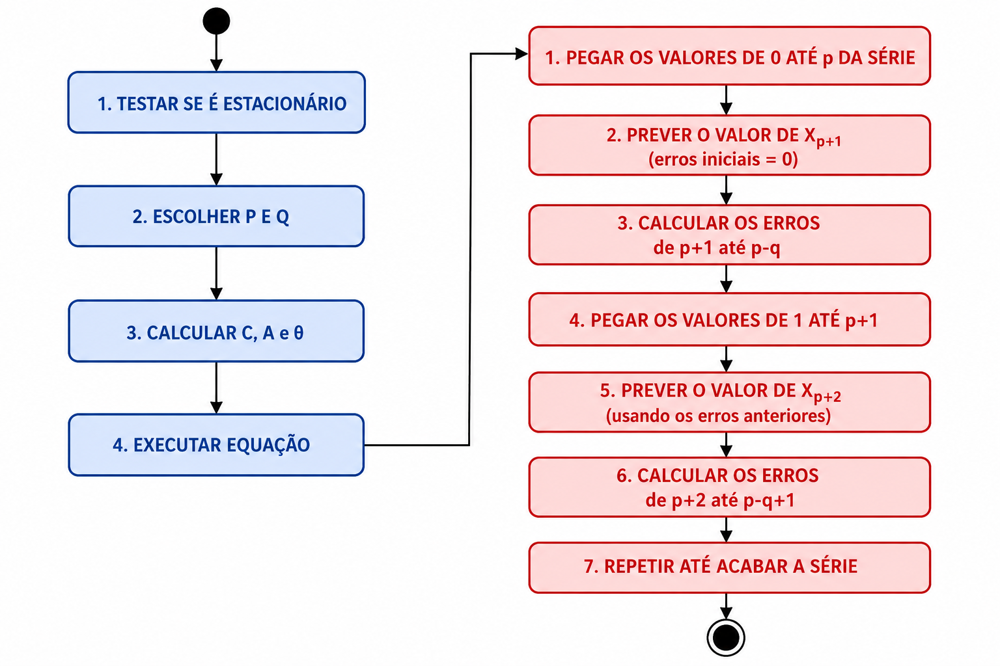

# ARMA

é um modelo para séries `estacionárias` que usa autorregressão juntamente com uma correção a partir dos erros das últimas previsões, inspirado nas médias móveis. Ele faz autorregressão em uma janela específica para prever o próximo valor e vai avançando a janela até o momento presente. Ela usa o erro de previsões passadas (aonde entra o comportamento das médias móveis) para ajustar a previsão atual. Importante deixar claro que a janela da autorregressão não precisa ser a mesma da média móvel.

Em resumo, **a medição em si é feita via autorregressão ajustado com os erros das medições anteriores**. Ela usa o conceito de médias móveis para pegar só os erro das últimas medições e descartando os erros de medições muito antigas. Isso deixa as medições futuras mais precisas e garante que só os erros mais recentes influenciam, descartando erros muito antigos.

É importante ressaltar que o MA é a média móvel dos erros, não é a equação normal da média móvel simples. Aqui o que importa é pegar a previsão feita pela autorregressão, subtrair do valor real e pegar esse resultado como o erro. Conforme a janela vai avançando vamos pegando os erros dos dados da frente e descartando erros muito antigos.

## COMPONENTES

- AR (autorregressão): representado pela variável P
  - P nos diz o tamanho da janela de autorregressão (quantos valores passados considera)
- MA (média móvel): representado pela variável Q
  - Q nos diz o tamanho da janela da média móvel (quantos erros passados considera)

## PREMISSAS

- **Tem de ser estacionária**
- Tem de ter autocorrelação

## COMO CALCULAR

A união dos 2 componentes formam a seguinte equação:

$X_t$ = autorreg + mediaMovel

O cálculo da autorregressão é o mesmo, não muda nada:

**autorreg** = $C + \sum_{i=1}^p A_i X_i$

Aonde:

- C é o intercepto
- p é o tamanho da janela da autorregressão
- $X_i$ é um dado anterior dentro da nossa janela de tamanho p
- $A_i$ é o peso de um dado anterior

Já o cálculo da média móvel muda bastante, pois não estamos calculando a média móvel em si, mas só usando sua ideia para pegar os últimos erros das predições feitas.

**mediaMovel** = $e_t + \sum_{i=1}^q \theta_i e_{t-1}$

Aonde:

- $e_t$ é o erro da medição atual (quando paramos antes do fim da série)
- q é o tamanho da janela da média móvel
- $\theta$ é o peso dado ao erro da média móvel
- $e_{t-1}$ é o erro da média móvel pro valor anterior

Com isso o cálculo da ARMA fica:

$$X_t = (C + \sum_{i=1}^p A_i X_i) + (e_t + \sum_{i=1}^q \theta_i e_{t-1})$$

A grande compexidade está em definir C, $A_i$ e $\theta$. Após definir esses coeficientes é só executar a equação. Com isso vemos que o modelo ARMA pode se dividir em 2 partes: 

1. Definir coeficientes
2. Calcular autorregressão e erros

Os erros iniciais são sempre 0 para iniciar o algoritmo.

## ROTEIRO COMPLETO

O roteiro a seguir nos diz o que fazer antes e depois de executar o modelo ARMA para garantir que temos o melhor modelo em mãos.

1. Testar se é estacionário
2. escolher um p e q
3. Calcular nosso modelo (as 2 partes do ARMA)
4. Pegar AIC/BIC, MAE, MAPE e RMSE do nosso modelo
5. escolher outros p e q
6. Calcular novo modelo com os novos p e q (as 2 partes do ARMA)
7. Pegar AIC/BIC, MAE, MAPE e RMSE do novo modelo
8. Comparar e decidir qual é o melhor

Podemos também ter um loop executando o ARMA para diversas combinações diferentes, testando todos os p e q que fizerem sentido.

## DEFINIR COEFICIENTES (1ª parte)

O processo de definir os coeficientes usa algum método de estimação internamente. Pode ser mínimos quadrados (ordinais ou condicionais, embora prefira o condicional) ou máxima verossimilhança. O passo 0 então é escolher qual algoritmo usaremos.

### Passo 1: centralizar os dados

O próximo passo é centralizar a série, isso é, subtrair a média de cada valor. Para os demais passos usaremos somente os dados centralizados (que chamaremos de Y).

$Y_t = X_t - media$

### Passo 2: definir a equação do erro

O próximo passo é isolar o erro na nossa equação. Isso nos faz sair da equação:

$Y_t = C + A_t * Y_{t-1} + e_t + \theta_t * e_{t-1}$

Para

$e_t = Y_t - C - A_t * Y_{t-1} - \theta_t * e_{t-1}$

Nesse momento desconsideramos o intercepto C, deixando a equação como:

$e_t = Y_t - A_t * Y_{t-1} - \theta_t * e_{t-1}$

Ao fim iremos somar o quadrado de todos os erros para medir quão preciso é nosso modelo com os coeficientes definidos.

$SSE = \sum{ e_t^2 }$

Portanto, o objetivo é ter o menor SSE possível, pois isso nos dará o modelo com menor erro encontrado.

### Passo 3: descobrir os coeficientes A e $\theta$

Queremos descobrir quais A e $\theta$ nos dão o menor SSE. Como pode ver, isso tá com toda cara de mínimos quadrados e gradiente descendente. Iniciamos com A e $\theta$ aleatórios e vamos fazendo pequenas mudanças até termos o melhor SSE. É aqui que entra o algoritmo escolhido anteriormente.

## COMO CALCULAR AUTORREGRESSÃO E ERROS (2ª parte)

### EXEMPLO 1: Cálculo da 2ª parte para p e q = 1

Dados = [100, 105, 103, 110, 108]. Supondo que encontramos C = 10, A = 0.8 e $\theta = 0.3$ (Como nossos p e q são 1, só temos 1 A e 1 $\theta$).

Como as janelas são 1, a equação só considera os valores imediatamente antes.

$PREV_2 = C + A * X_1 + \theta * Err_1$

Como o erro inicial é sempre 0, $Err_1 = 0$

$PREV_2 = 10 + 0.8 * 100 + 0.3 * 0 = 90$

$Err_2 = X_2 - PREV_2 = 105 - 90 = 15$

---

$PREV_3 = C + A * X_2 + \theta * Err_2 = 10 + 0.8 * 105 + 0.3 * 15 = 98.5$

$Err_3 = X_3 - PREV_3 = 103 - 98.5 = 4.5$

---

Após repetir todo o processo até acabar a série chegamos nessa tabela

| t    | real | previsto | erro |
|:---: |:---: | :---:    |:---: |
|   1  |  100 |   -      |  -   |
| 2    | 105  | 90       | 15   |
| 3    | 103  | 98.5     | 4.5  |
| 4    | 110  | 93.75    | 16.25|
| 5    | 108  | 102.875  | 5.125|

A partir disso podemos calcular o MAE, MAPE E RMSE do nosso modelo para saber quão preciso ele é e compará-lo com outros. Nesse caso, as métricas são:

- MAE: 10.22
- MAPE: 9,54%
- RMSE: 11.57

OBS: nessas métricas N usado é o nº de previsões feitas (4).

### EXEMPLO 2: Cálculo da 2ª parte para p e q = 2

Usaremos os mesmo dados = [100, 105, 103, 110, 108]. Supondo que encontramos C = 10, $A_1$ = $A_2$ = 0.8 e $\theta_1 = \theta_2 = 0.3$ (temos 2 A e 2 $\theta$ porque nosso p e q são 2).

Os erros iniciais $Err_1$ e $Err_2$ também serão 0. No caso são 2 porque q = 2.

$PREV_3 = C + A_1 * X_1 + A_2 * X_2 + \theta_1 * Err_1 + \theta_2 * Err_2$

$PREV_3 = 10 + 0.8 * 100 + 0.8 * 105 + 0.3 * 0 + 0.3 * 0 = 174$

$Err_3 = X_3 - PREV_3 = 103 - 174 = -71$

---

$PREV_4 = C + A_1 * X_2 + A_2 * X_3 + \theta_1 * Err_2 + \theta_2 * Err_3$

$PREV_4 = 10 + 0.8 * 105 + 0.8 * 103 + 0.3 * 0 + 0.3 * (-71) = 155.1$

$Err_4 = X_3 - PREV_3 = 110 - 155.1 = -45.1$

---

$PREV_5 = C + A_1 * X_2 + A_2 * X_3 + \theta_1 * Err_2 + \theta_2 * Err_3$

$PREV_5 = 10 + 0.8 * 103 + 0.8 * 110 + 0.3 * (-71) + 0.3 * (-45.1) = 145.57$

$Err_5 = X_4 - PREV_4 = 108 - 145.57 = -37.57$

---

Após repetir todo o processo até acabar a série chegamos nessa tabela

| t    | real | previsto | erro |
|:---: |:---: | :---:    |:---: |
|   1  |  100 |   -      |  -   |
| 2    | 105  | -        | -    |
| 3    | 103  | 174      | -71  |
| 4    | 110  | 155.1    | -45.1|
| 5    | 108  | 145.57   |-37.57|

A partir disso podemos calcular o MAE, MAPE E RMSE do nosso modelo para saber quão preciso ele é e compará-lo com outros. Nesse caso, as métricas são:

- MAE: 51.22
- MAPE: 48.24%
- RMSE: 53.19

OBS: nessas métricas N usado é o nº de previsões feitas (3).

### EXEMPLO 3: Cálculo da 2ª parte para p = 2 e q = 3

Usaremos os mesmo dados = [100, 105, 103, 110, 108]. Supondo que encontramos C = 10. Como p = 2, teremos 2 A: $A_1 = A_2 = 0.8$ e como q = 3 teremos 3 $\theta$: $\theta_1 = \theta_2 = \theta_3 = 0.3$.

Os erros iniciais $Err_1, Err_2 e Err_3$ também serão 0. No caso são 3 porque q = 3.

Como q = 3, iremos calcular a partir da 4ª posição.

$PREV_4 = C + A_1 * X_2 + A_2 * X_3 + \theta_1 * Err_1 + \theta_2 * Err_2 + \theta_3 * Err_3$

$PREV_4 = 10 + 0.8 * 105 + 0.8 * 103 + 0.3 * 0 + 0.3 * 0 + 0.3 * 0 = 176.4$

$Err_4 = X_4 - PREV_4 = 110 - 176.4 = -66.4$

---

$PREV_5 = C + A_1 * X_3 + A_2 * X_4 + \theta_1 * Err_2 + \theta_2 * Err_3 + \theta_3 * Err_4$

$PREV_5 = 10 + 0.8 * 103 + 0.8 * 110 + 0.3 * 0 + 0.3 * 0 + 0.3 * (-66.4) = 147.2$

$Err_5 = X_5 - PREV_5 = 108 - 147.2 = -39.2$

---

$PREV_6 = C + A_1 * X_4 + A_2 * X_5 + \theta_1 * Err_3 + \theta_2 * Err_4 + \theta_3 * Err_5$

$PREV_6 = 10 + 0.8 * 110 + 0.8 * 108 + 0.3 * 0 + 0.3 * (-66.4) + 0.3 * (-39.2) = 131.6$

$Err_6$ = Como não temos $X_6$ não temo um erro.

---

Após repetir todo o processo até acabar a série chegamos nessa tabela

| t    | real | previsto | erro |
|:---: |:---: | :---:    |:---: |
|   1  |  100 |   -      |  -   |
| 2    | 105  | -        | -    |
| 3    | 103  | -        | -    |
| 4    | 110  | 176.4    | -66.4|
| 5    | 108  | 147.2    |-39.2 |
| 6    | -    | 131.6    |-     |

A partir disso podemos calcular o MAE, MAPE E RMSE do nosso modelo para saber quão preciso ele é e compará-lo com outros. Nesse caso, as métricas são:

- MAE: 52.8
- MAPE: 48.33%
- RMSE: 54.52

OBS: nessas métricas N usado é o nº de previsões feitas (2).