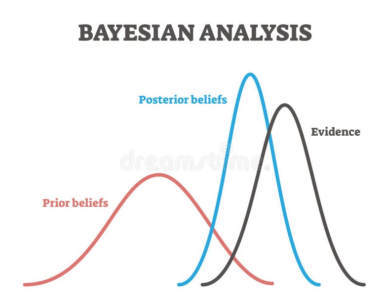

# ESTATÍSTICA BAYESIANA

É um paradigma de inferência estatística diferente do estudado até agora. O paradigma bayesiano pertence a área da inferência, mas é tão diferente que merece ser estudada a parte, pois segue outras bases diferentes da estatística tradicional. 

Nele a probabilidade é interpretada como o **grau de crença ou incerteza** sobre um determinado evento ou parâmetro, e não como a frequência de ocorrência a longo prazo (visão frequentista). É importante entender que a estatística bayesiana **não trata os parâmetros do modelo como valores fixos e desconhecidos, mas sim como variáveis aleatórias**.

Em Aprendizado de Máquina e Ciência de Dados, a abordagem bayesiana permite **atualizar dinamicamente o conhecimento** à medida que novos dados são observados, fornecendo não apenas previsões pontuais, mas uma distribuição de probabilidade que **quantifica a incerteza do modelo**. 

Para se ter em mente, em vez de buscar um único melhor parâmetro que buscamos descobrir (como a Máxima Verossimilhança no paradigma frequentista), a abordagem bayesiana preserva todas as hipóteses plausíveis ponderadas pelas suas probabilidades. Ele diz qual a probabilidade de cada parâmetro possível ser o melhor valor.

## Modelagem do Aprendizado

A estatística Bayesiana chama a atenção por modelar matematicamente como o ser humano aprende. Por isso ela é tão valorizada em aprendizado de máquina. Ela parte de um conhecimento inicial e a cada nova evidência (dados do mundo real) descobrimos mais sobre como a realidade é e vamos mudando nosso conhecimento e opinião sobre como ele é.

Ele lembra muito o método científico ao sempre olhar para os dados (evidências) e usar como base para novas premissas de como o mundo se comporta (dados criam posteriori que viram a nova priori). Sua ideia/convicção inicial de mundo é levada em conta (prior) mas você está disposto a rever seus conceitos se os dados da realidade trouxerem outra resposta.

## Diferença entre Frequentista vs. Bayesiana

- **Frequentista:** A probabilidade é a frequência de um evento em um número infinito de repetições. Parâmetros da população são valores fixos e desconhecidos. Não faz sentido atribuir probabilidade a uma hipótese ou parâmetro.
   - Probabilidade = "a chance disso acontecer é X%"
- **Bayesiana:** A probabilidade é o grau de certeza ou confiança racional sobre uma afirmação. Parâmetros da população são tratados como variáveis aleatórias que possuem distribuições de probabilidade. Permite incorporar conhecimento prévio (prior) antes de coletar dados.
   - Probabilidade = "tenho X% de confiança que isso é verdade"

## O Ciclo de Aprendizado Bayesiano

O processo de inferência bayesiana segue uma estrutura iterativa contínua:

1. **Conhecimento A Priori (Prior):** Representa o estado inicial de conhecimento ou incerteza sobre o parâmetro $\theta$ antes de observar os novos dados.
2. **Coleta de Dados e Verossimilhança (Likelihood):** Mede a compatibilidade dos dados observados com os diferentes valores possíveis do parâmetro $\theta$.
3. **Distribuição A Posteriori (Posterior):** Combina o conhecimento prévio com a evidência contida nos dados, resultando no conhecimento atualizado sobre $\theta$.
4. **Iteração Contínua:** A distribuição posteriori atual vira o prior para o próximo conjunto de dados observados.

### Prior: Crença/Conhecimento Inicial

É a nossa crença/conhecimento inicial, antes de olharmos qualquer dado ou fazermos qualquer cálculo. É nossa premissa ou chute inicial sobre o assunto. 

O prior ele possui duas informações: a **distribuição que acredito que os dados sigam** e a **porcentagem de certeza que tenho disso estar certo**. São essas duas informações que formam o prior. Ao definir a distribuição dos dados tô dizendo qual a equação de probabilidade dele (normal, Poisson, exponencial...), se tem tendências, assimetrias e qual dispersão acredito que siga.

Veja que nesse ponto a estatística bayesiana lembra o gradiente descendente e outros algoritmos por precisar de um ponto de partida. Esse ponto pode ser aleatório, mas o ideal é ele realmente apresentar o que já sabemos (ou achamaos que sabemos) sobre o assunto. Já que a ideia é ir incrementando nosso conhecimento com novos dados e ter cada vez menos incerteza/dúvida sobre ele, que comecemos com nosso entendimento inicial. Quando realmente não fizer a menor ideia sobre nada no início comece com uma distribuição uniforme (tudo tem a mesma chance de acontecer).

Existem 2 tipos de dados a prior: informativo (forte) e não informativo (fraco).

#### Prior Forte

No forte eu tenho muita certeza da premissa inicial. Por exemplo posso dizer que tenho 90% de certeza que a premissa (distribuição e seus parâmetros iniciais) é verdade. Quanto maior a certeza inicial, mais forte ela é e é preciso muitos dados contrários para contradizê-la.

`Um prior forte (alta certeza) enviesa muito o resultado`. Se você tiver certo irá acelerar muito o processo de treinamento da IA e de convergir, pois já te bota perto da linha de chegada. Porém se tiver errado faz sua IA errar feio pois ela não irá chegar nem perto dos parâmetros reais. Cada dado te empurra muito pouco pros parâmetros corretos da realidade. Um prior forte e errado é como se você pesasse 1 tonelada e muito longe de onde quer ir.

> Considere prior forte como um forte sinal de viés! A chance de você só confirmar o que já acredita é alta.

#### Prior Fraco

No prior fraco eu tenho muita pouca certeza da premissa inicial. Por exemplo eu posso dizer que tenho 50% de certeza que a resposta é "sim" e 50% de "não". Isso seria o prior mais fraco possível, pois não assume certeza nenhuma. 

O **prior mais fraco possível é uma dsitribuição uniforme**, aonde todas as possibilidades tem a mesma chance de acontecer. `Quanto menor o prior mais próximo a equação fica da estatística tradicional (frequentista)`.

### Posterior: Crença/Conhecimento Atualizada

O posterior (ou conhecimento a posteriori) é a nossa crença/conhecimento após rodar os calculos. Depois de processar os dados e juntar com nossa premissa inicial, descobrimos mais do mundo e mudamos nossas opiniões iniciais (prior).

Ele usa o cálculo da verossimilhança nos dados para processá-los. A verossimilhança vê o quanto os dados combinam com a distribuição a priori. Em outras palavras ela ajusta os parâmetros iniciais (do priori) empurrando-o para o lado que os dados indicam. A quantidade de certeza que temos do priori e dessa amostra de dados representarem o mundo todo são os pesos que dizem o quão forte será esse empurrão.

> O cálculo da resposta final (posterior) é, simplificando muito, algo próximo a multiplicação do prior pela verossimilhança (posterior = prior * verossimilhança).

Importante deixar claro que os dados **não mudam a distribuição**, só muda os atributos dela. Portanto definir a distribuição errada no início pode torar toda a inferência um desastre. Você só pode mudar a distribuição manualmente após olhar os dados e os resultados e agir diretamente sobre o modelo.

Quando se usa poucos dados a premissa inicial (priori) domina, pois não tem muitas evidências para mudar sua opinião. Quando se tem muitos dados o efeito do prior é diluído. Porém a escolha do prior segue sendo importante, mesmo que ela diminua conforme os dados aumentem, pois sua influência sobre o resultado final nunca é nula. Principalmente quanto a distribuição escolhida, pois os dados não a podem alterar.

## O Teorema de Bayes

O pilar da estatística bayesiana é o Teorema de Bayes. Ele expressa como a probabilidade condicional de um parâmetro $\theta$ dado os dados X se relaciona com a probabilidade dos dados dado o parâmetro:

$$P(\theta \mid X) = \frac{P(X \mid \theta) * P(\theta)}{P(X)}$$

Onde cada componente desempenha um papel fundamental:

- **$P(\theta \mid X)$ — Distribuição A Posteriori:** A probabilidade atualizada do parâmetro $\theta$ após observar os dados $X$.
   - A probabilidade do valor do parâmetro ser $\theta$ sabendo que os dados X são reais.
- **$P(X \mid \theta)$ — Verossimilhança:** A probabilidade de observar os dados X dado que a distribuição tem o parâmetro $\theta$.
   - A probabilidade de existirem dados com os valores X dado que o parâmetro da distribuição é $\theta$. 
- **$P(\theta)$ — Distribuição A Priori:** O conhecimento prévio ou hipótese inicial sobre o parâmetro $\theta$ antes de ver os dados.
- **$P(X)$ — Evidência:** A probabilidade total de observar os dados X, somada ou integrada sobre **todos os valores possíveis de $\theta$**.

Repare que começamos com um valor inicial $\theta$ em $P(\theta)$ e terminamos atualizando esse mesmo $\theta$ em $P(\theta \mid X)$.

Como P(X) atua como uma constante de normalização para garantir que a soma (ou integral) das probabilidades seja igual a 1, frequentemente expressamos a relação como uma proporcionalidade:

$$P(\theta \mid X) \propto P(X \mid \theta) * P(\theta)$$

`A posteriori é proporcional à verossimilhança vezes a Prior`.

## Prova do Teorema de Bayes

O Teorema de Bayes pode ser alcançado a partir dos axiomas básicos da probabilidade condicional.

> ### Definição de Probabilidade Condicional

Para dois eventos A e B sendo que P(B) > 0, a probabilidade condicional de A dado B é:

$P(A \mid B) = \frac{P(A \cap B)}{P(B)}$

Da mesma forma, a probabilidade condicional de B dado A assumindo P(A) > 0, é:

$P(B \mid A) = \frac{P(A \cap B)}{P(A)}$

> ### Isolando $P(A \cap B)$

Isolamos o termo comum nas 2 equações $P(A \cap B)$:

$P(A \cap B) = P(B \mid A) P(A)$

E a substituímos na expressão oposta temos o teorema de Bayes:

$$P(A \mid B) = \frac{P(B \mid A) P(A)}{P(B)}$$

### Expansão do Denominador (Evidência)

Para variáveis contínuas ou discretas, o denominador P(X) representa a probabilidade dos dados. Pelo Teorema da Probabilidade Total, expandimos P(X) integrando (no caso contínuo) ou somando (no caso discreto) sobre todo o espaço de parâmetros $\Theta$:

- **Caso Discreto:**
  $$P(X) = \sum_{i}^\Theta P(X \mid \theta_i) P(\theta_i)$$

- **Caso Contínuo:**
  $$P(X) = \int^\Theta P(X \mid \theta) P(\theta) d\theta$$

Portanto, para o caso contínuo, a forma integral explícita da inferência bayesiana é expressa como:

$$P(\theta \mid X) = \frac{P(X \mid \theta) P(\theta)}{\int_{\Theta} P(X \mid \theta) P(\theta) d\theta}$$

## O Problema da Evidência e Priors Conjugadas

A integração no denominador $\int_{\Theta} P(X \mid \theta) \cdot P(\theta) d\theta$ é frequentemente **incalculável analiticamente**, especialmente em espaços de alta dimensão (como redes neurais com milhões de parâmetros).

Para contornar essa limitação computacional, utilizam-se duas estratégias principais:

1. **Priors Conjugadas:** Quando a distribuição prior pertence à **mesma família paramétrica** que a distribuição posteriori. Nesses casos, o cálculo da posteriori tem solução em forma fechada (sem necessidade de integrar P(X) numericamente). Exemplos:
   - Beta (Prior) + Binomial (Verossimilhança) -> Beta (Posteriori).
   - Normal (Prior) + Normal (Verossimilhança) -> Normal (Posteriori).

2. **Métodos de Aproximação (Quando não há conjugação):**
   - **Monte Carlo via Cadeias de Markov (MCMC):** Algoritmos como Metropolis-Hastings e Gibbs Sampling que amostram diretamente da distribuição posteriori sem calcular a constante P(X).
   - **Inferência Variacional (VI):** Transforma o problema de integração em um problema de otimização matemática (minimizando a Divergência de Kullback-Leibler, $D_{KL}$).

## PREMISSAS e TESTES DE HIPÓTESE

A inferência Bayesiana não possui premissas testáveis nem testes de hipótese a serem feitos em sua resposta.

## Redes Neurais Bayesianas - BNNs

Em uma Rede Neural tradicional (determinística), os pesos W são pontos fixos ajustados pelo Gradiente Descendente para minimizar uma função de perda. Em uma Rede Neural Bayesiana (BNN), **cada peso é uma distribuição de probabilidade diferente**.

- **Rede Neural Tradicional**: Input -> [ W = 0.85 ] -> Output (Pontual)
- **Rede Neural Bayesiana**: Input -> [ W ~ N(μ, σ²) ] -> Output (Distribuição)

O resto do funcionamento da rede neural é igual, só o que muda é que os **pesos deixam de ser um número para ser uma probabilidade dada por uma distribuição**. O backpropagation ao invés de atualizar os pesos atualiza os atributos da distribuição. A rede ao final também deixa de dar um valor único para dar o **valor e o nivel de certeza daquele valor**.

### Pesos como Distribuições

Em vez de aprender um único valor $W_i$, a BNN aprende os parâmetros de uma distribuição sobre $W_i$ (por exemplo, a média $\mu_i$ e a variância $\sigma_i^2$).

- **Vantagem:** O modelo quantifica a **incerteza epistêmica** (incerteza do modelo por falta de dados) e a **incerteza aleatória** (ruído intrínseco aos dados).

### Inferência Variacional e Bayes by Backpropagation

Como calcular $P(W \mid X)$ em uma rede com milhões de parâmetros é computacionalmente inviável via MCMC, utiliza-se a **Inferência Variacional**.

Aproxima-se a posteriori verdadeira $P(W \mid X)$ por uma distribuição viável $q(W \mid \theta)$ (por exemplo, uma Gaussiana). O objetivo passa a ser minimizar a **Divergência de Kullback-Leibler ($D_{KL}$)** entre as duas distribuições, o que equivale a maximizar o **ELBO (Evidence Lower Bound)**:

$$L(\theta) = E_{q(W \mid \theta)}[\log P(X \mid W)] - D_{KL}(q(W \mid \theta) || P(W))$$

A função de custo resultante combina um termo de ajuste aos dados (verossimilhança) com um termo de regularização que impede os pesos de se afastarem da prior.

### Dropout como Aproximação Bayesiana

Já foi provado que executar dropout (desligar aleatoriamente alguns neurônios em cada passo) em uma rede neural normal durante o treino dá um resultado muito próximo de uma Rede Neural Bayesiana. Ao realizar N repetições da predição ativando o Dropout, obtém-se uma amostra da distribuição e com ela podemos medir a incerteza da previsão sem alterar a arquitetura tradicional.

## Redes Bayesianas e Redes Neurais Bayesianas

Estes são 2 modelos de IA diferentes que funcionam de forma diferente. 

Redes Bayesianas são grafos unidirecionais que mostram as relações de causa e efeito entre variáveis. Em outras palavras, mostra como as variáveis se relacionam. cada nó do grafo é uma variável X e as arestas são as relações entre elas.

As Redes Neurais Bayesianas são redes neurais como já explicado. Ou seja, enquanto uma é uma rede neural a outra é um grafo que modela as relações entre as variáveis.