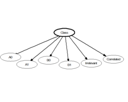

# NAIVE BAYES

É um algoritmo de aprendizado de máquina supervisionado de **classificação** baseado no **Teorema de Bayes**. É famoso por ser muito simples e rápido. É especialmente eficiente para dados de alta dimensão (como textos). 

Seu nome traz a palavra "Naive" (Ingênuo) porque ele faz uma suposição super simplificadora: assume que todas as variáveis X são completamente independentes entre si, dado a classe alvo Y. Isso significa que ele parte do pressuposto que **não existe correlação nem multicolineariedade** nos dados. Nenhuma variável X pode estar mínimamente relacionada com outra. 

Essa simplificação absurda que ele faz permite ele ser super rápdio, mas raramente é verdade. Porém ainda é útil em cenários simples e funciona muito bem com milhares de dados.

Para cada variável X ele calcula tabelas de frequências e probabilidades a partir dos dados de treino. O modelo calcula a probabilidade de um dado pertencer a uma categoria com base no conhecimento prévio da frequência daquela classe (priori) e na frequência com que cada variável aparece em cada categoria (verossimilhança).

## A Premissa "Ingênua" (Naive)

É a simplificação de assumir que a presença de uma variável X não altera a probabilidade da presença de outra variável X, dentro de uma mesma categoria. Por exemplo, em um e-mail a palavra "promoção" e a palavra "clique" são tratadas como se ocorressem de forma totalmente independente uma da outra quando o e-mail é spam. É isso que torna o modelo tão simples e leve.

Na prática essa suposição simplista raramente é verdadeira, mas ele compensa com uma eficiência enorme em cenários reais. Essa eficiência se deve aos seguintes fatores:

- Alta velocidade mesmo com muitos dados
- Alta acurácia mesmo com poucos dados
- Ótimo para textos e quando tem centenas de variáveis X
  - Funciona bem com texto porque cada palavra é uma variável

**Objetivo**: Reduzir uma multiplicação de probabilidades condicionais conjuntas (complexo) a um produto simples de probabilidades individuais.

## Log-Probabilidade

Quando temos várias variáveis independentes $X = (x_1, x_2, ..., x_n)$ o Teorema de Bayes exige calcular a probabilidade conjunta dessas variáveis ocorrerem juntas em cada categoria.

Sem a premissa ingênua, precisaríamos de uma quantidade astronômica de dados para cobrir todas as combinações possíveis de $x_1, x_2, ..., x_n$. Com a suposição de independência condicional, transformamos essa probabilidade conjunta em um produto de probabilidades individuais:

$$P(X|y) = P(x_1|y) * P(x_2|y) * ... * P(x_n|y) = \prod_{i=1}^{n} P(x_i|y)$$

Para facilitar para a máquina e evitar perda de precisão ao multiplicar frações cada vez menores, trocamos o produtório pelo somatório dos logs.

$$\log(P(X|y)) = \sum_{i=1}^{n} \log(P(x_i|y))$$

> Podemos visualizar isso como uma balança de evidências: **cada característica traz uma "força" a favor ou contra uma categoria**. Ao multiplicarmos todas essas forças, obtemos a pontuação total daquela categoria.

## Quando Usar

- Textos
  - Filtros de spam
  - Chatbot
  - Análise de sentimento em texto
  - Categorizar notícias e documentos
- Recomendação simples (próximo filme a assistir, produtos a comprar)
- Diagnóstico médico inicial (avaliar sintomas para estimar a probabilidade inicial de doenças)
- Quando velocidade é primordial
- Quando tiver centenas de variáveis X (colunas)

## Cenários Sem Dados

Imagine que estamos classificando e-mails como Spam ou Não-Spam. No treino, a palavra "pix" nunca apareceu em nenhum e-mail de Spam. 

Se recebermos um novo e-mail que é claramente spam, mas traz a palavra "pix", a probabilidade P(pix | Spam)$ será 0. Como o Naive Bayes multiplica todas as probabilidades, **um único zero anula toda a multiplicação**, resultando em probabilidade zero para aquela classe, independentemente de quão fortes sejam as outras evidências!

### A Solução: Suavização de Laplace

Para evitar que uma única característica ausente destrua a probabilidade total, adicionamos uma constante (geralmente $\alpha = 1$) ao numerador e um ajuste correspondente ao denominador ao calcular as probabilidades condicionais:

$$\hat{P}(x_i|y) = \frac{\text{contagem}(x_i, y) + \alpha}{\text{contagem}(y) + \alpha |V|}$$

Onde:
- $\alpha$ é o parâmetro de suavização ($\alpha = 1$ para Laplace, $0 < \alpha < 1$ para Lidstone).
- $|V|$ é a quantidade de variáveis X.

Dessa forma, nenhuma probabilidade jamais será exatamente 0, garantindo que palavras novas ou raras apenas reduzam levemente a chance daquela classe, em vez de zerá-la completamente.

## Limitações

1. **A Premissa da ingenuidade quase nunca é verdadeira:** No mundo real, características estão correlacionadas. Em texto, a palavra "Nova" tem maior probabilidade de ser seguida por "York". Em saúde, febre e calafrios aparecem juntos. O Naive Bayes ignora essas correlações.
2. **Sensível a categorias desbalanceadas:** Se 99% do dataset for da classe A e 1% da classe B, a probabilidade a priori vai dominar fortemente as previsões, dificultando a detecção da classe minoritária sem ajuste prévio.
3. **Probabilidades Mal Calibradas:** Embora o Naive Bayes seja excelente em **ordenar** as classes (dizer qual é a mais provável), as estimativas de probabilidade brutas (ex: "87% de chance") costumam ser extremas (muito próximas de 0 ou 1) devido à multiplicação de termos independentes.
4. **Escolha da distribuição adequada:** Para variáveis contínuas, assume-se uma distribuição específica (geralmente Gaussiana). Para contagens, assume-se Multinomial. Se a distribuição real dos dados for muito diferente da assumida, a performance cai.

## PREMISSAS

O Naive Bayes possui algumas exigências e comportamentos esperados em relação aos dados:

1. **Independência Condicional das variáveis:** O modelo assume que para cada classe Y, as variáveis X não possuem dependência mútua.
  - Variáveis se multicolinearidade
  - Baixíssima correlação
2. **Teste de Distribuição**: Se não for possível plotar todas as variáveis X para ver suas distribuições, faça com algumas, cheque sua distribuição e assuma que todas seguem a mesma. Para tanto testar se cada variável se encaixa na distribuição determinada evita um modelo ruim.

## ENTRADAS E SAÍDAS

Entrada:

- Dados de Treinamento (X e Y):
- Tipo de Distribuição: A definição da variante do modelo (Gaussian, Multinomial, Bernoulli) baseada na natureza dos dados X.
- Parâmetro de Suavização ($\alpha$): Hiperparâmetro para evitar o problema do zero (geralmente 1).

Saída:

- Classe Prevista: A classe que obteve a maior probabilidade a posteriori.
- Probabilidades: A probabilidade calculada para cada classe possível $P(y_k|X)$.

## COMO FUNCIONA

Ao contrário de algoritmos iterativos (como o Gradiente Descendente), o Naive Bayes aprende em **uma única passagem** pelos dados (fase de contagem estatística):

1. **Fase de Treinamento (Estatística):**
   - Calcula a probabilidade a priori P(y) de cada classe (proporção de ocorrência de cada classe no treino).
   - Para cada variável $x_i$ e cada classe y, calcula a probabilidade condicional $P(x_i|y)$ (frequência de $x_i$ na classe y ou ajustando a curva definida).
   - Aplica a Suavização de Laplace para prevenir contagens zero.
2. **Fase de Predição (Classificação):**
   - Calcula a probabilidade (log-probabilidade para ser mais exato) de X pertencer a cada classe somando $\log(P(y)) + \sum \log(P(x_i|y))$.
    - Aonde P(y) é o prior e $P(x_i|y)$ o posterior.
   - Seleciona a classe com o maior valor resultante.

### CRITÉRIOS DE DECISÃO

A escolha da classe final baseia-se na regra da **Máxima Probabilidade a Posteriori (MAP)**: Escolher a categoria com maior probabilidade. O MAP é portanto só mais um termo para algo banal: a categoria escolhida é a com maior nível de confiança (probabilidade).

## MÉTODOS INTERCAMBIÁVEIS (Alternativas)

O Naive Bayes pode ser substituído por outros algoritmos, dependendo do cenário:

- **Regressão Logística:**
  - **Quando trocar:** Quando há muitos dados e existem correlações fortes entre as variáveis que precisam ser capturadas.

- **Árvores de Decisão / Random Forest:**
  - **Quando trocar:** Quando a relação entre as variáveis é não-linear ou quando a interpretação de regras de decisão for importante.

- **Máquinas de Vetor de Suport (SVM):**
  - **Quando trocar:** Em classificação de texto quando se busca a máxima precisão possível e há poder computacional suficiente.

- **K-Nearest Neighbors (KNN):**
  - **Quando trocar:** Quando os dados têm poucas variáveis e vizinhança espacial importa.

> Em resumo, o Naive Bayes é imbatível em termos de velocidade em dados esparsos/textuais imensos. Quando há dependência forte entre variáveis e tempo e poder computacional disponível, modelos discriminativos sobrensaem.
