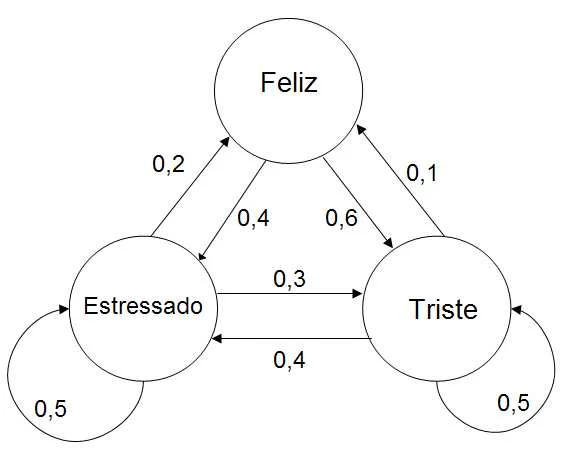

# CADEIAS DE MARKOV

É um modelo probabilístico que descreve todos os estados de um sistema e a **probabilidade de mudar de um estado para o outro**. O ponto principal das cadeias de Markov são as probabilidades de sair de um estado e ir para outro. Ele é representado por um grafo aonde cada nó é um estado e as arestas as contém as probabilidades de eles migrarem desse ponto para o outro.

Importante ter em mente que nas cadeias de Markov o próximo estado **depende exclusivamente do estado atual**, ignorando todo o histórico de estados anteriores. Essa característica fundamental é conhecida como a falta de memória. 

As Cadeias de Markov **não são modelos treinados por iterações** (como gradiente descendente), mas sim estruturas matemáticas de modelagem estocástica baseadas em matrizes de transição e grafos de estados. O modelo calcula a probabilidade de um sistema evoluir de um estado A para um estado B através de uma matriz, onde cada linha representa a distribuição de probabilidade sobre os possíveis estados futuros.

## Glossário

### Espaço de Estados

É o conjunto de todos os valores possíveis que $X_i$ pode assumir. Costuma ser representado como S. Em outras palavras, **Espaço de Estados são os nós do grafo**.

Os estados podem ser qualquer coisa, a posição dum robô aspirador num mapa, um status de um objeto, as categorias da variável Y...

### Processo Estocástico

É a formalização matemática de um conjunto de variáveis aleatórias $X_0, X_1, X_2, ..., X_t$ ordenadas no tempo, representando a evolução de um sistema. Ele é `O QUE` descreve a dinâmica incerta do sistema ao longo do tempo.

**Objetivo**: Modelar a trajetória aleatória de um sistema através de um conjunto discreto ou contínuo de estados ao longo do tempo.

### Falta de Memória

Também chamada de **Propriedade de Markov**, é a **premissa simplificadora central** que permite fazermos algo com nossos dados. Ela diz que a distribuição de probabilidade do estado futuro $X_{t+1}$ depende **apenas do estado presente** $X_t$, tornando irrelevante o conhecimento da sequência histórica $X_0, X_1, ..., X_{t-1}$. Ela é o `COMO` reduzimos drasticamente a complexidade do cálculo de sequências temporais.

**Objetivo**: Transformar a probabilidade condicional conjunta de toda a história do sistema em uma probabilidade condicional simples entre dois passos consecutivos.

## Matriz de Transição

Ao invés de termos de montar um grafo, guardar em cada nó uma lista de nós vizinhos e salvar nessa aresta os valores dela, existe uma forma muito mais simples e computacionalmente rápida de fazer: colocar todos os pesos das arestas em matrizes.

Se o número de estados for discreto e finito a gente pode organizar todas as arestas em formato de matriz quadrada, onde cada linha e cada coluna representam um nó (estado). Assim se eu quero ir do estado A para o estado B basta olhar na matriz a linha A e coluna B que tenho a probabilidade dessa aresta. Caso não seja possível ir de um estado para o outro o valor dessa posição é 0. Também podemos ver que esse método cobre grafos bidirecionais. A aresta A->B é diferente de B->A. O primeiro vamos na linha A e coluna B, enquanto o outro vamos na linha B e coluna A, que dão em locais diferentes da matriz com valores diferentes.

A Matriz de Transição tem portanto tamanho NxN, sendo N o total de nós/estados. Ela é representada como P.

$$P = \begin{bmatrix}
P_{11} & P_{12} & \dots & P_{1N} \\
P_{21} & P_{22} & \dots & P_{2N} \\
\vdots & \vdots & \ddots & \vdots \\
P_{N1} & P_{N2} & \dots & P_{NN}
\end{bmatrix}$$

Onde podemos escrever a probabilidade em cada elemento como:

$$P_{ij} = P(X_{t+1} = S_j \mid X_t = S_i)$$

A equação acima é entendida da seguinte forma:

- T é o momento (passo) atual. Portanto no momento atual (T) estamos na posição i. 
- Estamos no estado $S_i$ e no próximo iremos para o estado $S_j$ 
  - Não confundir a posição com tempo. "i" e "j" são nossas posições no momento T e T+1. Portanto não podemos dizer que j = i + 1 por exemplo.
  - "i" e "j" seriam como RJ e SP e T seria como "dia 5". A equação seria "a probabilidade de ir de RJ para SP no dia 6".

Ou seja, a equação significa "probabilidade de estar no estado J dado que no momento anterior estou no estado "i"".

Um ponto importante de se notar é que o nó pode ter uma aresta apontando para ele mesmo. Isso significa que existe uma chance de não mudar de estado. Seria a probabilidade de tudo continuar como tá (continuar no estado atual). Todo nó pode ter uma aresta apontando para si, embora isso não seja obrigatório.

### Propriedades fundamentais da Matriz de Transição

1. **Todos os elementos são não-negativos** (afinal são probabilidades).
2. **A soma de cada linha é exatamente 1** (garantindo uma distribuição de probabilidade válida para a saída de qualquer estado).

A soma de cada linha tem de ser 1 por um motivo muito óbvio: a soma de todas as probabilidades possíveis tem de ser 1! Como a linha representa todos os estados possíveis de se estar (saindo de algum lugar) a soma deles dá 100% = 1. 

Isso mostra que nós temos outra **premissa: todos os estados possíveis foram mapeados**!

Porém o mesmo não é verdade para as colunas. As colunas representam as probabilidades de você chegar no estado J (J sendo a coluna) e a linha onde estava antes. Porém como você pode não estar em J em algum momento **a soma da coluna não tem obrigação de dar 1**. A soma pode inclusive ser maior que 1 ou menor que 1. A imagem abaixo demonstra isso bem.

> Visualizando essas regras em um grafo, a soma de todas as arestas que saem de um nó tem de dar 1, mas a soma das arestas que chegam não.

A matriz da imagem abaixo seria:

$$\begin{bmatrix}
---               & \text{Feliz} & \text{Estressado} & \text{Triste} \\
\text{Feliz}      & 0            & 0.4               & 0.6 \\
\text{Estressado} & 0.2          & 0.5               & 0.3 \\
\text{Triste}     & 0.1          & 0.4               & 0.5
\end{bmatrix}$$

### Relação entre Matriz de Transição e Matriz de Adjacência

Em teoria dos grafos, a matriz de transição P é formalmente a **Matriz de Adjacência Ponderada e Normalizada por Linha** do grafo de estados. Essa perspectiva topológica permite analisar propriedades da cadeia usando conceitos clássicos de grafos:

- **Componentes Fortemente Conectados:** É possível chegar em qualquer nó saindo de qualquer outro.
- **Estados Absorventes:** Um nó só tem aresta de saída para ele mesmo. Uma vez que entra nele nunca mais sai.
- **Período e Ciclos:** O período de um estado é o máximo divisor comum (MDC) do comprimento de todos os caminhos fechados (ciclos) que retornam a ele. Se o MDC for 1, o estado é **Aperiódico**.
- **Ergodicidade:** Quando é fortemente conectados e aperiódico o grafo garante a existência de uma única distribuição estacionária global, independentemente do estado inicial $p^{(0)}$.

## Evolução do Estado em N Passos

Se conhecemos a distribuição de probabilidade inicial do sistema no instante 0, representada por um vetor linha $p^{(0)}$, a distribuição de probabilidade no instante $1$ é dada pelo produto vetorial-matricial:

$p^{(1)} = p^{(0)} P$

Aonde P é a nossa matriz de transição.

Do mesmo modo, no momento 2 após ter realizado uma segunda ação a distribuição será:

$p^{(1)} = p^{(0)} P*P$

Pois teremos feito 2 ações (representado pela matriz). Como a matriz é a probabilidade de cada ação ser tomada, a minha posição após 2 ações é a posição inicial vezes 2 vezes a matriz de probabilidades.

Portanto a distribuição de probabilidade após N passos é a distribuição inicial vezes n-ésima potência da matriz de transição:

$$p^{(n)} = p^{(0)} P^n$$

> Ao elevar todos os valores da matriz por N temos na matriz a probabilidade de sairmos da linha i e chegarmos a coluna j após N passos.

## O Problema da Distribuição Estacionária (p)

Conforme o número de passos N vai para o infinito, muitas cadeias de markov se estabilizam. O sistema atinge um equilíbrio estatístico onde a distribuição de probabilidade entre os estados não muda mais ao aplicar a transição. Esse estado de equilíbrio é chamado de **Distribuição Estacionária** (p):

$$p^P = p$$

Significa que p é um **autovetor à esquerda** da matriz P associado ao autovalor $\lambda = 1$. Encontrar essa distribuição é fundamental para entender o comportamento de longo prazo do sistema.
