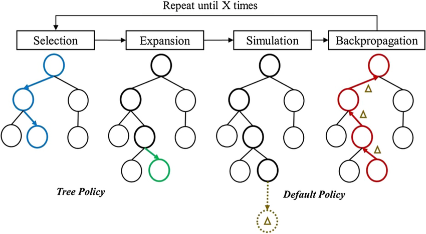

# VARIAÇÕES DE MONTE CARLO

O Método de Monte Carlo tradicional utiliza **amostras independentes e identicamente distribuídas** para estimar integrais. Problemas com muitas variáveis X em IA e espaços de busca gigantescos exigem estratégias de amostragem e de navegação no conjunto total de valores. 

Cadeias de Markov de Monte Carlo (MCMC) e Busca em Árvore de Monte Carlo (MCTS) são os dois métodos estocásticos avançados mais influentes da computação moderna. Eles **não são algoritmos de machine learning**, mas sim **mecanismos de amostragem probabilística e navegação heurística** em grafos/árvores de decisão sob incerteza.

Para se ter em mente, o MCMC constrói uma Cadeia de Markov para pegar amostras de distribuições de probabilidade complexas e intratáveis, enquanto o MCTS constrói e navega dinamicamente por uma árvore, equilibrando a exploração de novos caminhos com a exploração dos melhores caminhos já conhecidos.

# MONTE CARLO VIA CADEIAS DE MARKOV (MCMC)

## O Problema das Distribuições Intratáveis

Na inferência Bayesiana e em modelos estatísticos de alta dimensão (muitas variáveis X), frequentemente queremos calcular a distribuição a posteriori $p(\theta|X)$ de um vetor de parâmetros $\theta$ dado um conjunto de dados X:

$$p(\theta|X) = \frac{p(X|\theta) p(\theta)}{p(X)} = \frac{p(X|\theta) p(\theta)}{\int p(X|\theta') \cdot p(\theta') \, d\theta'}$$

O denominador p(X) (evidência) exige integrar sobre **todo o espaço de parâmetros** $\theta$. Quando $\theta$ possui dezenas ou centenas de dimensões, essa integral é analiticamente **intratável** e o método de Monte Carlo tradicional falha porque a região de alta probabilidade torna-se uma "agulha num palheiro" multidimensional. Lembre-se que o Monte Carlo padrão tem problemas quando a fórmula tem muitos picos muito íngremes.

O MCMC resolve isso ao **navegar iterativamente pelo espaço de parâmetros**, passando mais tempo nas regiões de alta probabilidade sem jamais precisar calcular a constante de normalização p(X).

## PREMISSAS

1. **Ergodicidade da Cadeia:** A cadeia deve ser irredutível (pode alcançar qualquer estado) e aperiódica.
2. **Avaliação da Densidade Não-Normalizada:** Deve ser possível calcular a parte de cima da equação de Bayes ($p(X|\theta)p(\theta)$) para qualquer ponto $\theta$.
3. **Fase de Burn-In:** As primeiras amostras devem ser descartadas até que a cadeia atinja a distribuição estacionária (encontre a região de maior probabilidade).

## ENTRADAS E SAÍDAS

- **Entrada:** Função de verossimilhança $p(X|\theta)$, distribuição a priori $p(\theta)$, ponto de partida $\theta_0$, número de amostras N.
- **Saída:** Conjunto de amostras da distribuição a posteriori $\{\theta_1, \theta_2, ..., \theta_N\}$, permitindo calcular médias, variâncias e intervalos de credibilidade.

## COMO FUNCIONA

1. Inicie em um ponto aleatório do espaço de parâmetros $\theta^{(0)}$.
2. Para $t = 1$ até N:
   - Proponha um novo ponto $\theta'$ usando a distribuição $q(\theta'|\theta^{(t-1)})$. Ou seja, usando a matriz da cadeia de Markov.
   - Calcule a razão de aceitação $\alpha$.
   - Sorteie $u \sim \text{Uniforme}(0, 1)$.
   - Se $u \le \alpha$, aceite $\theta^{(t)} = \theta'$. Caso contrário, rejeite e mantenha $\theta^{(t)} = \theta^{(t-1)}$.
3. Descarte as primeiras K amostras (Burn-in) e utilize o restante.

### CRITÉRIOS DE CONVERGÊNCIA E PARADA

Converge quando diagnósticos estatísticos (como Gelman-Rubin) indicam que múltiplas cadeias independentes se sobrepuseram e atingiram a distribuição estacionária.

## A Matemática do MCMC

### Condição de Balanço Detalhado (Detailed Balance Condition)

Para que uma Cadeia de Markov possua uma distribuição estacionária $p(\theta)$ que coincida exatamente com a nossa distribuição alvo $p(\theta|X)$, a transição entre qualquer par de estados $\theta$ e $\theta'$ deve satisfazer a **condição de balanço detalhado**:

$$p(\theta) P(\theta \to \theta') = p(\theta') P(\theta' \to \theta)$$

Onde $P(\theta \to \theta')$ é a probabilidade de transitar do estado $\theta$ para $\theta'$ (dada pela matriz de Markov). Se essa condição for satisfeita e a cadeia for ergódica, a distribuição limite da cadeia será garantidamente $p(\theta)$.

### Algoritmo de Metropolis-Hastings

> Ele nos permite fazer algumas transformações na equação de Monte Carlo aonde o denominador (a parte complexa e incalculável) se cancela, deixando tudo mais fácil.

O algoritmo de Metropolis-Hastings separa a transição em duas etapas: uma **proposta de candidato** $q(\theta'|\theta)$ e um **critério de aceitação** $\alpha(\theta, \theta')$.

A probabilidade de aceitação de um novo estado proposto $\theta'$ a partir de $\theta$ é calculada como:

$$\alpha(\theta, \theta') = \min\left(1, \frac{p(\theta'|X) q(\theta|\theta')}{p(\theta|X) q(\theta'|\theta)}\right)$$

Como $p(\theta|X) = \frac{p(X|\theta)p(\theta)}{p(X)}$, ao substituir na razão de aceitação, o denominador p(X) se **cancela completamente**:

$$\frac{p(\theta'|X)}{p(\theta|X)} = \frac{\frac{p(X|\theta')p(\theta')}{p(X)}}{\frac{p(X|\theta)p(\theta)}{p(X)}} = \frac{p(X|\theta')p(\theta')}{p(X|\theta)p(\theta)}$$

**Propriedade crítica**: Podemos amostrar perfeitamente da distribuição a posteriori conhecendo apenas o produto da verossimilhança pela priori ($p(X|\theta)p(\theta)$), sem calcular a prior.

### Amostragem de Gibbs (Gibbs Sampling)

A Amostragem de Gibbs é um caso especial do Metropolis-Hastings onde atualizamos **uma variável por vez** condicionado aos valores atuais de todas as outras variáveis:

$$\theta_j^{(t+1)} \sim p(\theta_j \mid \theta_1^{(t+1)}, \dots, \theta_{j-1}^{(t+1)}, \theta_{j+1}^{(t)}, \dots, \theta_d^{(t)}, X)$$

Nessa formulação, a probabilidade de aceitação $\alpha$ é **sempre $1$** ($100\%$ das propostas são aceitas), eliminando rejeições, desde que as distribuições condicionais plenas sejam conhecidas e fáceis de amostrar.

### Monte Carlo de Hamilton (HMC) e NUTS

Em espaços de altíssima dimensão (ex: centenas de parâmetros em redes neurais Bayesianas), a amostragem aleatória (Random Walk) do Metropolis-Hastings torna-se ineficiente, ficando presa ou demorando muito mais loops para explorar o espaço.

O Monte Carlo de Hamilton (HMC) introduz variáveis de "momento" simulando a física de uma partícula deslizando sobre a superfície do logaritmo negativo da densidade de probabilidade. Ele utiliza o **gradiente da distribuição** ($\nabla_\theta \log p(\theta|D)$) para dar saltos distantes e altamente eficientes. O **NUTS (No-U-Turn Sampler)** é a evolução do HMC que ajusta os passos do simulador hamiltoniano automaticamente.

Ou seja, através da derivada do log ele ajusta o **tamanho do passo** para encontrar e pular para a área de maior probabilidade em cenários de extrema dimensionalidade. Lembrando que quanto mais dimensões mais picos temos e mais difícil fica pro algoritmo achar essa região (por se prender e ficar tempo em máximos locais).

## MÉTODOS INTERCAMBIÁVEIS (Alternativas)

**Inferência Variacional (VI)**. Em vez de amostrar ela transforma a inferência em um problema de otimização rápida (minimizando a Divergência KL), sendo ideal para Big Data, embora possa subestimar a variância.

# BUSCA EM ÁRVORE MONTE CARLO (MCTS)

## O Problema da Busca Combinatória em Grafos e Jogos

Em jogos de informação perfeita (Xadrez, Go) ou no planejamento de ações de um agente de IA, o espaço de estados futuros cresce exponencialmente com a profundidade da árvore ($b^d$, onde $b$ é o fator de ramificação e $d$ é a profundidade).

A busca exaustiva (como Minimax puro) estoura em memória e tempo. O MCTS resolve esse problema construindo uma **árvore assimétrica**, expandindo apenas os ramos mais promissores do grafo de decisões enquanto avalia a qualidade de nós folha via simulações estocásticas de Monte Carlo. 

Ele lembra o Djikstra, mas opera de forma diferente, pois o MCTS foca em grafos que não são totalmente conhecidos.

## As 4 Fases do MCTS

O MCTS executa ciclicamente quatro etapas fundamentais até atingir um limite de tempo ou de iterações:

### Seleção

A partir da raiz (estado atual), o algoritmo desce pela árvore existente selecionando sucessivamente os nós filhos que maximizam um critério de **Upper Confidence Bound (UCB)**. Essa fase termina ao atingir um nó que ainda não foi totalmente expandido.

### Expansão

Se o nó selecionado não for um estado terminal do jogo/problema, cria-se um ou mais nós filhos correspondentes a ações válidas ainda não exploradas a partir daquele estado.

### Simulação / Rollout

A partir do novo nó expandido, executa-se uma simulação de Monte Carlo estocástica (jogando aleatoriamente ou com uma política simples/heurística rápida) até atingir um estado final (vitória, derrota, empate ou um estado limite).

### Retropropagação (Backpropagation)

O resultado da simulação, chamado de V (ex: +1 para vitória, -1 para derrota) é propagado de volta para cima ao longo de todo o caminho percorrido na árvore, atualizando duas estatísticas em cada nó visitado:
- **Contagem de visitas ($N$):** $N \leftarrow N + 1$
- **Valor/Recompensa acumulada ($W$):** $W \leftarrow W + v$
- **Valor Médio do Nó ($Q$):** $Q = \frac{W}{N}$

## COMO FUNCIONA

1. Monte a árvore com o nó raiz $S_0$.
2. Enquanto houver tempo de computação disponível:
   - **Seleção:** Desça na árvore usando a fórmula UCB1/PUCT até encontrar um nó não totalmente expandido.
   - **Expansão:** Adicione um novo nó filho à árvore.
   - **Simulação:** Execute um rollout estocástico (ou avaliação por Rede Neural) para estimar o valor do nó.
   - **Retropropagação:** Propague o resultado $v$ para cima, atualizando $N$ e $W$ de todos os nós ancestrais.
3. Escolha a ação $a$ com o maior número de visitas $N_i$ na raiz.

## CRITÉRIOS DE CONVERGÊNCIA E PARADA

Para quando o orçamento computacional (tempo em milissegundos ou número limite de simulações/rollouts) é esgotado.

## Matemática

O coração da seleção no MCTS é o algoritmo **UCT (Upper Confidence Bound applied to Trees)**. Importante ressaltar que existe 3 versões do algoritmo: o UCB, o UCT que é o UCB para árvores e o PUCT que é uma evolução do UCT.

### Equilíbrio entre Exploração e Explotação

O UCT possui 2 fórmulas internas que representam os 2 pontos que ele analisa e pondera para decidir qual o próximo nó a visitar:

- **Explotação**: favorece ações que tiveram alto rendimento no passado (podemos traduzir como "extrair").
- **Exploração**: favorece ações que foram pouco visitadas (incentiva a ir mais nos nós pouco explorados).

### Fórmula Básica: UCB1

$$\text{UCT}(s, a) = \underbrace{\frac{W_i}{N_i}}_{\text{Explotação (Q)}} + c \underbrace{\sqrt{\frac{\ln N_p}{N_i}}}_{\text{Exploração (U)}}$$

Onde:
- $W_i$: Recompensa total acumulada pelo nó filho $i$.
- $N_i$: Número de vezes que o nó filho $i$ foi visitado.
- $N_p$: Número de vezes que o nó pai foi visitado.
- $c$: Hiperparâmetro de exploração (teoricamente $c = \sqrt{2} \approx 1.414$).

Em outras palavras, **UCB = explotação + $\sqrt2$ exploração.**

Repare que a `explotação é a média dos resultados daquele ramo` e a `exploração a proporção entre novos caminhos inexplorados e explorados`.

### Variante Moderna de IA: PUCT

Em arquiteturas modernas de Deep Learning (como AlphaGo e AlphaZero), a simulação aleatória (rollout) é substituída pelas previsões de uma rede neural que fornece uma política a priori P(s, a) e uma estimativa de valor $V(s)$.

A fórmula do **PUCT** usada pelo AlphaZero é:

$$\text{PUCT}(s, a) = Q(s, a) + c_{\text{puct}} * P(s, a) * \frac{\sqrt{\sum_b N(s, b)}}{1 + N(s, a)}$$

Onde:
- $Q(s, a)$: Valor médio previsto pela rede e ajustado pelos rollouts/avaliações.
- $P(s, a)$: Probabilidade a priori atribuída à ação A.
- $c_{\text{puct}}$: Constante que controla a velocidade de transição de confiar na priori da rede para confiar nos dados acumulados da busca.

## MÉTODOS INTERCAMBIÁVEIS (Alternativas)

**Busca A* / Minimax com Alfa-Beta Pruning**. Em árvores pequenas com funções de avaliação heurísticas perfeitas, algoritmos determinísticos clássicos podem ser mais rápidos.
