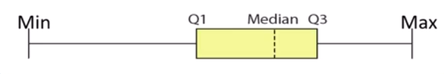
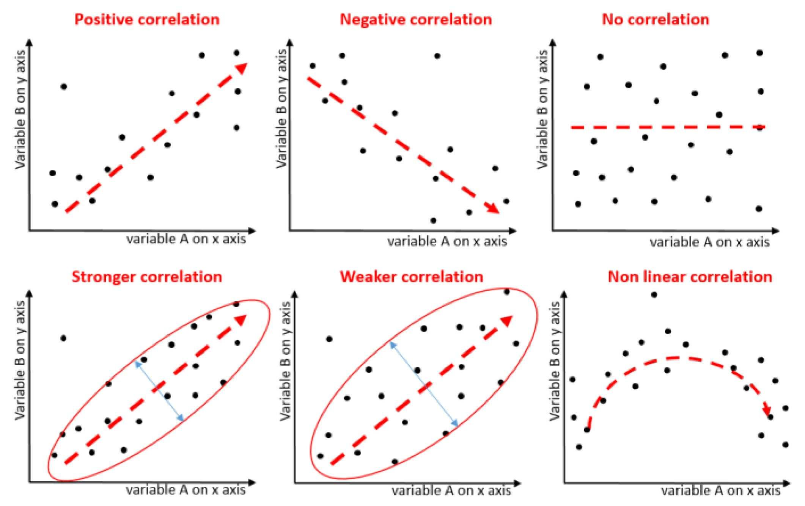

# Sobre Dispersão
- Mede o quanto os dados se concentram ou se distanciam do centro
- Nos informa se os dados são muito próximos entre si ou não
- Nos informa se o gráfico é mais afinado ou mais gordinho
- Nos ajuda a encontrar outliers

Alguns gráficos como histograma e boxplot são muito bons para nos fornecer informações.

# TIPOS DE DISPERSÃO

**1. AMPLITUDE**
- É a diferença entre o maior e o menor valor no eixo Y
- **Sensível a outliers** (pois considera só os mais distantes, possivelmente outliers)
- Não é bom, pois só considera 2 valores
- Preferível usar outros métodos de dispersão

`amplitude = maior - menor`

**2. BOXPLOT**
- Mostra numericamente e graficamente a distribuição dos dados (quão espaçados estão)
- Consegue saber exatamente quais valores são outliers
- Usa mediana ao invés de média pq mediana não é enviesada por outliers e como é usado para detectá-los, a média os encobriria.
- Ótimo pra detectar assimetrias e caudas

- Divide os dados em 4 grupos: 
    - Do menor aceitável (min) ao Q1
    - Q1 até a mediana
    - Mediana até o Q3
    - Q3 até o maior aceitável (max)

- **Quem tiver abaixo do menor aceitável e acima do maior aceitável são outliers**

Como construir um boxplot:
1. Ordenar os dados
2. Achar a mediana
3. Q1 e Q3 são as medianas de cada metade
OBS: caso o conjunto tenha nº par, a mediana é a média dos 2 valores do meio
4. Calcula o Intervalo Inter Quartil (IIQ ou IQR em ingles) IIQ = Q3 - Q1
5. Calcula os limites aceitáveis min = Q1 - 1,5*IIQ  max = Q3 + 1,5*IIQ

- Os limites aceitáveis (min e max) serão o menor/maior valor **existentes** dentro dos limites
    - Ex: menor valor que existe é 6 e o min deu -27, min será 6. ex2: max deu 69 mas os valores existentes são 58 e 71, o max será 58
- Q1 e Q3 formam a caixa do boxplot e representam 50% dos dados.
- Esse 1,5 do cálculo vem do z-score, para que os limites aceitos fiquem até 2,698 na tabela z (próximo a 3 desvios padrões de distância)

**3. VARIÂNCIA**
- Medida de dispersão baseada na média
- A distância que um valor está da média é seu desvio. 
	- Variância é a média dos desvios ao quadrado (para ignorar sinal)
- Média das distâncias do centro (média)

$$variancia = \frac{\sum_{i=1}^n (x_i - media)^2}{N}$$

Se for a variância da **população** divide por N e se for da **amostra** divide por N-1

`OBS: para amostrar enormes, N ou N-1 se torna insignificante`

Como eleva ao quadrado (pra eliminar o sinais) ele também acaba elevando demais o resultado final, ficando distorcido dos dados e `altera a unidade de medida`.
- Ex: se estou medindo a altura das pessoas na sala, a unidade final da variância é cm ao quadrado, não cm como o esperado

**Não pode** ser usado com mediana ou médias diferentes da aritimétca. Para mediana user o IQR (do boxplot). Para as outras médias usar tecnicas proprias listadas na sessão de médias.

Como é a dispersão em volta da média e média é a esperança, variância tbm pode ser calculado como:

$$variancia = E(x^2) - E(x)^2 = \sum_{i=1}^n { (x_i - esperanca)^2 * p(x_i) }$$
`esperanca = média`

Uma 3ª forma de calcular a variância é:

$$variancia = mediaQuad^2 - media^2 = \frac{\sum_{i=1}^n{x_i^2}}{n} - media^2$$
`Se resolver a formula principal da variância chegamos nessa`

Prova:
$mediaQuad = \sqrt{\frac{\sum_{i=1}^n x_i^2}{N}} = \sqrt{\frac{x_1^2 + x_2^2...+x_n^2}{N}}$

$\frac{\sum_{i=1}^n (x_i - media)^2}{N} = \frac{(x_1 - media)^2 + (x_2 - media)^2 ... (x_n - media)^2}{N}$

$\frac{x_1^2 - 2x_1*media + media^2 + x_2^2 -2x_2*media + media^2 ... x_n^2 - 2x_n*media + media^2}{N}$

$\frac{x_1^2 + x_2^2 ... + x_n^2 + n*media^2 - 2*media(x_1+x_2...+x_n)}{N} =\frac{x_1^2 + x_2^2 ... + x_n^2}{N} + \frac{N*media^2}{N} - \frac{2media(x_1+x_2...+x_n)}{N}$

$mediaQuad^2 + media^2 - 2*media*media = mediaQuad^2 + media^2 - 2*media^2 = mediaQuad^2 - media²$

**4. DESVIO PADRÃO**
- É a raiz quadrada da variância
- É a média quadrática dos desvios
- Mede o quanto os valores se distanciam da média
- Vem pra corrigir a unidade de medida que a variância altera e trazer o resultado de volta pra mais próximo dos valores medidos

$$desvio = \sqrt{variancia}$$

Se for o desvio da **população** divide por N e se for da **amostra** divide por N-1

**Não pode** ser usado com mediana ou médias diferentes da aritimétca. Para mediana user o IQR (do boxplot). Para as outras médias usar tecnicas proprias listadas na sessão de médias.

Explicação do porque o desvio padrão é a média quadrática dos desvios:

$desvio = \sqrt{variancia} = \sqrt{\frac{\sum_{i=1}^n (x_i - media)^2}{N}}$
$X_i - media = desvio_i$
$desvio = \sqrt{\frac{\sum_{i=1}^n desvio_i^2}{N}} /  mediaQuad = \sqrt{\frac{\sum_{i=1}^n x_i^2}{N}}$

Mesma equação, só trocando Xi por desvio.

`Não posso comparar 2 desvios diretamente. As vezes um conjunto é menos esparso mesmo tendo desvio maior (devido a contexto ou unidade de medida). Para comparar usa-se o coeficiente de variação.`

**5. COEFICIENTE DE VARIAÇÃO**
- É o desvio padrão dividido pela média
- Serve pra comparar 2 desvios padrões com unidades de medidas diferentes (cm e kg)

$$cv = \frac{desvio}{media}$$

Se for o coeficiente da **população** divide por N e se for da **amostra** divide por N-1

- Ex: a média de altura duma sala é 170cm com desvio de 15cm e o peso é 75kg com desvio de 10kg. Qual unidade tem maior dispersão?
	- 1cm é muito pouco, mas 1kg é muita coisa, então msm o desvio da altura sendo maior (15 > 10) quem tem maior dispersão (cv) é o peso pq cada unidade é mais significativo

$cv(altura) = \frac{15}{170} = 0,09$
$cv(peso) = \frac{10}{75} = 0,13$

**6. COEFICIENTE DE CORRELAÇÃO**
- Usado pra medir se 2 variáveis são correlacionadas (dependentes ou não)
- Serve tanto para vars discretas (com gráficos de dispersão) como contínuas (com gráficos de linha)
- `Valor entre -1 e 1`
- Se for `= 0` não possui nenhuma correlação entre as vars
- Diz a direção (positivo se são diretamente proporcionais e negativo se são inversamente proporcionais) 
- Diz a intensidade do quanto elas tão relacionadas (mais proximo do 1 ou -1 mais intenso é)
- Correlação forte: os pontos tão menos dispersos (mais próximos da reta média (regressão))

Tem 4 formas de calcular, que serão mostradas na sessão "coeficiente-de-correlação"

# Resumo
- Encontrar outliers: **desvio padrão e boxplot**
- Avaliar dispersão de dados: **desvio padrão e boxplot** (e gráfico)
- Comparar dispersões: **coeficiente de variação** (e gráfico)
- Verificar correlação: **coeficiente de correlação** (e gráfico de dispersão)