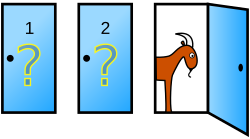
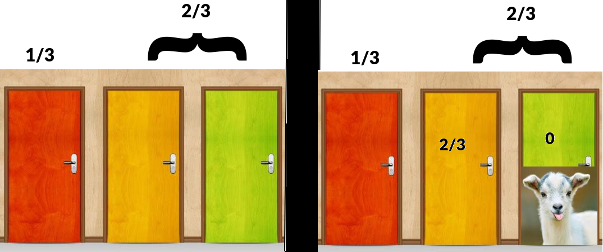
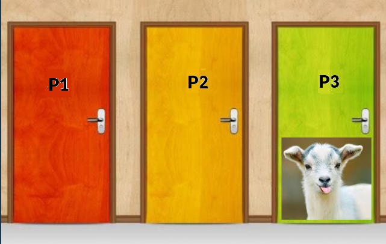

# Problema de Monty Hall

O problema é nomeado com o nome do apresentador de TV que fazia esse desafio em seu programa de auditório nos anos 70. No Brasil tivemos uma versão parecida com Sérgio Malandro e a Porta dos Desesperados.

O desafio é mostrar 3 portas, aonde uma delas guarda um prêmio e as outras duas um bode sem valor. A pessoa tinha de escolher uma das portas, então o apresentador abria outra, revelando um dos bodes. Então era feita a pergunta: "Deseja permanecer na porta atual ou trocar"? Esse é o grande enigma do desafio. Com apenas 2 portas restando, uma com o prêmio e outra com um bode, é melhor continuar com a sua ou trocar?

## A resposta intuitiva, porém errada

Inicialmente cada porta tinha 1/3 de chances de ter o prêmio. O raciocínio intuitivo é que, após uma das portas, cada uma das que sobraram terá 50% de chances de guardar o prêmio, portanto não faz diferença trocar.

Isso pode fazer o jogador **permanecer na porta escolhida** e acreditar que tem **50%** de chance de vencer, o que é um **erro**.

## O Truque

Porém o apresentador sabe aonde está o prêmio e a escolha de qual porta abrir não é aleatória. A verdade é que **trocar de porta aumenta as chances de vitória** para 2/3 (**66%**).

A forma simples de ver isso é imaginar que no início cada porta possuía 1/3 de chances. Sua porta possui 1/3 de chances e as duas não escolhidas juntas possuem 2/3. Ao abrir uma das portas não escolhidas o conjunto "2 portas não escolhidas" continua com os mesmos 2/3 de chances, porém agora concentradas em uma única porta.

Isso tudo ocorre porque o apresentador sabe desde o início quais portas tem bode e qual tem prêmio. A ação dele altera a percepção do jogo, mas ele tem mais informações que o jogador.

### A prova

Como houve duas ações prévias (escolher uma porta e abrir uma porta), e a primeira ação afeta a segunda, esse problema é um problema de **probabilidade condicional**. Considere as portas abaixo e que escolhemos a porta P1 e que a chance do prêmio (carro) estar na porta 1 é C1 e de estar na porta 2 é C2. Vamos representar a porta aberta como A (A3 significa porta 3 aberta).

E lembrando das fórmulas

$P(A∩B) = P(A|B)*P(B)$

$P(A|B) = \frac{P(A∩B)}{P(B)}$

$P(A∩B) = P(A)*P(B)$

Podemos calcular que a chance do carro estar na porta 2 (C2) é:

$P(C2 | P1∩A3) = \frac{P(C2∩P1∩A3)}{P(P1∩A3)}$ -> P1∩A3 é B e A|B = A∩B/B

Isso significa `probabilidade do carro estar na porta 2 (C2) dado que escolhi a porta 1 (P1) e porta 3 está aberta (A3)`.

$\frac{P(C2∩P1∩A3)}{P(P1∩A3)} = \frac{P(A3∩P1∩C2)}{P(A3∩P1)}$ -> só troquei a ordem

$\frac{P(A3∩P1∩C2)}{P(A3∩P1)} = \frac{P(A3 | P1∩C2)*P(P1∩C2)}{P(A3|P1)*P(P1)} = \frac{P(A3 | P1∩C2)*P(P1)*P(C2)}{P(A3|P1)*P(P1)}$

Agora analise:

P(A3 | P1∩C2) = probabilidade da porta 3 ser aberta dado que eu escolhi a porta 1 e o carro está na 2. Como o apresentador não pode abrir nem minha porta nem a do carro, a única opção é abrir a 3, portanto **P(A3 | P1∩C2) = 1**.

P(P1) = probabilidade de eu escolhar a porta 1 = 1/3

P(C2) = probabilidade do carro estar na porta 2 = 1/3

P(A3|P1) = probabilidade da porta 3 ser aberta dado que escolhi a porta 1. Como escolhi a porta 1 o apresentador só pode abrir as portas 2 e 3, portanto **P(A3|P1) = 1/2**.

$P(C2 | P1∩A3) = \frac{P(A3 | P1∩C2)*P(P1)*P(C2)}{P(A3|P1)*P(P1)} = \frac{ 1*\frac{1}{3}*\frac{1}{3} }{ \frac{1}{2}*\frac{1}{3} } = \frac{ \frac{1}{9} }{ \frac{1}{6} } = \frac{1}{9}*6 = \frac{6}{9} = \frac{2}{3}$

---

Se quisermos calcular a chance do carro estar na mesma porta que escolhemos (C1).

P(C1 | P1∩A3) = probabilidade do carro estar na porta 1 dado que escolhi a porta 1 e abriram a porta 3

$P(C1 | P1∩A3) = \frac{P(C1∩P1∩A3)}{P(P1∩A3)} = \frac{P(A3∩C1∩P1)}{P(P1 | A3)*P(A3)}$

$\frac{P(A3∩C1∩P1)}{P(P1 | A3)*P(A3)} = \frac{P(A3 | C1∩P1)*P(C1∩P1)}{P(P1 | A3)*P(A3)} = \frac{P(A3 | C1∩P1)*P(C1)*P(P1)}{P(P1 | A3)*P(A3)}$

P(A3 | C1∩P1) = probabilidade da porta 3 ser aberta dado que eu escolhi a porta 1 e o carro também está na porta 1. Como ambas as portas 2 e 3 tem bodes o apresentador pode escolher qualquer uma. Portanto **P(A3 | C1∩P1) = 1/2**.

P(P1) = probabilidade de eu escolhar a porta 1 = 1/3

P(C1) =  probabilidade do carro estar na porta 1 = 1/3

P(P1 | A3) = probabilidade da porta 1 ser escolhida dado que a porta 3 foi aberta. Como só sobrou a 1 e 2 para serem escolhidas, **P(P1 | A3) = 1/2**.

P(A3) = probabilidade da porta 3 ser aberta = 1/3

$\frac{P(A3 | C1∩P1)*P(C1)*P(P1)}{P(P1 | A3)*P(A3)} = \frac{ \frac{1}{2}*\frac{1}{3}*\frac{1}{3} }{\frac{1}{2}*\frac{1}{3}} = \frac{\frac{1}{18}}{\frac{1}{6}} = \frac{1}{18}*6 = \frac{6}{18} = \frac{1}{3}$