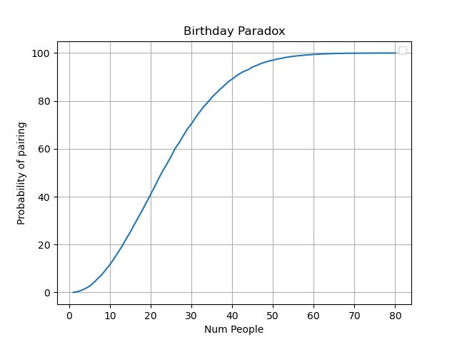

# Paradoxo do Aniversário

Pense em uma sala com 23 pessoas. Qual a chance de 2 terem o mesmo aniversário? Parece pouco. E quantas pessoas você precisa juntar para ter certeza que ao menos 2 fazem aniversário no mesmo dia? Aparentemente 366, uma para cada dia + uma para bater com alguém.

Está certo, com total certeza só com 366, mas e com 300 pessoas, quais as chances de já ter 2 aniversariantes no mesmo dia? A grande surpresa do paradoxo é que com apenas **23 pessoas** já temos **50%** de chance de ter duas pessoas que fazem aniversário no mesmo dia. A verdade é que as chances crescem exponencialmente a cada pessoa adicionada na sala. Antes do 100 você já pode considerar que já tem 2 pessoas.
- Com 23 pessoas: 50%
- Com 50 pessoas: 97%
- Com 70 pessoas: 99,9%

Importante que isso não significa que terá alguém que faça aniversário no mesmo dia que **você**. A chance de você ser uma dessas 2 pessoas que fazem aniversário juntas é de $\frac{1}{numPessoas-1}$. Isso porque temos `numPessoas - 1` datas diferentes e só uma ter um par.

## Explicação

A explicação vem da análise combinatória. 

As chances de 1 pessoa fazer aniversário em alguma data é $\frac{365}{365}$. 

As chances de 2 pessoas fazerem aniversário em dias diferentes é $\frac{365}{365}*\frac{364}{365}$.

As chances de 3 pessoas fazerem aniversário em dias diferentes é $\frac{365}{365}*\frac{364}{365}*\frac{363}{365}$ 

E assim por diante. Portanto a chance de n pessoas fazerem aniversário em dias diferentes é $\frac{365}{365}*\frac{364}{365}...*\frac{n}{365} = \frac{365!}{(365-n)!*365^n}$

---

Ex: 3 pessoas fazerem aniversário em dias diferentes (n=3).

$\frac{365}{365}*\frac{364}{365}*\frac{363}{365} = \frac{365*364*363}{365*365*365} = \frac{365*364*363}{365^3}$

A parte de cima (365 * 364 * 363) tende a virar 365! porém parando em n. Para conseguir esse resultado precisamos fazer $\frac{365!}{(365-n)!}$

No exemplo:

$\frac{365!}{(365-3)!} = \frac{365*364*363*362!}{362!} = 365*364*363$

Então podemos simplificar a equação para

$\frac{365*364*363}{365^3} = \frac{365!}{365^3*(365-n)!}$ provando a equação.

---

Essa é a equação para N pessoas fazerem aniversário em dias diferentes. Para as pessoas fazerem no mesmo dia é o complementar.

$P(n) = 1 - \frac{365!}{(365-n)!*365^n}$

---

Ex: A probabilidade de dentre 23 pessoas ao menos 2 fazerem aniversário no mesmo dia.

$P(23) = 1 - \frac{365!}{(365-23)!*365^{23}}$

$P(23) = 1 - \frac{365*364*363*362*361*360*359*358*357*356*355*354*353*352*351*350*349*348*347*346*345*344*343*342!}{342!*365^{23}}$ 

$P(23) = 1 - \frac{365*364*363*362*361*360*359*358*357*356*355*354*353*352*351*350*349*348*347*346*345*344*343}{365^{23}}$

$P(23) = 0,5073$

## Aplicações

Sabendo dessa propriedade, a criptografia precisa se preocupar ainda mais com colisões em funções hash, pois a chance de colisão não é 1/n (n = tamanho do hash), mas sim bem menor. Pensando que cada possibilidade do hash é uma data de aniversário, a chance de duas entradas darem o mesmo hash final é absurdamente menor que o tamanho do hash.

Um hacker pode encontrar uma entrada que dê a mesma saída na função de hash com $1,25\sqrt{N}$ tentativas (N é o nº de saídas diferentes que o hash pode dar). Isso afeta diretamente o tamanho mínimo de bits das funções de criptografia, que precisam ser maiores para evitar ataques de força bruta.