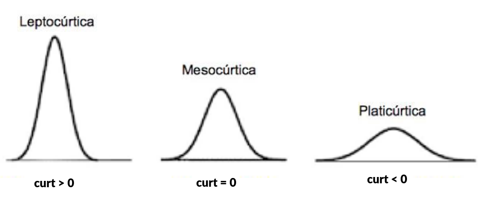
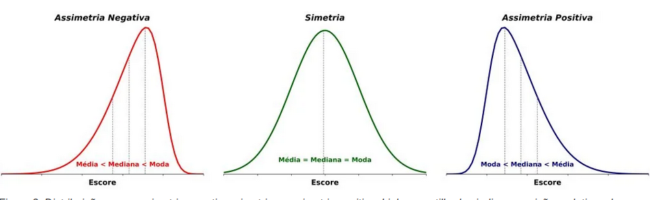
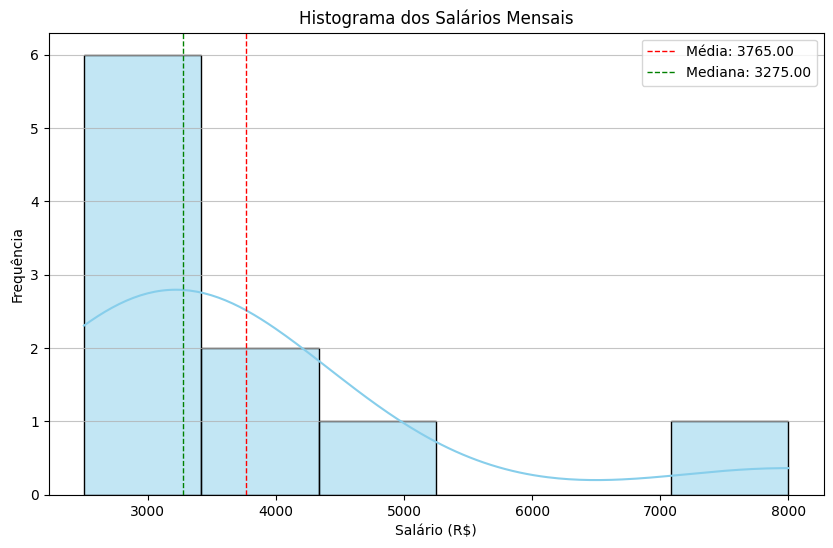

# Assimetria em gráficos

- Analisar a assimetria pode trazer alguns insights sobre os dados
- Os insights precisam ser confirmados por cálculos de inferência e de distribuição, mas pode servir como pontapé do que e onde olhar

#### Cauda e Curtose
- Histograma, gráfico de linhas e de dispersão são bons pra ver o formato geral da distribuição
- O formato pode dar suspetias sobre a curtose e encontrar onde pode traçar limites de outliers (confirmar via equações)
- **Quanto maior a curtose, menor a "cauda"**, mais rápido os valores caem (**mais concentrados no centro**)

#### Distribuições
- Gráficos simétricos podem ser Normal, T ou Tukey-Lambda
- Gráficos assimétricos à direita podem ser Exponencial, Qui-Quadrado, Lognormal, Gama ou F (topo fica à esquerda)
- Desconheço distribuições assimétricas a esquerda

#### Sinal da Assimetria
- Menores valores ficam a direita: assimetra a direita (positiva)
    - Frequencias mais comuns (a maioria dos dados) são valores baixos 
- Menores valores ficam a esquerda: assimetra a esquerda (negativa)
    -Frequencias mais comuns (a maioria dos dados) são valores altos

- Essa definição de positivo/negativo vem da média
- Se a média > mediana e moda, então é positivo (isso ocorre quando o topo tá à esquerda)

Exemplo: quantidade de pessoas que recebem um determinado salário. A maioria recebe salarios baixos e quanto maior, menos pessoas recebem. Portanto as barras maiores estarão no início e será uma assimetria a direita 

#### Boxplot
- Boxplot com a **maior cauda para cima** ou à direita = assimetra a **direita** (positiva)
- Boxplot com a **maior cauda para baixo** ou à esquerda = assimetra a **esquerda** (negativa)

