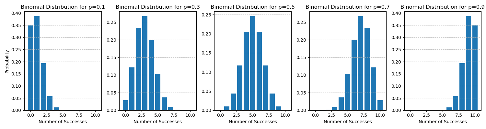
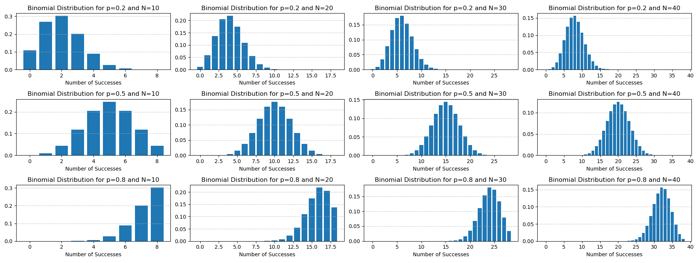

# DISTRIBUIÇÃO BINOMIAL

- É o caso genérico da Bernoulli, para n medidas
- Mede o nº de sucessos (ou falhas) em n medições binárias
- **Não é mais binário**, x agora pode ser qualquer valor

As variáveis da equação são:

- x é quantidade de sucessos ou falhas que queremos medir
- n é a quantidade de tentativas
- p é a probabilidade do sucesso ou falha acontecer

$$P(X=x) = \frac{n!}{x!*(n-x)!} * p^x * (1-p)^{n-x}$$

- O lado direito $p^x * (1-p)^{n-x}$ é igual ao Bernoulli, porém com n-x ao invés de 1-x. Isso se deve pq no Bernoulli n é sempre 1 (sempre 1 medida)
- O lado esquerdo é o binomial de n e x (nº de medidas e quantas devem dar sucesso ou falha)

O **binomial** calcula **quantas combinações** dão o resultado que a gente tá buscando (`quantas formas eu tenho de misturar x sucessos em n tentativas`)

---

Ex: x = 2 e n = 3
- falha, falha, falha
- falha, falha, sucesso
- falha, sucesso, falha
- falha, sucesso, sucesso (cumpre)
- sucesso, falha, falha
- sucesso, falha, sucesso (cumpre)
- sucesso, sucesso, falha (cumpre)
- sucesso, sucesso, sucesso

8 combinações, 3 cumprem

- binomial(3, 2) = 3 -> há 3 formas de combinar 2 acertos em 3 tentativas
- binomial(n, x) = **COMBINAÇÃO** -> a ordem das combinações **NÃO IMPORTA**

`Logo, a distribuição binomial nos diz quantas formas temos de alcançar uma certa probabilidade`

### OBSERVAÇÃO

Se a probabilidade do evento for 1/2, a distribuição fica $\frac{binomial(n,x)}{2^n}$

Prova:

Quando p=0,5, 1-p = p

$p^x * (1-p)^{n-x} = p^x * p^{n-x} = p^{x+n-x} = p^n = 0,5^n = \frac{1}{2^n}$

**$2^n$ é o número de possibilidades**

### Gráfico

- O gráfico é assimétrico a esquerda quando p < 0,5, simétrico quando = 0 e assimétrico pra direita quando > 0,5

- O gráfico **se aproxima da normal conforme n aumenta** (independente da probabilidade p)

### Infos Importantes

- Moda = (n+1)p
- Esperanca = np (nº tentativas * prob de sucesso)
- Variancia = $np(1-p) = np - np^2$
- A variância e o desvio padrão tem seu máximo quando p=0,5
	- Como a prob é meio a meio, as chances tão muito esparsas, espalhadas podendo dar qualquer valor com igual chance
	- Conforme p aumenta, as chances de outro resultado diminui drasticamente, diminuindo a variância e o desvio padrão
	- Conforme p diminui, a mesma coisa acontece, pois 1-p aumenta

---

### Exercícios com p = 0,5

**1. Ao jogar 3 moedas, qual a chance apena 2 darem cara?**

**1.1** Resolvendo por raciocínio lógico:

Evento = apenas 2 caras -> cara (1/2), cara (1/2), coroa (1/2) = 1/8

Como a ordem não importa, multiplico pela combinação (binomial) dos valores ([cara, cara,coroa], [cara, coroa, cara], [coroa, cara, cara]) = 3 formas de combinar.

`Resposta = 3 * 1/8 = 3/8`

**1.2** Resolvendo por Espaço Amostral:
- cara, cara, cara 
- cara, cara, coroa (cumpre)
- cara, coroa, cara (cumpre)
- cara, coroa, coroa
- coroa, cara, cara (cumpre)
- coroa, cara, coroa
- coroa, coroa, cara
- coroa, coroa, coroa
8 possibilidades, 3 cumprem

`Resposta = 3/8`

**1.3** Resolvendo pela Equação: 

$binomial(n, x) * 0,5^2 * 0,5^{3-1} = binomial(n, x) * 0,25 * 0,5^1 = binomial(n, x) * 0,25 * 0,5 = binomial(n, x) * 0,125 = \frac{binomial(n, x)}{8}$

Ou outra forma de pensar a questão:

$\frac{binomial(n, x)}{2^n} = \frac{binomial(n, x)}{2^3} = \frac{binomial(n, x)}{8}$ lembrando que isso só é verdade se p=0,5

Calculando a binomial:

$binomial(3, 2) = \frac{3!}{2!*(3-2)!} = \frac{3*2}{2} = 3$

`Resposta = 3/8`

---

**2. Ao jogar 3 moedas, qual a chance 2 ou mais darem cara?**

**1.1** Resolvendo por Espaço Amostral:
- cara, cara, cara (cumpre)
- cara, cara, coroa (cumpre)
- cara, coroa, cara (cumpre)
- cara, coroa, coroa
- coroa, cara, cara (cumpre)
- coroa, cara, coroa
- coroa, coroa, cara
- coroa, coroa, coroa
8 possibilidades, 4 cumprem
resposta: 4/8 = 1/2

**1.2** Resolvendo pela Equação: 

`P(X>= 2) = P(2 caras em 3) + P(3 caras em 3)`

P(2 caras em 3) = binomial(3,2) / total_possibilidades = 3/8

P(3 caras em 3) = binomial(3,3) / total_possibilidades = $\frac{ \frac{3!}{(3!*(3-3)!} }{8} = \frac{ \frac{3!}{3!-0!} }{8} = \frac{ \frac{3!}{3!} }{8} = 1/8$

`Resposta: 3/8 + 1/8 = 4/8`

---

**3. ao jogar 15 moedas, quais as chances de 5 darem cara?**

p=0,5 n=15 x=5

$P(X=x) = \frac{15!}{5!*(15-5)!}*0,5^5*(1-0,5)^{15-5}$

$P(X=x) = \frac{15!}{5!*(15-5)!}*0,5^5*0,5^{10}$

$P(X=x) = \frac{15!}{5!*(15-5)!}*0,5^{15}$

$P(X=x) = \frac{binomial(15,5)}{2^{15}} = 0,09$

---

### Exercícios com p $\ne$ 0,5

**1. uma fábrica produz produtos com 5% de ter defeito. A empresa pega diariamente 100 peças pra inspeção. Qual a probabilidade de 10 terem defeito?**

p=0,05 n=100 x=10

$P(X=10) = binomial(100, 10) * 0,05^{10} * 0,95^{90}$

$P(X=10) = binomial(100, 10) * 0,0009765625 * 0,009888365$

$P(X=10) = binomial(100, 10) * 0,0000000000000009657$

$binomial(100, 10) = \frac{100!}{10!*90!} = \frac{100*99*98*97*96*95*94*93*92*91}{10*9*8*7*6*5*4*3*2}$

$binomial(100, 10) =10*11*12,5*13,857*16*19*23,5*31*46*91 = 17663398980000$

$P(X=10) = 17663398980000 * 0,0000000000000009657 = 0,017$
