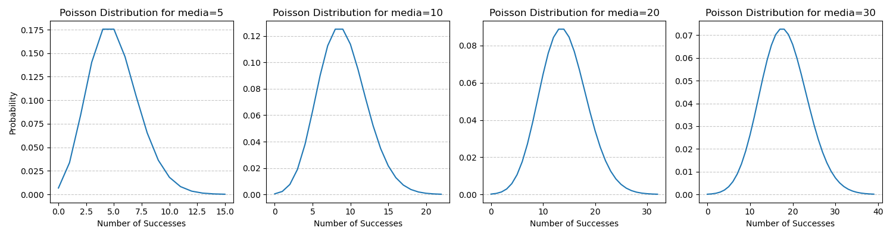

# DISTRIBUIÇÃO POISSON

- Mede o nº de sucessos (ou falhas) em um **período de tempo ou espaço**
- É preciso ter uma média de sucessos por tempo/espaço definida **e fixa**
	- Se a média mudar ao longo do tempo/espaço essa distribuição não serve
- **Os eventos devem ser independentes**. Ou seja, um evento acontecer num certo período não deve afetar a quantidade em outro período
- É uma derivação da distribuição binomial

Exemplos: 
- nº carros que passam numa ponte entre 9h e 10h
- nº defeitos em um carro (carro é o espaço)
- nº terremotos em uma região

$$P(X=x) = \frac{e^{-media} * media^x}{x!} = \frac{media^x}{e^{media} * x!}$$

OBS: a média **precisa** ser na mesma unidade do período/espaço que se quer medir.

## Explicação da equação

$e^{-media}$ faz a chance dum evento cair exponencialmente conforme se distancia da média

$media^x$ chance de x eventos ocorrerem dado a média

$x!$ divide a chance de acontecer ($media^x$) pela quantidade de maneiras que o evento pode ocorrer. Garante que a ordem dos eventos não importe

## Infos Importantes

- media = esperanca = variancia
- Para médias baixas, o gráfico tem um formato assimétrico para esquerda com pico na média e na média-1
	- Ele cai mais rápido pra esquerda e é mais suave pra direita
- Conforme a média cresce o gráfico vai se aproximando duma normal (media > 30 pode usar a normal)

---

- Quando x = media, o valor da prob é diferente pra cada x e vai só diminuindo conforme eles aumentam
	- Isso ocorre porque o gráfico tá ficando cada vez menos assimétrico e distribuindo seu pico entre os demais valores

Ex: 

x=media=2 P(X)=0,27 

x=media=3 P(X)=0,224 

x=media=4 P(X)=0,195

---

- Quando tem Probabilidade condicional nessa distribuição eu subtraio os valores

$P(X>a | X>b) = P(X>a-b)$

Ex: P(X>10 | x>4) = P(X>6) -> probabilidade de algo acontecer 10x dado que já aconteceram 4 é a mesma de algo acontecer 6x

## Exercícios 

**1. A média de vezes que um cliente vai na sua loja é 3x na semana. Qual a probabilidade de um cliente ir 5x?**

média = 3, x = 5

$P(X=5) = \frac{e^{-3} * 3^5}{5!} = 0,1008$

**2. A média de vezes que um cliente vai na sua loja é 3x na semana. Qual a probabilidade de um cliente ir exatamente 3x?**

media = 3, x = 3

$P(X=3) = \frac{e^{-3} * 3^3 }{3!} = 0,22$

**3. a média de vezes que um cliente vai na sua loja é 8x na semana. Qual a probabilidade de um cliente ir exatamente 8x?**

media = 8, x = 8

$P(X=3) = \frac{e^{-8} * 8^8 }{8!} = 0,1396$

OBS: mesmo a média e o x sendo iguais nos exercícios 2 e 3, os resultados são diferentes conforme explicado antes.

**4. A média de vezes que uma pessoa faz uma compra no cartão de crédito acima de 100 reais é 3x por dia. Qual a probabilidade dessa pessoa fazer compras acima desse valor 24x na semana?**

Antes de tudo precisamos colocar tudo na mesma unidade de tempo.

x_semana = 24 | média_dia = 3 | media_semana = 21

$P(X=24) = \frac{e^{-21} * 21^{24} }{24!} = 0,066$

**5. A média de vezes que um cliente vai na sua loja é 3x na semana. Qual a probabilidade de um cliente ir mais de 6x?**

media = 3, x = 6

P(X>6) = 1 - P(X=0) - P(X=1) - P(X=2) - P(X=3) - P(X=4) - P(X=5)

P(X>6) = 1 - 0,049787 - 0,149361 - 0,22404 - 0,22404 - 0,16803 - 0,1008188 = 0,0839
