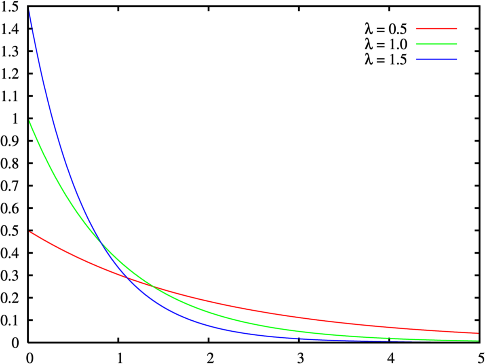

# DISTRIBUIÇÃO EXPONENCIAL

- **Calcula o tempo entre 2 eventos independentes**
- Os eventos precisam ocorrer a uma **taxa constante**
	- taxa = média de acontecimentos num período de tempo
- A taxa é representa com que frequencia um evento acontece
- Parece com a poisson aplicado a var contínua, onde a média é a taxa.
- Porém a poisson mede a **quantidade** de eventos em um período de tempo. A exponencial mede o **tempo** entre 2 eventos
- Só serve para calcular o tempo entre eventos **consecutivos e independentes** (não posso calcular o tempo entre o 1ª e 3ª evento nem se um evento acontecer afeta o outro)
	- Ex: tempo entre 2 ônibus passarem na parada

A distribuição tem uma taxa erro quando calculamos em cima de amostra. Como calcular esse erro será definido na parte de inferência estatística.

## Equação

Para um valor específico.

$$P(X=x) = taxa*e^{-taxa*x} = \frac{taxa}{e^{taxa*x}}$$

Para todos os valores abaixo de x

$$P(X<x) = 1 - e^{-taxa*x} = 1 - \frac{1}{e^{taxa*x}}$$ 

Essa é a integral da 1ª equação.

### Prova

$\int taxa*e^{-taxa*x} \,dx = taxa*\int e^{-taxa*x} \,dx = taxa * \frac{-1}{taxa} * e^{-taxa*x} = \frac{-taxa}{taxa} * e^{-taxa*x} = -1 + e^{-taxa*x} = 1 - e^{-taxa*x}$

$\frac{1}{e^{taxa*x}}$ é a chance do evento acontecer acima do x

Por isso que a equação é 1 - chance

## Infos Importantes

- moda = 0
- esperanca = desvio padrao = $\frac{1}{taxa}$
- variancia = $\frac{1}{taxa^2}$

**Taxa é sempre positivo** e **X sempre >= 0**. Não existe distribuição exponencial para valores negativos.

---

Quando tem Probabilidade condicional nessa distribuição eu subtraio os valores

$P(X>a | X>b) = P(X>a-b)$

Ex: P(X>10 | x>4) = P(X>6) -> probabilidade de algo acontecer 10x dado que já aconteceram 4 é a mesma de algo acontecer 6x

## Casos de Uso

- Fluxo de entrada de casos por tempo
	- Tempo entre chamadas ao servidor
	- Tempo de espera numa fila
	- Tempo entre 2 ações (manutenção num produto)

## Gráfico

- O maior valor dessa distribuição é x=0 (valor sendo a propria taxa)
	- Quando x=0 y=prob=taxa
- Depois disso cai exponencialmente
- Taxa é a velocidade em que ela cai, portanto quanto maior a taxa mais vertiginosa a queda
	- Uma equação com taxa maior sempre vai passar por baixo duma com taxa menor

## Exercícios

**1. O metrô passa a cada 15 minutos. Qual a probabilidade duma pessoa esperar menos de 10 minutos?**

taxa = 1/15 (passa 1 metrô a cada 15 minutos)

x = 10

$P(X<10) = 1 - \frac{1}{e^{\frac{1}{15}*10}} = 1 - \frac{1}{e^\frac{10}{15}} = 0,4866$

**2. O metrô passa a cada 15 minutos. Qual a probabilidade duma pessoa esperar mais de 15 minutos?**

taxa = 1/15 (passa 1 metrô a cada 15 minutos)

x = 15

$P(X>15) = 1 - P(X<15)$

$P(X>15) = 1 - (1 - \frac{1}{e^{\frac{1}{15}*15}}) = 1 - 1 + \frac{1}{e^{\frac{15}{15}}} = 0 + \frac{1}{e^1} = 1/e$

**3. O metrô passa a cada 15 minutos. Qual a probabilidade duma pessoa esperar entre 7 e 10 minutos?**

P(X<10 e X>7) = P(X<10) - P(X<7)

$P(X<10) = 1 - \frac{1}{e^{\frac{10}{15}}} = 0,4866$

$P(X<7) = 1 - \frac{1}{e^{\frac{7}{15}}} = 0,3729$

P(X<10 e X>7) = 0,4866 - 0,3729 = 0,1137

**4. O metrô passa a cada 15 minutos. Uma pessoa já está esperando há 3 minutos. Qual a probabilidade dela esperar pelo menos mais 7?**

P(X > 7+3 | X > 3)
- | X > 3 -> probabilidade da algo **dado que já esperou 3 minutos**
- X > 7+3 -> como pode vir a esperar 7 ou mais minutos, tem de ser P(X > 7). O +3 é pq já esperou esse tempo.

P(X > 10 | X > 3) -> probabilidade de esperar 10 ou mais minutos dado que já esperou 3

P(X > 10 | X > 3) = P(X > 10-3) = P(X > 7)

$P(X > 7) = 1 - P(X < 7) = 1 - (1 - \frac{1}{e^{\frac{1}{15}*7}}) = 1 - 1 + \frac{1}{e^{\frac{7}{15}}} = \frac{1}{e^{\frac{7}{15}}} = 0.6271$
