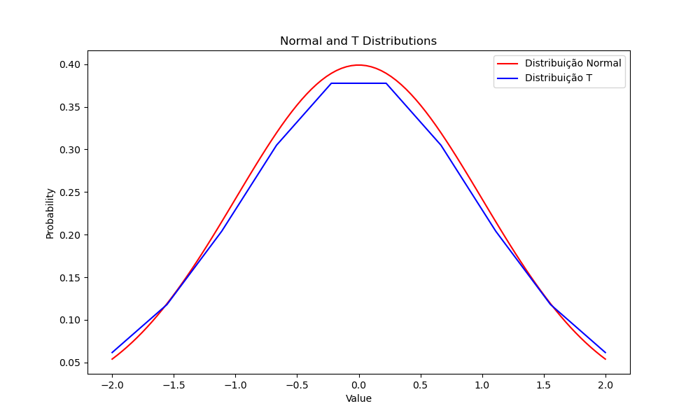
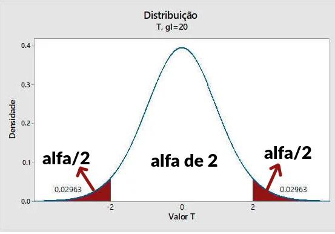

# DISTRIBUIÇÃO T

- É uma versão da normal **padrão** para uma **amostra pequena**
- O gráfico é igual a normal porém mais espaçada, menor no topo e com as bordas mais elevadas
	- Ou seja, ela é menos precisa (justamente por ter uma amostra pequena)
- Por ser mais "imprecisa", encaixa perfeito pra quando você tem amostras pequenas (< 30)
- Conforme sua amostra cresce, ela se aproxima da normal **padrão** (com média 0 e desvio 1)
- É simétrica em forma de sino
- **Perfeita para quando não sabe o desvio padrão da população** (só tem o da amostra)

## Equação

$$f(x) = (1+\frac{x^2}{n-1})^{-n/2} * \frac{gama(\frac{n}{2})}{gama(\frac{n-1}{2})\sqrt{\pi * (n-1)}}$$

Aonde gama é o fatorial que serve para todos os números reais e complexos.

Porém a equação quase nunca é usada, ao invés disso é usado uma tabela (tabela t-score).
- Para procurar na tabela precisa usar o grau_liberdade (N-1) e o alfa (% presente nas bordas)
- Quanto maior o alfa mais a curva é coberta e considerada no cálculo
	- Alfa é a % de erro que aceito ter na minha medida (quanto menor o alfa maior a precisão)
- Ou seja, **toda medida do T-student envovle um grau de erro** (devido trabalhar com amostras pequenas)
- O alfa considera os 2 lados do gráfico, com alfa/2 pra cada lado
- Então, ao buscar a prob que cubra 15% do gráfico de cada lado o alfa é 30%

OBS: tem tabelas bi-caudal (que faz desse modo) e uni-caudal (aonde todo alfa está em um único lado) e os valores mudam de um pro outro. Atenção pra usar a tabela certa
- Bi-caudal: usar alfa
- Uni-caudal: usar alfa/2
- Se só tiver a uni-caudal você pode dividir o alfa por 2 e usar ela

## Infos Importantes

- media = moda = mediana = esperança = 0
- Um dos params é o grau de liberdade = tamanho da amostra - 1
	- grau_liberdade = N-1
	- Isso vem do viés estatístico, aonde o desvio padrão da amostra tem grau 1 no viés
- variancia = $\frac{grauLiberdade}{grauLiberdade - 2} = \frac{N-1}{N-3}$ 
	- N precisa obrigatoriamente ser > 3
	- A equação mostra que quanto menor N, maior a variância e o desvio padrão (mais incerto tudo)
	- Para N=30, variância=1,07 e desvio=1,036 (praticamente igual a normal)
- Importante ver que a T nunca será idêntica a normal (valores de variância e desvio nunca chegarão a 1)
	- Mas a partir de 30 já estão tão próximos que dá pra descartar a diferença
	- Quando N tende ao infinito a tabela T dá os mesmos valores da tabela Z
		- Quanto maior N, mais próximo o valor das duas tabelas (já que alfa e Z são mais ou menos a mesma coisa)

## Nível de Confiança

$$confianca = 1 - alfa$$

Quanto menor o alfa usado, mais confiança eu tenho na minha medição (pois mais area sobra no meio, garantindo que seu valor tá ali no meio).

**Alfa é a minha taxa de erro**

- Nível de confiança diz quantos % de certeza eu tenho que a média **populacional** está em um intervalo
- Só me informa a chance para a **média** verdadeira, não consigo estimar outros valores.
- Faço isso a partir de uma amostra (da qual tenho média e desvio)
- Quanto maior a amostra, maior o nível de confiança (maior minha certeza)
- É o mesmo cálculo da normal

$$intervalo = mediaAmostra \pm T * \frac{desvioAmostra}{\sqrt{n}}$$

- T é o valor da tabela
- n tamanho da amostra

OBS: $\frac{desvioAmostra}{\sqrt{n}}$ é o erro padrão. Ele será melhor abordado no tópico de inferência estatística.

### Explicação da Equação

Podemos interpretar isso como "eu tenho (1-alfa)% de certeza que a média **populacional** está neste intervalo".
- $T*\frac{desvio}{\sqrt{n}}$ diz o quanto nossa média amostral tá longe da média real
- Dividir por raiz de N faz o intervalo ficar cada vez mais incerto pra valores pequenos e mais preciso para valores grandes
	- Para N infinito o intervalo é a própria média amostral, pois a amostra é toda a população
- Quanto menor N, maior o intervalo
- T é quantos desvios padrões estamos da média real e multiplicando pelo desvio da amostra ajustamos para nossa medição

## Exercícios

**1. uma loja fez um pesquisa pra saber quanto dá as compras dos clientes. A pesquisa foi feita com 15 clientes, a média foi 120 reais com desvio de 42 reais. Calcule a média populacional com 95% de confiança.**

confianca = 1 - alfa, portant, alfa = 1 - confianca

alfa = 1 - confiança = 1 - 0,95 = 0,05

grau_liberdade = 15 - 1 = 14

olhando na tabela bi-caudal, t = 2,145

$intervaloConfianca = media \pm t*\frac{desvio}{\sqrt{n}} = 120 \pm 2,145*\frac{42}{\sqrt{15}} = 96,74 e 143,26$

`Tenho 95% de certeza que a média verdadeira está entre 96,74 e 143,26!`
