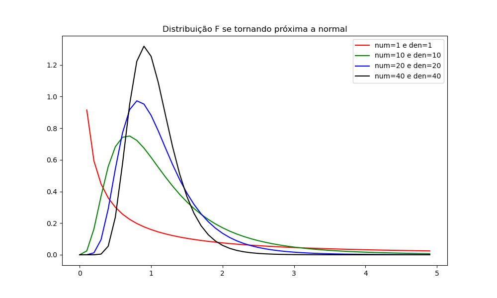
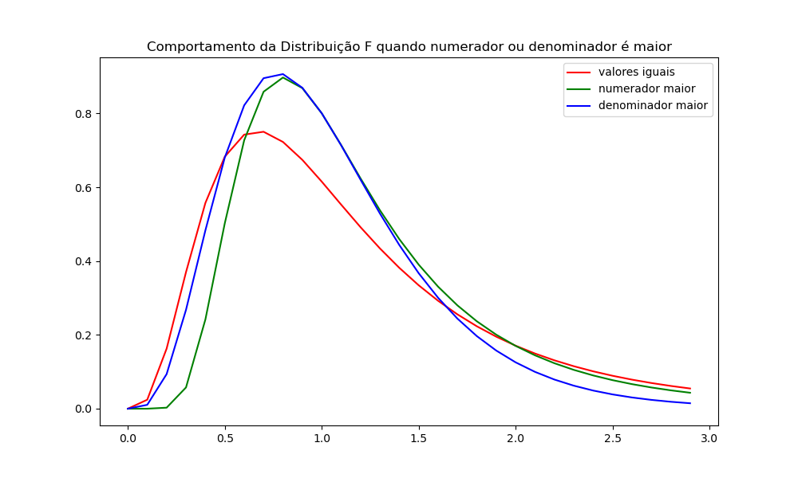
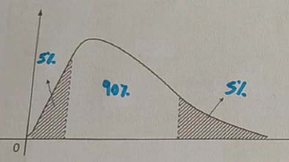
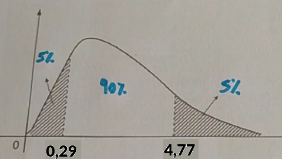

# DISTRIBUIÇÃO F

- É uma distribuição definida pela divisão de 2 números positivos e inteiros
  - Começa no 0, sem valores negativos
- É **assimétrica a direita** (ápice à esquerda)
- Ela vai se tornando mais **simétrica conforme os valores aumentam**
  - Quando os valores são iguais, a distribuição é simétrica com média = mediana = moda = 1
  - Quando os valores (tamanho das amostras) tendem ao **infinito**, a distribuição se aproxima da **normal**

O valores usados nessa divisão não são valores quaisquer, são a variância de 2 amostras/populações.

## PARA QUE SERVE

Serve para **comparar 2 variâncias**, medindo quão distantes eles são. Caso sejam iguals ou próximas, seu valor será 1 ou próximo. Quanto maior, mais a primeira variância é maior e quanto menor, mais a segunda variância é maior.

Como a variância representa a dispersão de uma amostra ou população, ela nos diz o quanto uma amostra/população é mais dispersa que outra ou se elas tem uma dispersão próxima.

Podemos também plotar o boxplot dos 2 grupos e alinhar as medianas para ver visualmente o que a distribuição F nos informa. Porém a distribuição nos dá de forma numérica a informação, não dependendo de análise visual.

OBS: o comportamento dela não muda muito caso inverta o numerador e o denominador, afinal comparar A com B ou B com A tem de dar o mesmo resultado.

## QUANDO USAR

- Quando as 2 amostras que geram o numerador e denominador forem **independentes**
- Quando as 2 amostras que geram o numerador e denominador tiverem **distribuição qui-quadrado**

### DIVISÃO DA DISTRIBUIÇÃO

No cálculo da distribuição usamos na verdade os **graus de liberdade** ao invés das variâncias em si. Pegamos os graus de liberdade de cada amostra/população e as colocamos na equação.

Os graus de liberdade dependem do tamanho da amostra (normalmente sendo N-1), por isso quando a amostra cresce se aproxima da normal.

## EQUAÇÃO

$$f(x, num, den) = \frac{\sqrt{\frac{(num * x)^{num} den^{den}}{(num * x + den)^{num + den}}}}{x \int_{0}^1 {t^{x-1}(1-t)^{y-1} dt}}$$

Ou seja, precisamos informar o numerador, o denominador e o X para o qual queremos calcular. X terá um valor diferente se mudarmos o numerador e o denominador.

A equação da distribuição F é muito próxima a da distribuição Qui-Quadrado, porém dividindo-as pelas graus de liberdade.

$$F = \frac{ \frac{Q1}{g1} }{ \frac{Q2}{g2} }$$

Aonde Q1 e Q2 são variáveis que seguem a distribuição Qui-Quadrado e g1 e g2 seus respectivos graus de liberdade.

$MEDIA = \frac{den}{den-2}$ dado que den > 2

$VARIANCIA = \frac{2 * den^2 (num + den - 2)}{num (den - 2)^2 (den - 4)}$ dado que den > 4

$MODA = \frac{num - 2}{num} * \frac{den}{den + 2}$ dado que num > den

## TABELA F

Assim como as distribuições T e Z, não é preciso fazer cálculo algum. Usamos a tabela F para encontrar o valor. **Existe uma tabela F para cada alfa**, portanto deve ter atenção para usar a tabela correta. Usar a tabela do alfa errado resultará em respostar muito erradas. O motivo dela ter várias tabelas se deve a ter 3 variáveis independentes (parâmetros), assim sendo impossível colocar todas as combinações em uma tabela só.

Ao ter a tabela correta em mãos, basta usar o numerador como coluna e o denominador como linha para achar o valor de X. **Importante ter em mente que a tabela nos dar o valor de X, não da equação**. 

### Alfa e Gráfico

Ao definir um alfa numa distribuição assimétrica temos de ter em mente que a área dos 2 lados do alfa é a mesma, apesar de visualmente não parecer. Na cauda da esquerda o valor será bem menor devido ao gráfico crescer raṕido e na direita o alfa é maior pela distribuição descer lentamente. 

Para encontrar o valor de X aonde a área até lá (ou a partir de lá) dá alfa é diferente para os 2 lados. Para o lado direito basta procurar na tabela F, usando o grau de liberdade do **numerador como a coluna** e o graude liberdade do **denominador como a linha**.

Para o lado esquerdo é preciso usar a equação abaixo, aonde **trocamos o numerador pelo denominador e dividimos 1 pelo valor encontado**. Apesar de parecer complicada, o cálculo é super simples.

$F_{1-alfa} = \frac{1}{F(alfa, den, num)}$

## RELAÇÃO COM OUTRAS DISTRIBUIÇÕES

### QUI-QUADRADO

A distribuição F é a divisão de 2 variáveis com distribuição Qui-quadrado divididas pelos seus graus de liberdade.

As duas tem formato parecido. Lembram a exponencial  para k, num e den = 1 e formato de sino assimétrica a direita no geral.

### T de Student

A tabela F é igual ao quadrado da tabela T quando seu numerador é 1.

## Exercícios

1. **Sendo uma amostra com 10 valores e outra com 6, calcule a média, moda, variância e desvio padrão da distribuição, bem como os valores críticos para alfa=5%.**

numerador = $N_1 - 1 = 10 - 1 = 9$

denominador = $N_2 - 1 = 6 - 1 = 5$

$media = \frac{5}{5-2} = \frac{5}{3} = 1,666$

$variancia = \frac{2 * 5^2 (9 + 5 - 2)}{9 (5 - 2)^2 (5 - 4)} = \frac{2 * 25 (12)}{9 (3)^2 (1)} = \frac{50 (12)}{9 * 9} = \frac{600}{81} = 7,4$

$desvio = \sqrt{7,4} = 2,7$

$moda = \frac{9 - 2}{9} * \frac{5}{5 + 2} = \frac{7}{9} * \frac{5}{7} = \frac{7*5}{9*7} = \frac{5}{9} = 0,5555$

Os valores críticos para 5% são aonde o gráfico cobre 5% de cada lado. Para calcular o lado direito com alfa=5% devemos usar a tabela F para alfa=0.05.

Como o numerador é 9 e denominador é 5, procuramos o valor da coluna 9 e linha 5, encontrando 4,77.

Para o valor esquerdo usamos a equação do valor esquerdo.

$F_{1-alfa} = \frac{1}{F(alfa, den, num)}$

Usamos a mesma tabela F, porém trocando numerador por denominador. Procurando pela coluna 5 e linha 9 encontramos 3,48

$F_{1-alfa} = \frac{1}{3,48} = 0,29$