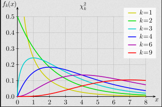
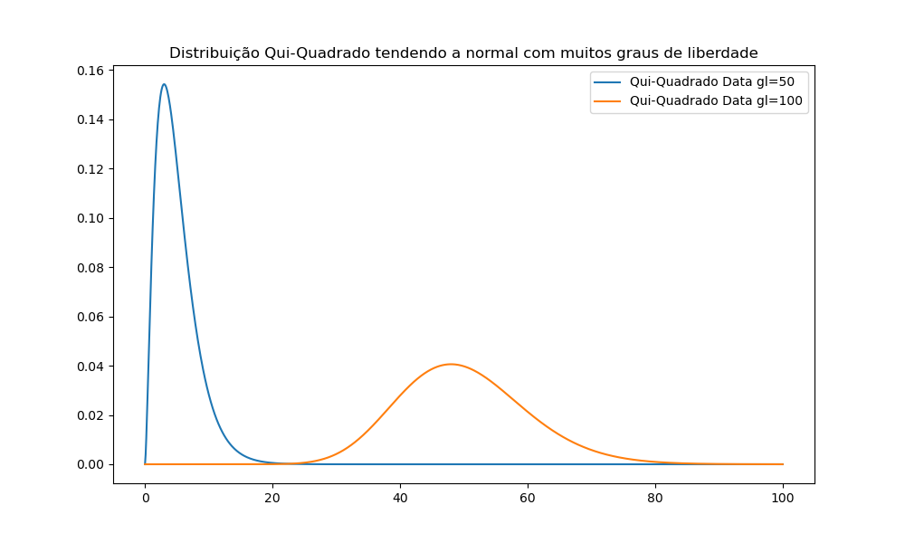
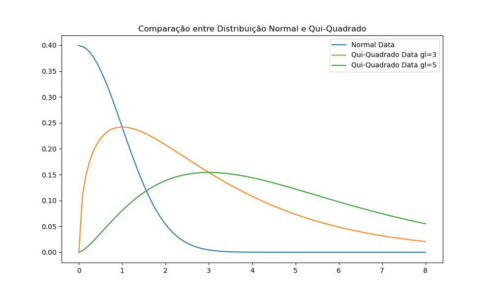

# DISTRIBUIÇÃO QUI-QUADRADO

- É uma distribuição definida na **soma dos quadrados de variáveis retiradas da distribuição normal padrão** (média 0 e desvio 1)
- As variáveis são retiradas da normal aleatoriamente, podendo ser qualquer valor seguindo a proabilidade da distribuição
- A quantidade de variáveis somadas (N) é o grau de liberdade
  - **Grau de liberdade = N**
  - OBS: em alguns testes muda para N-1

## FORMATO DA CURVA

- É **assimétrica a direita** (ápice à esquerda)
  - Cresce rápido e diminui lentamente
    - Exceto para graus de liberdade = 1 ou 2, onde lembra a exponencial
- Começa no 0, sem valores negativos
  - Por ser soma de valores ao quadrado não tem como ser negativo
  - Pode ser 0 caso todos os valores retirados sejam 0
- Ápice em grau de liberdade - 2
- Quanto maior o grau de liberdade, mais lento é seu crescimento e declíneo
- Ela vai se tornando mais **simétrica conforme o grau de liberdade aumenta**
- Quando os graus de liberdade **tendem ao infinito** se torna **igual a normal**
  - A partir de 30 tende a normal

O X é a soma dos valores retirados ao quadrado, por isso só pode a partir do 0. 

Y é a probabilidade de tirar números que ao somar e elevar ao quadrado dê esse resultado, considerando a curva normal. 

#### EXEMPLO: CURVA COM GL = 1

Isso significa pegar 1 número da curva normal e elevar ele ao quadrado. Como a média=0 e desvio=1, a grande maioria dos números são muito próximos de 0.

Isso faz que a probabilidade do resultado final ser próximo de 0 ser imensa, por isso seu formato com x=0 lá em cima.

Quando X=4 isso significa que a soma de todos os quadrados deu 4. Como gl=1 a única opção é meu número retirado ter sido 2 ou -2. Y para esse valor é muito baixo pois 2 e -2 estão fora da área mais provável da curva normal padrão (que vai até 1) e a única combinação que dá 4 é retirando exatamente 2 ou -2.

#### EXEMPLO: CURVA COM GL = 3

A partir desse grau de liberdade a curva toma sua forma conhecida. O valor de Y próximo de 0 são pequenos e vão crescendo rápido até seu ápice. 

Isso ocorre pois, apesar da probabilidade de tirar 3 números próximos de 0 na normal ser alto, a soma de suas potências torna o número muito específico e a a combinação de 3 números que dê esse número tão específico é baixa. 

Como poucos números podem dar essa combinação tão próxima, Y próximo de 0 cai rapidamente.

Conforme o valor aumenta as combinações que dão esse valor aumentam junto, até que X se distancia muito da média e os valores retirados também precisam crescer e portanto se distanciam da média, ficando menos prováveis também. Aí a probabilidade (Y) começa a decair.

$X = x_1^2 + x_2^2 + x_3^2$

## NOMENCLATURA

Os graus de liberdade são representados pela letra v

A distriuição é referenciada como $Q_v$ com v sendo os graus de liberdade

$Q_v = x_1^2 + x_2^2 + ... + x_{v+1}^2$

## PARA QUE SERVE

- Calcular intervalo de confiança e teste de hipótese para variâncias 
- Relação entre dados categóricos (não numéricos)
- Teste F usa variâncias de qui-quadrado
- Maioria dos testes não paramétricos usam essa distribuição (qui-quadrado, qui-quadrado de pearson, Kruskal-Wallis...)

A distribuição qui-quadrado aparece sempre que você tente a elevar suas variáveis ao quadrado (por isso ela é tão associada com variância, que eleva a dispersão ao quadrado).

## EQUAÇÃO

$$y = \frac{x^{(v/2)-1} *  e^{-x/2} }{2^{v/2} \int_0^{\inf} x^{(v/2)-1} * e^{-x} dx }$$

media = graus de liberdade = v

variancia = 2*media = 2v

moda = v-2 ou 0 quando v<2

mediana = $v(1 - \frac{2}{9v})^3$

## TABELA QUI-QUADRADO

Assim como outras distribuições, a distribuição qui-quadrado também tem seus valores tabelados. A tabela informa os graus de liberdade nas linhas e P(x>X) na coluna. No meio da coluna estão o valor de x aonde P(x>Xtabelado).

OBS: o símbolo no P(x) depende se é unicaudal a direita ou esquerda. Na direita é > e na esquerda <.

Isso significa que se você quer saber qual x em que a cauda a direita é 10% da área total para 5 graus de liberdade, vamos na linha 5 e coluna 0,1. Encontramos o valor 9,236. Isso significa que a área a partir de x=9,236 tem 10% da área da curva.

Caso só tenha a tabela à direita e queira saber o valor a esquerda, só calcular o valor a direita e fazer 1 - valorDireita.
