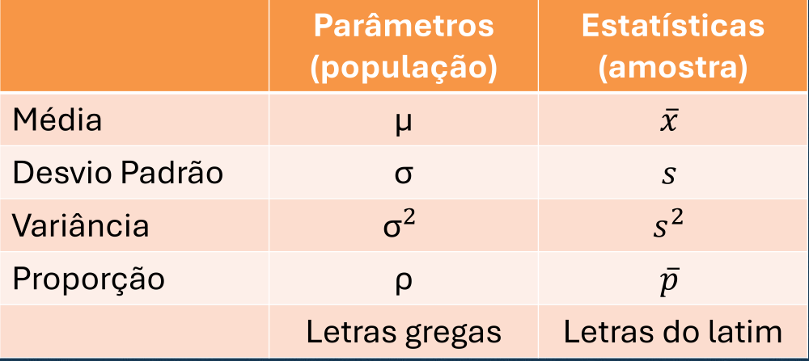

# ESTATÍSTICA INFERENCIAL

- Tipo de estatística que usa amostras para criar modelos 
- Tenta prever o comportamento do todo
- A palavra chave aqui é **amostra**
- Objetivo é previsão, inferir como o todo é a partir duma parte
- Envolve `margem de erro, intervalo de confiança`

Até então estudamos a descritiva, que descrevia os dados da população/amostra. Agora entraremos em outro tipo com outros objetivos. Apesar dela usar as ferramentas da descritiva, aqui o objetivo é outro e traz muita coisa nova.

## INFERÊNCIA

- Processos de inferir infos da **população** a partir da **amostra**
- Intervalo de Confiança dá o grau de certeza do seu valor
- O Teste de Hipótese diz como inferir e qual deve ser a distribuição da sua população
- A amostra deve ser aleatória (para evitar viés) e representativa (não pode ser muito pequena)
	- Ex: se eu faço o senso só no meu bairro não vai refletir o país todo
	- Ex: eu faço uma pesquisa de gosto com meus amigos e assumo que o mundo todo é assim
	- Ex: faço senso pegando pessoas aleatórias, mas entrevisto só 10 pessoas

- se eu quero comparar 2 grupos, normalmente a melhor escolha é que na amostra os grupos tenham tamanhos iguais (mesmo que na população não)
	ex: tenho 30% de seniors e 70% de juniors, mas na amostra são 50-50
só devo usar grupos de tamanho diferente se as variâncias forem muito diferentes, então preciso pegar mais gente do grupo com maior variância pra equiparar

## Nomenclatura

- Em geral, quando se diz **parâmetro** se refere a um dado da **população**
	- Macete: tudo começa com P
	- Como as infos da população é fixa (só tem 1 população e não varia como a amostra), chamamos de parâmetro porque não muda conforme a medição
- Em geral, quando se diz **estatística** se refere a um dado da **amostra**
	- Como os valores mudam de acordo com a amostra, chama de estatística, pois é algo incerto

# CONCEITOS

### População

- É todo o grupo/objeto estudado
- Todas as pessoas, unidades ou ocorrências daquilo que se está estudando
- Pode ser todo seu conjunto de dados caso você possua tudo que existe sobre o assunto estudado
	- Ex: registros no banco de dados
- Geralmente não se tem a população toda, aí é preciso trabalhar só com a amostra que se tem e fazer inferências

### Amostra

- Uma parcela da população/grupo/objeto estudado
- Geralmente todo seu conjunto de dados
- Quando não se pode analisar todos os membros dum grupo, pega um pedaço dele e a partir desse pedaço estima-se o todo
	- Ex: numa sala de aula tem 30 alunos. Faz um estudo com 5 deles
	- Ex2: numa loja passam 500 pessoas. Se entrevista 40 pra entender suas preferências
	- Ex3: a população do país é 200milhõs. Entrevista-se 20mil pra pesquisa

`Mesmo se tiver toda a população mas quer medir um comportamento futuro, pode ser (a depender do contexto) melhor usar uma amostra` (ex: o facebook quer testar uma feature nossa e só libera pra um pequeno grupo pra estimar quantos vão aderir).

### Distribuição Amostral

- Ao tirar várias amostras, vemos que elas são diferentes entre si
- Cada amostra tem uma média e desvio padrão diferente, as vezes até distribuições diferentes
- Distribuição Amostral diz **como a média pode variar entre as amostras**
- É a média das médias

### Erro Padrão

- É o desvio padrão da distribuição amostral
- Diz o quanto a média de diferentes amostras podem variar entre si
- Diz também a **precisão da média** de uma amostra
- **Só vale para um grupo (amostra)**
- Podemos tirar o erro padrão de uma proporção também

### Teorema Central do Limite

- Diz que se as amostras forem grandes o suficiente (> 30) a distribuição amostral das médias aproxima-se de uma curva normal
- Se tirar muitas amostras de tamanho 30 ou mais, as médias dessas amostras formarão uma distribuição normal
- Nos permite assumir certas coisas que facilitará nas inferências

### Nível de Confiança

- É o grau de certeza do seu valor
- Quantos % de certeza tenho que o valor real (média ou proporção), estão numa certa faixa

### Margem de Erro

- É o quanto minha média pode variar
- É a faixa aonde a média real pode estar

### Intervalo de Confiança

- É a união da média com a margem de erro
- $valor \pm margem$