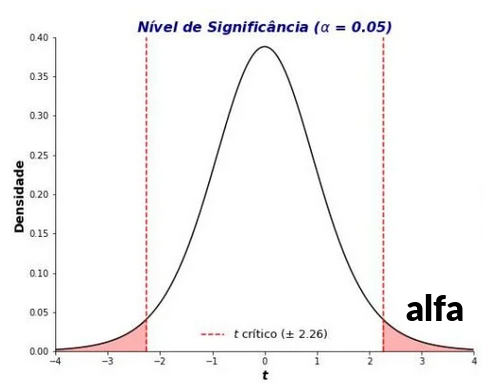

# DEFININDO HIPÓTESES

Um teste tem 2 tipos de Hipóteses: a nula (Ho ou H0) e a alternativa (H1 ou Ha)

- Hipótese Nula (Ho ou H0)
	- Ação padrão, não há mudanças, representa status quo
	- Confirma algo que é consenso
	- Representa cenários onde as coisas se mantem como são
	- Representa cenários que se confirma o senso comum
- Hipótese Alternativa (Ha ou H1)
	- Contradiz a hipótese nula
	- Frequentemente chamado de "Rejeição da hipótese nula"
	- **Reflete o que realmente queremos testar**
	- Geralmente perguntamos se algo é diferente do consenso, por isso H1 é nossa pergunta
- Se uma é verdade, obrigatoriamente a outra é falsa
	- Uma é o complementar da outra (Ho = Todo - H1)
	- **Não existe intercessão entre as 2 hipóteses**! Isso facilita na hora da probabilidade
- As duas juntas cobrem todo o espaço amostral do meu teste

### Regras

- Seu teste trabalhará apenas com essas 2 hipóteses e nada mais
- Começar definindo H1 é mais simples pois ela é a sua pergunta
- O sinal de igual **sempre** ficará no Ho
	- Isso vem da ideia da questão do Ho representar nenhuma mudança
	- Igual significa falta de mudança

---

### Características do Teste

Definimos um valor crítico (alfa) no passo 2 com o qual queremos comparar nossa hipótese.

O teste pode ser:

- Unicaudal a esquerda (quando H1 tem sinal de <)
	- Região da distribuição que representa H1 está a esquerda de -alfa (valor crítico ou de comparação)
- Unicaudal a direita (quando H1 tem sinal de >)
	- Região da distribuição que representa H1 está a direita de alfa (valor crítico ou de comparação)
- Bicaudal (quando H1 tem sinal de $ne$)
	- H1 nunca pode ter sinal de =
	- Região da distribuição à esquerda de -alfa e à direita de alfa

- Alfa é área coberta
- Ao fazermos um teste unicaudal só um dos lados importa
	- Por isso usamos alfa ou -alfa a depender do lado
- No bicaudal usa ambas as caudas

---

## IMPORTANTE

Considere esse exemplo: "Uma pizzaria diz que seu tempo de entrega é, em média, menor que 30 minutos".

Com isso, Ho significa media <= 30 e H1 significa media > 30.

- Se eu rejeitar Ho estou dizendo: "O tempo médio de entrega é maior que 30 minutos".
- Se eu não rejeitar Ho estou dizendo: "Não tenho evidências para concluir que o tempo médio de entrega é maior que 30 minutos".

Eu não posso dizer "O tempo médio é menor ou igual a 30 minutos". **O teste não dá essa informação**!

- Por isso não posso usar o termo "confirmar Ho" ou "confirmar H1"
- Só posso concluir que **não tenho informações suficiente para negar a afirmação**

**Um teste de hipótese ou vai negar Ho (confirmar H1) ou é inconclusivo!** Eu nunca consigo aceitar/confirmar Ho, por isso ele é o status quo, se não posso negar, na dúvida segue tudo como tá.

---

### Exemplos: 

**1. Uma loja diz que em média a satisfação do cliente é maior que 9 (de 0 a 10).**

H1: A média é menor que 9?

- H1: media < 9 
- Unicaudal a esquerda
- Faço menor pois H1 vai contra o status quo (o que a loja diz ser a verdade)

Ho: A média é maior ou igual a 9?

- H0: media >= 9

**2. Quero saber se existe relação entre tipo de filme e compra de pipoca.**

H1: Mais pessoas compram pipoca quando vão ver filme infantil do que filme de comédia ou drama?

- H1: media_pipoca > media_comedia E media_pipoca > media_drama
- Unicaudal a direita

H0: A quantidade de pessoas que compram pipoca ao ir ver filme infantil é igual ou menor do que os que vão ver comédia ou drama?

- H0: media_pipoca <= media_comedia OU media_pipoca <= media_drama

**3. Quero saber se a noiva aceitará o pedido de casamento.**

H1: Aceita se casar?

- H1: P(sucesso) = 1
- Bicaudal
- Distribuição de Bernoulli
- Aceitar é a hipótese H1 pois muda o cenário (sai de namorado para noivo)

H0: Recusa se casar?

- H0: P(fracasso) = 1
- H0: P(sucesso) $\ne$ 1
