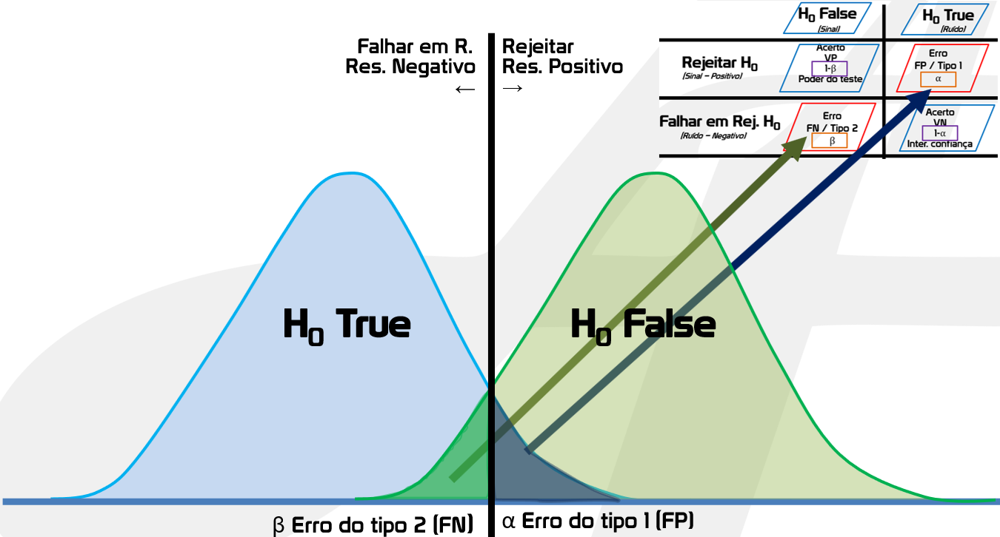

# TIPOS DE ERRO DA HIPÓTESE

- São as chances de rejeitar/descartar alguma hipótese erroneamente
- Quando se chega a conclusão errada no final é porque caiu em um desses erros
- Esses erros não tem haver com erro padrão ou margem de erro
	- Porém podem ser entendidos como a margem de erro das suas hipóteses
- Tem 2 erros: erro tipo 1 (ligado a Ho) e tipo 2 (ligado a H1)
- Esses erros nunca serão 0

# Erro Tipo 1

- Rejeitar Ho incorretamente
- Quando se acredita que H1 é verdadero, mas não é
- É um **falso positivo**
	- Pois achei que minha premissa (H1) era verdadeira, mas não era
- Ligado ao Ho
- Probabilidade do erro acontecer = **alfa**

**No erro tipo 1, Ho é o correto.**

---

### Valor do Erro

- Temos de definir ele **antes de realizar o teste**
- É a % de erro que aceitamos no nosso teste
- Muito semelhante ao nível de confiança
- Valores mais usados: 0,01 (1%), 0,05 (5%) e 0,1 (10%)
	- Mesmos valores do nível de confiança mais comuns
- Também são retirados da tabela Z ou T (a depender do teste usado)

---

### Trade Off Alfa

Um alfa menor traz 3 problemas:

1. **Mais difícil provar sua hipótese**

- Quanto menor alfa, mais difícil provar algo (rejeitar Ho) Pois ficou **mais criterioso**.
- Fica mais difícil pois para provar sua hipótese seu resultado final precisa ser menor que alfa
- Com alfa muito pequeno a chance de seu resultado final ser menor ainda é muito pequena e a resposta do teste é "inconclusivo"

2. **Quando N é muito pequeno**

- Em um cenário aonde é difícil coletar amostras, aumentar o alfa ajuda o teste a chegar em alguma conclusão
- N pequeno e alfa pequeno aumenta muito a chance da resposta ser "inconclusiva" (Não Rejeitar Ho)
	- Pois alfa pequeno naturalmente aumenta a chance de inconclusão e N pequeno também significa poucos dados para analisar
- Aumentar forçadamente alfa ajuda a termos chances de concluir algo
	- Porém aumenta as chances de erro tipo 1 (falso positivo)
- A solução para o **cenário de N pequeno é usar testes não paramétricos**

3. **Aumenta chance de erro tipo 2**

- Quanto menor alfa, maior beta
- Por isso é importante saber qual erro é pior para seu contexto, para escolher qual erro minimizar

---

### P-Hacking

É quando o pesquisador altera o alfa depois de calcular o teste ou altera/tortura os dados para que eles digam o que ele quer (**como mentir com estatística**)

`Por isso é crucial definir o alfa antes de realizar o teste e se manter fiel a ele.`

Como adulterar sua pesquisa:

- Alterar alfa para um que faça H1 ser verdadeiro
- Seguir aumentando sua amostra até ter o resultado que você quer e parar só quando alcança o que quer
- Eliminando outliers que havia decidido deixar anteriormente
	- Por isso o ideal é decididr se exclui os outliers antes de começar o passo 1
	
`Caso comum: as vezes você coloca alfa 5%, p-value dá 6% e você pensa "6% de erro é ok ainda, vou mudar meu alfa pra passar"`. **Não faça isso**!

# Erro Tipo 2

- Rejeitar H1 incorretamente
- Quando se acredita que H1 é falsa, mas não é
- É um **falso negativo**
	- Pois achei que minha premissa (H1) era falsa, mas não era
- Ligado ao H1
- Probabilidade do erro acontecer = **beta**
- **Não precisamos definir**, ele é calculado no meio do teste
- **Representa a chance de não detectar um efeito ou diferença que existe**

**No erro tipo 2, H1 é o correto.**

### Equação

$$beta = 1 - poder$$

- É calculado a partir do poder do teste
- Podemos diminuir beta das seguintes formas:
	- Aumentando a amostra
	- Aumentando alfa (quanto menor a chance de erro tipo 1, maior o erro tipo 2)
	- Pegando dados com menor dispersão
		- Melhorando a medição
		- Fazendo coleta nas mesmas condições e horas
		- Ignorando/eliminando outras vars que influenciem o resultado (simplificando sua hipótese)
	- Usando o teste de hipótese mais adequado

# Poder to Teste

- Também chamado de potência estatística ou Statistical Power
- Probabilidade de rejeitar Ho quando quando ela é falsa (acertar)
- É a sua probabilidade de fazer uma hipótese correta
	- poder = 1 - beta

EXPLICAR COMO CALCULA ISSO E COMO N E VARIANCIA AFETAM ESSE VALOR????

# Resumo

| | Ho é verdadeiro | Ho é falso  |
| :--- | :--- | :--- |
| Aceitar Ho | Decisão correta (1-alfa) | **Erro tipo 2 (beta)** |
| Rejeitar Ho | **Erro tipo 1 (alfa)** | Decisão correta (1-beta) = Poder do Teste |

Uma forma gráfica de entender os erros é mostrada abaixo. Roxo representa o erro tipo 1 e amarelo o erro tipo 2. As áreas não pintadas representam a chance de Ho e H1 serem verdadeiras.

Repare que se arrastamos a linha vermelha pro lado, a área roxa cresce/diminui juntamente com a área amarela diminui/cresce. O que mostra que se um erro aumenta, o outro diminui.

Aqui podemos ver nitidamente os erros no gráfico e as áreas que informam cada sucesso.

