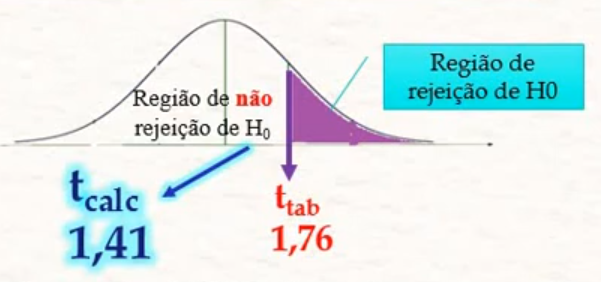

# TESTE T

- Serve para **testar a média**
- Compara a média tanto com um valor específico quanto com outra média
- Serve apenas para **comparar até 2 médias**
	- Acima disso precisa ser a Anova
- Diferente da distribuição T, o teste T serve para amostras de todos os tamanhos
- É sensível a outliers

# PREMISSAS

- Os dados devem ter distribuição normal ou próxima (passar no teorema do limite central)
- Os dados devem ser independentes
- Os dados devem ser contínuos (não funciona com dados discretos)
- Não deve ter outliers (ou os mesmos devem ter sido tratados ou avaliados)

# Equação para 1 média

$$t = \frac{mediaAmostra - valorComparacao}{ \frac{desvioAmostra}{\sqrt{n}} }$$

**O p-valor será o valor de alfa na tabela t.** 

- O t calculado acima é o valor no meio da tabela
- Temos de fazer o caminho inverso para, a partir do valor final, chegar no valor de alfa.

### Como Calcular

- Procuramos na tabela T a linha do nosso grau de significância (n-1)
- Procuramos nessa linha o valor t ou o mais próximo dele
- Vemos o alfa dessa coluna

# Para 2 médias

Se divide em 2 tipos: amostras independentes e dependentes

## Amostras Independentes

- Amostras independentes são 2 grupos em que uma não interfere na outra
- Uma medição não afetou a outra
- Ambas as amostras foram feitas ao mesmo tempo
- As **variâncias das 2 populações devem ser iguais**
- Exemplos:
	- Comparar os preços de 2 lojas
	- Comparar nº de assaltos em 2 cidades
	- Comparar nº de acidentes em 2 épocas do ano
	- Comparar grupo controle com grupo tratamento
- **Calcula a diferença das 2 médias**

---

### Mudança nas Hipóteses

As nossas hipóteses passam a comparar se uma média é maior ou menor que a outra (ou diferentes), ficando no seguinte formato:

$Ho: media_1 \le media_2$ E $Ha: media_1 > media_2$

Podemos reescrever as equações como:

$Ho: media_1 - media_2 \le 0$ E $Ha: media_1 - media_2 > 0$

Assim fica mais fácil de calcular, pois na normal padrão 0 é a média da distribuição.

---

### Como Calcular

- Calculamos a área de alfa normalmente, somando o tamanho das amostras 
	- Vemos na tabela o valor para o alfa escolhido e graus de liberdade = $n_1 + n_2 - 2$
- O valor do t encontrado na tabela será comparado com o t final da equação do teste
- t final é calculado via equação, que varia de acordo com a variância
	- A equação dá o t direto, não há necessidade de usar a tabela novamente
- Vemos se o t_final está na área de alfa (que rejeita Ho) ou na área maior da curva (que não rejeita Ho)
 	- Quando é unicaudal a direita, t_final < t_tabelado não rejeita Ho
 	- Quando é unicaudal a esquerda, t_final > t_tabelado não rejeita Ho
 	- Qunado é bicaudal, t_final < t_tabelado E t_final > -t_tabelado não rejeita Ho
- p-valor será o valor de alfa dado t_final e o grau de liberdade usado
	- Para bicaudal, p-valor será o resultado final * 2

---

### Equação

A equação geral é:

$t = \frac{media_1 - media_2}{ \sqrt{ \frac{variancia}{n_1} + \frac{variancia}{n_2} } }$

Porém a variância muda caso as variâncias entre as 2 amostras sejam parecidas ou não. Quando as variâncias são próximas a variância usada é a média ponderada das duas (usando os graus de liberdade como peso) e quando não muito diferentes usa-se ambas, cada uma dividindo seu respectivo N.

No caso das variâncias diferentes é preciso alterar o passo de achar o t tabelado que define a área alfa: ao invés de somar os graus de liberdade fazemos um cálculo ponderado. Isso se deve pois como a variância muda muito temos levar isso em conta, não apenas somar os N.

Para **variâncias próximas**:

$$tFinal = \frac{media_1 - media_2}{ \sqrt{ \frac{variancia_m}{n_1} + \frac{variancia_m}{n_2} } }$$

Aonde $variancia_m$ é a média ponderadas das 2 variâncias

$$variancia_m = \frac{ (n_1-1)variancia_1 + (n_2-1)variancia_2 }{n_1 + n_2 - 2}$$

E o cálculo do N para os graus de liberdade ao usar a tabela é $gl = n_1 + n_2 - 2$

Para **variâncias diferentes**:

$$tFinal = \frac{media_1 - media_2}{ \sqrt{ \frac{variancia_1}{n_1} + \frac{variancia_2}{n_2} } }$$

E o cálculo do N para os graus de liberdade ao usar a tabela é: 

$$gl = \frac{(\frac{vari_1}{n_1}+\frac{vari_2}{n_2})^2}{ \frac{(\frac{vari_1}{n_1})^2}{n_1-1} + \frac{(\frac{vari_2}{n_2})^2}{n_2-1} }$$

Devemos ignorar completamente a parte fracionária. Não podemos arredondar para cima!

OBS: **Para saber se as variâncias são diferentes o suficiente é preciso fazer um teste de Levene com elas.**

- Como faz 2 testes aninhados, os erros se somam, tornando a resposta final mais incerta
	- Porém você não precisa somar os erros no cálculo do teste t, é só algo para ter em mente

---

### Exemplos

**1. Temos 2 rações de cachorro que dizem evitar queda de pelos, A e B. Queremos saber se A é melhor que B ou se são equivalentes. O alfa é 0,05.** 

Ração A: N = 11, variância = 40, média = 66

Ração B: N = 19, variância = 16, média = 63

O teste de Levene nos deu que as variâncias são diferentes o sucifiente.

Ho: media_a = media_b

H1: media_a > media_b

Como as variâncias são diferentes, para achar a área alfa temos de calcular N pela equação

$gl = \frac{(\frac{variA}{nA}+\frac{variB}{nB})^2}{ \frac{(\frac{variA}{nA})^2}{nA-1} + \frac{(\frac{variB}{nB})^2}{nB-1} } = \frac{(\frac{40}{11}+\frac{16}{19})^2}{ \frac{(\frac{40}{11})^2}{11-1} + \frac{(\frac{16}{19})^2}{19-1} } = 14,729 = 14$

Procuramos na tabela usando gl=14 e alfa=0,05, encontramos `t_tabelado = 1,76`

Agora calculamos o t_final pela equação do teste.

$t = \frac{mediaA - mediaB}{ \sqrt{ \frac{varianciaA}{nA} + \frac{varianciaB}{nB} } } = \frac{66 - 63}{ \sqrt{ \frac{40}{11} + \frac{16}{19} } } = 1,4118$

**Solução 1**

Como nosso teste é unicaudal a direita, t_final ser menor que t_tabelado significa que `não rejeitamos Ho`, portanto as duas rações são iguais.

**Solução 2**

Usando a tabela vemos que o alfa para gl=14 e t=1,4118 é ligeiramente menor que 0,1. Portanto p-valor é ligeiramente menor que 0,1 e maior que alfa, portanto `não rejeitamos Ho`.

**2. Queremos saber se pessoas que tiveram covid respondem igual a um teste de memória do que quem não teve. O alfa é 0,05.**

Grupo A: teve covid. N=52, variancia=23, media=142,1

Grupo B: não teve covid. N=50, variancia=21,3, media=121,6

O teste de Levene nos deu que as variâncias são próximas o sucifiente.

Ho: mediaA = mediaB

H1: $mediaA \ne mediaB$

Como as variâncias são próximas, para achar a área alfa basta somar o tamanho das amostras e usar o alfa escolhido. N=52+50-2=100 e alfa=0,05. Encontramos `t_tabelado = 1,984`.

Portanto, a área de alfa é menor que -1,984 e maior que 1,984. Portanto podemos reescrever as hipóteses como

Ho: t_final $\ge$ -1,984 E t_final $\le$ 1,984

H1: t_final < -1,984 OU t_final > 1,984

Agora calculamos o t_final pela equação do teste.

$variancia_m = \frac{ (nA-1)variA + (nB-1)variB }{nA + nB - 2} = \frac{ (52-1)23 + (50-1)21,3 }{52 + 50 - 2} = 492,0981$

$tFinal = \frac{mediaA - mediaB}{ \sqrt{ \frac{variancia_m}{nA} + \frac{variancia_m}{nB} } } = \frac{142,1 - 121,6}{ \sqrt{ \frac{492,0981}{52} + \frac{492,0981}{50} } } = 4,67$

**Solução 1**

Como tFinal > t_tabelado e nosso teste é bicaudal, `rejeitamos Ho`, portanto as pessoas com covid respondem diferente a testes de memória.

**Solução 2**

Usando a tabela vemos que o alfa para gl=100 e t=4,67 é menor que 0,0005. Porém como teste é bicaudal multiplicamos por 2 pra ter nosso p-valor. p-valor é pouco menor que 0,001. P-valor é menor que alfa, portanto `rejeitamos Ho`.

## Amostras Dependentes

- Amostras dependentes são quando queremos comparar um **antes e depois**
- O tamanho das 2 amostras devem ser iguais
- Geralmente são as mesmas pessoas/objetos analisados em momentos diferentes
- As **variâncias** das 2 populações **não precisam ser iguais**
- Exemplos:
	- Avaliação de antes e depois de um treinamento
	- Medir se uma ação do governo diminuiu os acidentes de trânsito
	- Se uma mudança de metodologia melhorou o aprendizado dos alunos
- **Calcula a diferença entre cada par de dados (um de cada amostra) e tira a média dos resultados**

---

### Mudança nas Hipóteses

As nossas hipóteses passam a comparar se uma média é maior ou menor que a outra (ou diferentes), ficando no seguinte formato:

$Ho: mediaAntes \le mediaDepois$ E $Ha: mediaAntes > mediaDepois$

Podemos reescrever as equações como:

$Ho: mediaAntes - mediaDepois \le 0$ E $Ha: mediaAntes - mediaDepois > 0$

Ou ainda

$Ho: \Delta media \le 0$ E $Ha: \Delta media > 0$

Assim fica mais fácil de calcular, pois na normal padrão 0 é a média da distribuição.

---

### Como Calcular

- Calculamos a área de alfa normalmente, usando nosso N-1 e o alfa escolhido
	- Como o tamanho das 2 amostras são iguais, não há problema com a definição de grau de liberdade
- O valor do t encontrado na tabela será comparado com o t final da equação do teste
- t final é calculado via equação, que varia de acordo com a variância
	- A equação dá o t direto, não há necessidade de usar a tabela novamente
- Vemos se o t_final está na área de alfa (que rejeita Ho) ou na área maior da curva (que não rejeita Ho)
 	- Quando é unicaudal a direita, t_final < t_tabelado não rejeita Ho
 	- Quando é unicaudal a esquerda, t_final > t_tabelado não rejeita Ho
 	- Qunado é bicaudal, t_final < t_tabelado E t_final > -t_tabelado não rejeita Ho
- p-valor será o valor de alfa dado t_final e N-1
	- Para bicaudal, p-valor será o resultado final * 2

---

### O que Muda Entre o Dependente e o Independente

- Detalhes na equação em si (apesar da base ser a mesma)
- Os graus de liberdade usados ao pegar o valor na tabela

---

### Equação

A base da equação é a mesma da independente, porém ao invés do numerador ser a diferença das médias é a `média das diferenças - o valor de comparação na hipótese (geralmente zero)`. O denominador segue sendo raiz da variância sobre N. Nesse caso, como N é igual nos dois casos, basta 1 única fração no denominador. A variância usada é a variância das diferenças entre o antes e o depois.

$$tFinal = \frac{media - valorComparacao}{ \sqrt{ \frac{varianciaDiferencas}{n} } }$$

Aonde a média é simplesmente a média normal de cada diferença e a variância é calculada normalmente também.

OBS: `Repare que é a mesma equação do teste para 1 média`.

---

### Exemplo

**1. 7 pacientes tiveram a pressão medida antes e depois de receber um remédio. O remédio teve efeito? Alfa é 0,01.**

| Antes | 1,1   | 3,9   | 3,1   | 5,3   | 5,3   | 3,4   | 5     |
| :---  | :---: | :---: | :---: | :---: | :---: | :---: | :---: |
| Depois| 0     | 1,2   | 2,1   | 2,1   | 3,4   | 2,2   | 3,2   |
| Dif (Depois - Antes) | -1,1  | -2,7   | -1   | -3,2  | -1,9  | -1,2  | -1,8  |

media=-1,84 variancia=0,7095 n=7

$Ho: diferenca = 0$
$Ha: diferenca < 0$ Por calcularmos Depois - Antes e esperamos que Depois seja menor, então a diferença tem de ser negativa

valorComparacao = 0

$t = \frac{media - valorComparacao}{ \sqrt{ \frac{variancia}{n} } } = \frac{-1,84 - 0}{ \sqrt{ \frac{0,7096}{7} } } = -5,78$

**Solução 1**

Olhando na tabela t por t=5,78 e gl=6, vemos que alfa é ligeiramente maior que 0,0005, portanto p-valor é quase 0,0005 e menor que alfa. Portanto `rejeitamos Ho`.

**Solução 2**

Olhando na tabela o valor de t para alfa e n-1, achamos t_tabela = 3,143. Como t_final é menor que -t_tabela (-5,78 < -3,1143) está dentro da área alfa. Portanto `rejeitamos Ho`.
