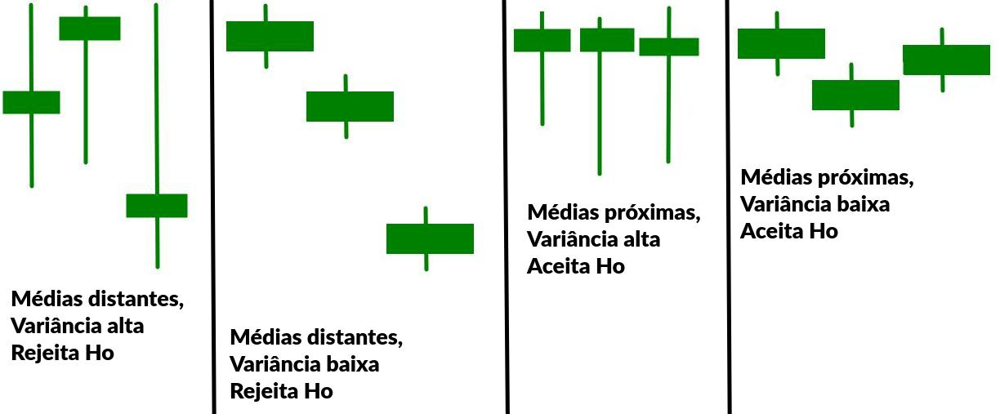

# ANOVA

- Também chamada **Análise de Variância**
  - Apesar de comparar médias, a variância tem um peso considerável no processo
- Serve para **testar 3 ou mais médias**
- Compara 3 ou mais grupos **independentes**
- Existem 2 tipos:
  - Anova de 1 via:  Compara baseado em uma única variável independente
    - Ex: Há diferença entre os salários de analista de dados, cientista de dados e engenheiro de dados na empresa?
  - Anova de 2 vias:  Compara baseado em duas variáveis independentes simultaneamente
    - Ex: Há diferença entre os salários de analista de dados, cientista de dados e engenheiro de dados na empresa por nível de escolaridade?

## Como Funciona

- O teste verifica se a variação **entre os grupos** é maior que a variação **dentro deles**
- Compara médias dos grupos para ver se pelo menos uma difere significativamente das outras
- Caso a anova indique diferença significativa (p-valor < alfa), é preciso rodar um teste post-hoc (**Bonferroni** ou **Tukey**) para saber **quais grupos** diferem do resto
  - Anova só diz que algum grupo ali destoa dos demais, mas não qual
  - O teste post-hoc diz qual deles é o que destoa
    - 2 opções de testes são **Bonferroni** e **Tukey**
- Internamente usa o teste F para determinar se há destoamento

$Ho: media1 \approx media2 \approx media3 ... \approx media_n$ (todas as médias são **próxima o suficiente**)

$H1: uma ou mais médias são diferentes o suficiente das demais$

## PREMISSAS

- Os **resíduos** de cada grupo deve ter **distribuição normal ou próxima**
  - `Resíduo = diferença entre uma amostra e a média de seu grupo`
  - Passar no teorema do limite central (>30 amostras em cada grupo)
  - Passar em testes como Shapiro-Wilk ou Kolmogorov-Smirnov (opcional plotar um QQ-plot para ter certeza)
- Os dados devem ser independentes
- As variâncias entre os grupos devem ser homogêneas
  - Passar no teste de levene
- Não deve ter outliers 
  - Checar via boxplot

## Equação Anova de 1 via

### Passo 1: médias e variâncias de cada grupo

- Calcular as médias e as variâncias de cada grupo
- Calcular a média total (juntando todos os grupos)

### Passo 2: calcular a variância entre as médias

- É isso que diz o quanto as médias estão distantes umas das outras
- Quanto maior, mais os grupos diferem entre si
  - E **maior a chance de rejeitar Ho**
- O cálculo é a variância das médias com pesos (tamanho de cada grupo age como um peso)
- Divide pela quantidade de grupos - 1 (k-1)
- Chamamos esse trecho de `variação explicada` pois é a variação de grupos diferentes, portanto é esperado que sejam diferentes mesmo

$QME = \frac{\sum_{i=1}^k {n_i(media_i - media_t)^2} }{k-1}$

Aonde

- k é o nº de grupos
- n é a quantidade de amostras em cada grupo (tamanho do grupo)
- $media_i$ é a média do grupo
- media_t é a média total

### Passo 3: calcular a variância dentro dos grupos

- Calcula o quanto cada grupo varia internamente (variância)
- Soma as variâncias de cada grupo, dando peso a cada um (o peso é o tamanho do grupo)
  - No caso o peso é n-1 (tamanho - 1) pois a variância trabalha com 1 grau de liberdade a menos
  - No passo 2 por trabalhar com médias o peso era só n, pois a média tem grau de liberdade 0
- Chamamos esse trecho de `variação inexplicada` pois é a variação dentro dos grupos, representa a aleatoriedade natural entre os objetos
  - Essa variação pode ser causada tanto por outras variáveis quanto por aleatoriedade
- A diferença entre cada amostra e a média de seu grupo é chamada de **resíduo ou erro**
  - Essas diferenças precisam formar uma distribuição normal!

$QMD = \frac{ \sum{i=1}^k {(n_i-1)vari_i} }{N-k}$

Aonde

- k é o nº de grupos
- n é a quantidade de amostras em cada grupo (tamanho do grupo)
- $vari_i$ é a variância do grupo
- N é o tamanho da amostra total, somando todos os grupos

### Passo 4: Calcula F

$$F = \frac{QME}{QMD} = \frac{variacaoExterna}{variacaoInterna}$$

- `Quanto mais variação externa (variação entre os grupos) maior a chance de que algum grupo destoe do resto.`
  - Sinal que alguma das médias tá longe da média das médias
- Quanto maior F, mais chance de rejeitar Ho
- F < 0 sempre aceita Ho

### Passo 5: Compara com o F tabelado

Aqui é onde entra o teste F de fato, usando a tabela F para comparar com o valor calculado.

`É o teste F que diz se as diferenças são significativas ou não.`

- Para usar a tabela, primeiro precisa definir o alfa
  - Existe uma tabela F diferente para cada alfa
- Use os graus de liberdade do numerador (QME) para definir a coluna a olhar
- Use os graus de liberdade do denominador (QMD) para definir a linha a olhar
  - O F tabelado é o valor nessa linha e coluna

Por fim, se **F calculado > F tabelado**, então **rejeita-se Ho**, caso contrário aceita Ho.

## Anova de 2 vias

O que muda é que agora temos 2 fatores a serem anlisados (ex: cargo e escolaridade influenciando o salário). Nós avaliamos cada variável de forma separada, gerando um p-valor para cada uma.

- As médias, variâncias, QME e QMD são calculados para cada grupo desconsiderando a existência do outro fator
- Trabalha como se fosse 2 anovas de 1 via
  - Isso significa que o mesmo dado é analisado 2 vezes, em contextos diferentes
- Depois realiza uma **3ª anova** com todos os valores de todos os grupos dividido pela multiplicação dos 2 graus de liberdade
  - Essa última anova é a anova da interação dos fatores (cargos x escolaridade)
  - Diferente das outras, a hipótese dela é diferente. É **se as variáveis se relacionam entre si**
- Ao final, teremos 3 p-valores:
  - p-valor dos cargos
  - p-valor dos escolaridade
  - p-valor de cargos x escolaridade (esse é o principal)

### 3ª Anova

Ho: não há interação entre as variáveis

H1: há interação entre as variáveis

Ou seja:

- Se eu **aceito Ho** significa que as **variáveis são independentes**.
  - Ex: A escolaridade tende a ser a mesma em todos os cargos
  - Então devo analisar as 2 anovas para tirar conclusões
    - Já que as vars são independentes, vejo se os grupos são iguais ou tudo é igual sempre
- Se eu **rejeito Ho** significa que as variáveis se afetam
  - Ex: A escolaridade muda entre os cargos
  - Então não faz sentido analisar as 2 anovas, pois elas não avaliaram o cenário completo
  - Nesse caso temos de fazer **análise de regressão** nos dados para saber o efeito de cada variável na média

**REGRA: Você só analisa os p-valores individuais caso o p-valor principal NÃO REJEITAR Ho!**

### Cálculo da 3ª Anova

$QMAB = {\sum{i=1}^N {(x_i - media)^2} }{(gruposA-1)(gruposB-1)}$

Soma de todas variâncias dividido pela multiplicação do nº de grupos de cada categoria.

$QMD = \frac{ \sum{i=1}^k {(n_i-1)vari_i} }{N-(grupoA * grupoB)}$

Soma das variâncias dentro de cada grupo (unindo os 2 fatores)

$$F = \frac{QMAB}{QMD}$$

### Tamanho do Efeito

Só porque um p-valor é menor que outro não significa que ele tem mais peso/relevância que outro. Para tanto é preciso medir o tamanho do efeito.

ver eta-quadrado (normal e parcial) e omega-quadrado

https://fernandafperes.com.br/blog/tamanho-de-efeito/