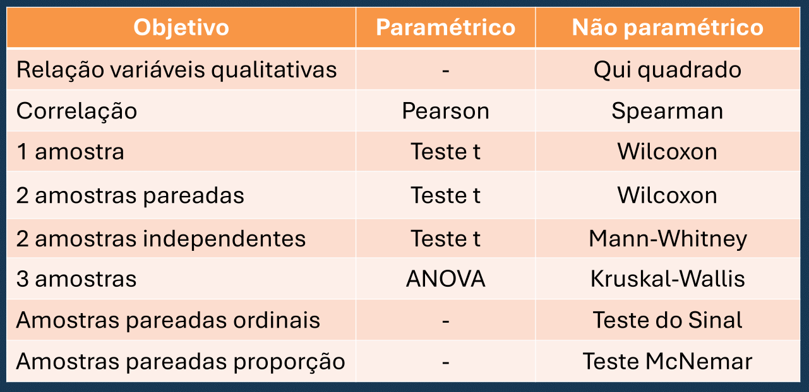

# TESTES NÃO PARAMÉTRICOS

São testes que **não assumem que os dados sigam a distribuição normal**. Os paramétricos trabalham muito a partir da normal e exigem que os dados sejam normais. Os não paramétricos são definidos por não terem essa premissa.

## QUANDO USAR

- Os `dados são não numéricos (categóricos) ou discretos`
- Quando a `amostra é pequena` (não passa no teorema do limite central)
- Quando alguma `premissa do teste paramétrico é quebrada`

**Se puder escolher, sempre escolha um teste paramétrico!**

Algumas forma de coleta de dados e contextos não permitem usar teste paramétrico por dar poucas amostras (ex: estudo clínico ou pesquisa abordando pessoas na rua ou que tem pedir favor pras pessoas participarem).

Caso seus **dados não sejam normais, sempre tente transformar eles em normal** (ex: convertendo pra log ou normalização mini-max) e teste novamente a normalidade.

## CARACTERÍSTICAS

- Os dados não seguem a distribuição normal
- Tem menos premissas ou premissas mais frouxas
- São resistentes a outliers
- Tem maior chance de erro tipo II (menor poder estatístico)
  - Falso negativo
  - Mais fácil de aceitar Ho quando ele é falso
  - Isso se deve à baixa amotra e regras mais flexíveis

## TESTES MAIS CONHECIDOS

- Qui Quadrado
- Fisher
- Wilcoxon
- Spearman
- Mann-Whitney
- Kruskal-Wallis
- McNemar
- Kolmogorov-Smirnov
- Teste do Sinal

