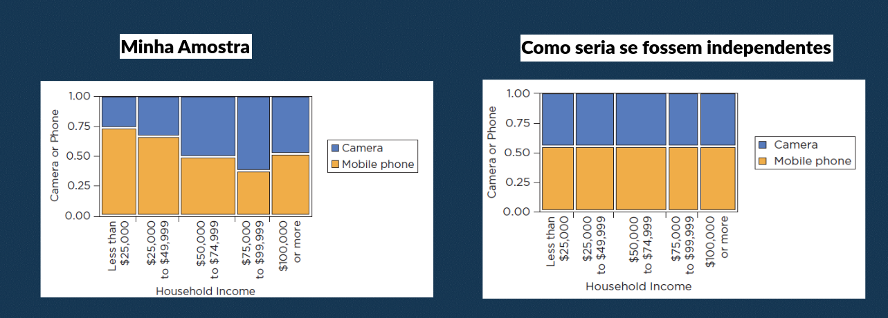
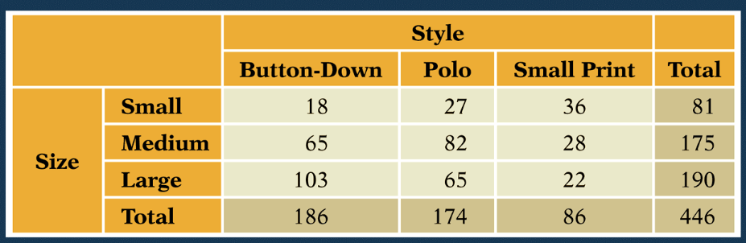
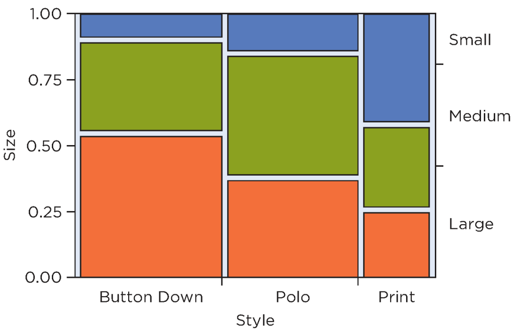

# TESTE QUI-QUADRADO

Esse teste faz uma comparação entre `valores esperados e valores observados`. 

- Serve para testar a **independência entre vars categóricas** (não numéricas) 
  - Checa se elas são relacionadas 
    - Ex: existe relação entre tipo de filme e consumo de pipoca? Existe relação entre volume muscular e flexibilidade?
    - OBS: não confundir esse relacionada com terem distribuição similar. É só ver se uma afeta a outra.
  - Também chamado de teste qui-quadrado de Pearson
  - É a versão da Anova para dados não numéricos
- Também testa se uma **amostra segue uma determinada distribuição**
  - Também chamado de bondade do ajuste (goodness of fit em inglês) ou aderência
  - `Aderência = se comporta como uma certa distrbuição`
  - É a versão do teste de shapiro/Kolmogorov para dados não numéricos.

Logo **existem 2 tipos de testes** Qui-Quadrado: **independência e aderência**.

## COMO FUNCIONA

`Em ambos os casos ele compara a amostra com uma outra amostra que segue um comportamento/distribuição ideal.`

Em suma, ela sempre **compara 2 distribuições**. O cálculo dos 2 é idêntico, na verdade a única coisa que muda é como os dados são interpretados, pois a matemática e o algoritmo é o mesmo.

## TIPOS DE QUI-QUADRADO

### TESTE DE INDEPENDÊNCIA

- Conta quantas vezes as categorias de 2 variáveis aparecem juntas
- Cada **variável só pode pertencer a 1 grupo de cada variável** (mutuamente exclusivas)
  - Ex: vendas de camisa pelo tamanho (P, M e G) e tipo da camisa (polo, botão ou regata). Uma camisa não pode ser polo e regata.
- **NÃO FUNCIONA para porcentagens**

Exemplo: Quero ver quais camisas foram mais vendidas. Cada camisa tem um tamanho e um tipo.

Uma forma muito boa de visualizar as combinações de 2 variáveis com várias categorias é o gráfico mosaico.
- É o gráfico de barras empilhado, só que colorido
- Separamos as categorias de uma das variáveis no eixo X (colunas) 
- Empilhamos as categorias da outra variável no eixo Y (formando linhas)
- Todos os valores da mesma categoria da variável do eixo Y tem a msm cor

### TESTE DE ADERÊNCIA

- Verifica se uma amostra de uma var categórica segue uma distribuição escolhida
- Podemos usar qualquer distribuição
- Com isso vemos se os dados tem um comportamento esperado e pertencem aquela distribuição
- Posso usar qualquer distribuição

Para usá-la fazemos do seguinte modo:

- Conta quantas vezes cada categoria aparece
- Vemos qual a probabilidade desse valor (contagem) aparecer na distribuição escolhida e multiplicamos pelo total de medidas

## PREMISSA 

- Os dados devem ser independentes
- Os dados devem ser categóricos
- As variáveis devem pertencer unicamente a 1 combinação de categoria (os grupos são mutuamente exclusivos)
- Para graus de liberdade < 4, a quantidade mínima em cada combinação de categorias deve ser 10 (nos valores **esperados**, não nos reais). 
- Para graus de liberdade $\ge$ 4, a quantidade mínima em cada combinação de categorias deve ser 5 (nos valores **esperados**, não nos reais). 

O motivo dessa premissa é que, se um `valor esperado (ideal) for menor que 5, então ele é pouco significativo e deve ser agrupado com alguma outra categoria`.

Caso as premissas não sejam cumpridas você pode usar o Teste Exato de Fisher.

## HIPÓTESES

Para o **teste de independência**:

H0: Variáveis independentes (Não há associação entre elas).
- P(Categoria1 da Var1) = P(Categoria2 da Var1) = ... P(CategoriaN da Var1)

H1: Variáveis dependentes (Há associação significativa entre elas).
- Ao menos 1 categoria da var1 tem probabilidade diferentes

Para o **teste de aderência**:

H0: Os dados seguem a distribuição esperada.

H1: Os dados seguem não a distribuição esperada.

## CÁLCULO

O cálculo do qui-quadrado é o mesmo para todas as suas versões. No fundo a única coisa que muda é como você interpreta os dados, pois tudo significa a mesma coisa.

$$q = \sum_{i=i}^k \frac{(O_i - E_i)^2}{E_i}$$

Aonde
- E são as medidas esperadas (caso as vars sejam independentes, caso a amostra siga a distribuição analisada)
- O são as medidas reais (os dados verdadeiros coletados)
- k é o número de combinações entre as categorias

Assim, a parte de cima é a variância entre os dados reais e o mundo ideal da nossa suposição. O numerador nos dá o quanto nossos dados estão próximos ou não da nossa suposição. Ao dividir pelos dados esperados temos a dispersão mais contida.

Para executar o teste precisamos definir os valores esperados (E). 

Após calcular q, procuramos na tabela qui-quadrado o valor de q na linha dos graus de liberdade. O número de graus de liberdade é a única parte que muda muito dentre os tipos de teste. Mas com o alfa definido e os graus de liberdade, podemos ver o Q tabelado e comparar com o Q calculado.

**Se Q calculado > Q tabelado então rejeitamos H0**.

As formas de encontrar o valor esperado e o grau de liberdade variam de acordo com o teste e é mostrado a seguir.

OBS: caso você tenha apenas 2 categorias nas 2 variáveis (uma tabela 2x2) é necessário uma pequena correção no cálculo para evitar erro. O fato de ter poucas categorias faz que qualquer número um pouco maior cause distorções. Para isso, usamos a **correção de Yates**.

$q = \sum_{i=i}^k \frac{( |O_i - E_i| - 0,5 )^2}{E_i}$

Aonde apenas diminuímos 0,5 da diferença entre observado e esperado (antes de elevar ao quadrado).

### CÁLCULO NO TESTE DE INDEPENDÊNCIA

#### Valor Esperado

Calculamos E para cada união de categorias das vars. Multiplicamos o total das categorias e dividimos por N (total de todas as uniões). Isso significa **pegar o nº de vezes que aquelas categorias aparecem e dividir pelo total**.

O valor esperado de cada combinação caso sejam independentes significa que **cada categoria não deve mudar por seu valor por conta da outra**, ou seja, devemos tentar tirar a média de cada categoria considerando suas proporções internar. Isso é feito multiplicando quantas vezes cada uma das categorias envolvidas aparecem e dividido pelo total.

$E = \frac{totalCat1 * totalCat2}{TotalGeral} = \frac{TotalLinha * TotalColuna}{N}$

#### Graus de Liberdade

Os graus de liberdade nesse tipo de teste é a multiplicação da quantidade de categorias de cada var - o número de vars.

$gl = numCatVar1 * numCatVar2 * numCatVar3... numCatVarN - N = (numCatVar1 - 1) * (numCatVar2 - 1)... (numCatVarN - 1)$

Para 2 variáveis temos

$gl = (numCatVar1 - 1) * (numCatVar2 - 1)$

#### Exemplo

Temos a tabela a seguir que mostra a combinação de compra de eletrônicos de acordo com o salário das pessoas. Esse é nosso O.

|  | Menos de 2k | Entre 2k e 4k | Entre 4k e 6k | Entre 6k e 10k | Acima de 10k | Total |
| :-- | :-- | :-- | :-- | :-- | :-- | :-- |
| Camera | 26 | 38 | 76 | 57 | 50 | 247 |
| Celular | 72 | 76 | 73 | 34 | 53 | 308 |
| Total | 98 | 114 | 149 | 91 | 103 | **555** |

Para saber o valores esperado da combinação "menos de 2k" e "câmera" multiplicamos o total de pessoas que ganham menos de 2k (98) com o total de pessoas que compraram câmera (247) e dividimos pelo total (555), tendo assim 43,61. Para saber o o valor esperado da combinação "menos de 2k" e "celular" pegamos o total de pessoas que ganham menos de 2k (98) e o total que compraram celular (308) e dividimos pelo total (555), dando 54,39. Para a combinação "Entre 2k e 4k" e câmera pegamos o total de pessoas que ganham nessa faixa (114) e o total de pessoas que compraram câmeras (247) e dividmos pelo total (555), dando 50,74. Repetindo isso por todos teremos a tabela final:

|  | Menos de 2k | Entre 2k e 4k | Entre 4k e 6k | Entre 6k e 10k | Acima de 10k | Total |
| :-- | :-- | :-- | :-- | :-- | :-- | :-- |
| Camera | 43,61 | 50,74 | 66,31 | 40,5 | 45,84 | 247 |
| Celular | 54,39 | 63,26 | 82,69 | 50,5 | 57,16 | 308 |
| Total | 98 | 114 | 149 | 91 | 103 | **555** |

Esses são nossos E. Com isso achamos y = 33,925.

Como a variável "salário" tem 5 categorias e a variável "eletrodoméstico" tem 2, nosso k = (5-1) * (2-1) = 4*1= 4.

Olhando na tabela Qui-Quadrado na linha 4 pra 5% de alfa, temos 9,488. Como Q Tabelado (9,488) < Q Calculado (33,925), rejeitamos H0 (as vars são dependentes).

### CÁLCULO NO TESTE DE ADERÊNCIA

#### Valor Esperado

O cálculo do valor esperado depende da distribuição que se quer comparar. Caso a distribuição seja uniforme (ver se todas as categorias tem a mesma chance de acontecer), o valor esperado é o total de medidas dividido pelo número de categorias.

Para as demais distribuições o processo é: 

**Passo 1: definir distribuição e parâmetros**

Além de definir a distribuição, é preciso definir os parâmetros que a formam. Você deve definir de acordo com **o que está querendo saber** dos dados e **seu conhecimento dos dados**.

Exemplo: na distribuição normal tem de definir a média e o desvio. O teste vai dizer se os dados batem com uma distribuição com esses valores apenas. Talvez batam com outras combinações de média e desvio.

Para evitar concluir que os dados não seguem a distribuição por escolher os parâmetros errados, é bom **conhecer os dados e a origem deles** para ajudar a escolher melhor. Para ter uma análise mais robusta, você pode testar com **diversas combinações de parâmetros**, a partir de um chute baseado no seu conhecimento deles.

**Passo 2: Definir as categorias**

Nem sempre os dados já vem estruturados. As vezes você precisa definir quais são as categorias e dividir os valores observados dentro delas. Caso os dados já estejam agrupados, pode passar para o próximo passo.

Se seus dados não estiverem separados em categorias, **crie categorias de acordo com o que quer saber** deles e divida os valores observados dentro delas. 

Exemplo: Dividir os dados em faixas de valores (até 1 saláro mínimo, de 1 a 3 salários mínimos...)

Caso não possua categorias bem definidas, pode dividir os valores em faixas de mesmo tamanho via técnica do histograma.

Ao fazer isso **seus dados se tornarão categóricos**, só então podendo ser usados no teste qui-quadrado.

**Importante**: seus dados de observação serão esses categorizados, não mais os originais.

**Passo 3: Calcular o valor esperado em cada categoria**

Uma vez que você definiu as categorias, **cada categoria deve representar uma faixa da distribuição a ser analisada**. Cada categoria deve ser um intervalo de valores, assim podendo calcular a área da distribuição dentro desse intervalo.

Exemplo: categoria "de 300 a 500", categoria "acima de 500".

O valor esperado da categoria é a probabilidade desse intervalo vezes o tamanho da amostra (probabilidade de encontrar um valor naquela faixa * número de tentativas).

$E_i = N * P(min_i \le x \ge max_i)$

Podemos chamar essa probabilidade de $p_i$ e reescrever a equação do teste da seguinte forma, que dá no mesmo.

$q = \sum_{i=i}^k N * \frac{(O_i/N - p_i)^2}{p_i}$

**Passo 4: Checar premissas**

Esse passo vale para os dois tipos de teste. Após ter definido seus valores esperados deve checar se eles são maiores que 5 para então continuar com o teste ou tomar outra decisão (como mudar para o teste de Fisher ou agrupar algumas categorias).

#### Graus de Liberdade

Os graus de liberdade no teste de aderência é número de categorias da nossa variável - 1 - nº de parâmetros da distribuição a ser comparada. Como nesse tipo só temos uma variável, não faz sentido multiplicar por outras categorias como na de independência, é só a quantidade de categorias dela menos 1.

Porém para cada parâmetro que a distribuição tem tiramos 1 grau de liberdade do teste, pois "gastamos" a liberdade amarrando os parâmetros com a distribuição.

**gl = numCat - 1 - numParams**, aonde numParams é o **nº de parâmetros da distribuição a ser comparada**.

Ex: uma distribuição uniforme (queremos ver se todas as categorias acontecem na mesma frequência) não tem parâmetros, então numParams = 0. Se quero comparar com uma distribuição normal, ela possui 2 parâmetros (média e desvio padrão), logo numParams = 2.

A seguir listo o número de parâmetros das distribuições mais comuns:
- Uniforme: 0
- Normal: 2
- Normal padrão: 0
- T: 1 (grau de liberdade)
- F: 2 (numerador e denominador)
- Qui-Quadrado: 1
- Exponencial: 1
- Poisson: 1
- Binomial: 2

#### Exemplo

Quero analisar se as notas dos alunos no Enem segue a normal. Verifiquei os seguintes valores:

- De 0 a 300: 180
- De 300 a 500: 122
- De 500 a 700: 121
- De 700 a 900: 177
- Acima de 900: 0

Temos total categorias (k) = 5 e N = 600

Primeiro temos de definir uma média de um desvio para nossa distribuição normal. Definiremos média 500 e desvio 100 por já termos conhecimento que costuma ser essa a média e desvio historicamente.

Depois calculamos a probabilidade de cada valor na distribuição normal.

- P(0 < x < 300): 0,02
- P(300 < x < 500): 0,47
- P(500 < x < 700): 0,47
- P(700 < x < 900): 0,02
- P(900 < x < 1000): 0,00005

Então calculamos os valores esperados para cada um.

- E1: 0,02  * 600 = 14
- E2: 0,47 * 600 = 286
- E3: 0,47 * 600 = 286
- E4: 0,02 * 600 = 14
- E5: 0,00005 * 600 = 0,03

Com isso vemos que precisamos eliminar a última categoria por ser menor que 5. A decisão então foi agrupá-la com a anterior, formando a categoria "Acima de 700".

Os valores desse novo grupo permanecem o mesmo, sua probabilidade foi para 0,02005 e seu valor esperado continuou 14.

Jogando na equação do teste

$q = (108 - 14)^2/14 + (122 - 286)^2/286 + (121 - 286)^2/286 + (177 - 14)^2/14 = 4055$

Como temos 4 categorias mas tivemos de gastar 2 graus de liberdade para definir uma curva normal, sobra 1 grau para o teste. Olhando na tabela na linha 1 e alfa 5%, encontramos 3,841. 

Como Q calculado (4055) > Q tabelado (3,841) então rejeitamos H0, os dados não são normais.

## RESÍDUOS

Assim como a Anova, o Qui-Quadrado nos diz se há ou não relação entre os grupos (minha amostra e a amostra esperada). Caso haja (rejeite H0) devo fazer um teste post-hoc para verificar quais combinações de categorias fogem do esperado. Esse teste post-hoc analisa os residuos.

**Caso rejeite H0, verifique os resíduos para ver quais grupos fogem do esperado.**

Cada combinação terá um resíduo. Se o resíduo for maior que $\pm$ 2 significa que ele foge um pouco do esperado e pode ou não ser considerado um desvio. Se o resíduo for maior que $\pm$ 3 significa que ele foge muito do esperado e com certeza é um desvio.

Esses valores de $\pm$ 2 e 3 vem diretamente do desvio padrão da distribuição normal padrão (da onde a distribuição qui quadrado deriva). Aonde 2 significa que o valor está a 2 desvios padrões da média e 3 está a 3 desvios padrões. E lembrando que 3 desvios padrões distante da média é a definição de outlier e 2 pode ou não já ser considerado um outlier.

Ou seja, **a combinação de categorias foge do esperado quando ela é um outlier**. Se pensar um pouco "fugir do esperado" é a própria definição de outlier, então tudo se encaixa.

OBS: muitas bibliografias trazem 1,96 como suficiente para considerar um outlier, porém só vale para alfa=5%.

`O cálculo de resíduo nada mais é que calcular o desvio padrão de cada grupo em relação ao esperado (média).`

### CÁLCULO DOS RESÍDUOS

$residuo = \frac{O - E}{\sqrt{E}}$

Isso é muito próximo do cálculo do Z na distribuição normal ($\frac{x - media}{\sqrt{vari}}$). Se terminarmos de padronizar o resíduo podemos usar a tabela Z para comparar os resíduos.

$residuoPadrao = \frac{residuo}{\sqrt{varianciaResiduos}} \approx Z $

Podemos calcular a variância de um resíduo da seguinte forma

$variResiduo = (1 - \frac{totalLinha}{total}) * (1 - \frac{totalColuna}{total})$

Assim podemos simplificar tudo em uma única equação

$$residuoPadrao = \frac{O - E}{ \sqrt{E (1 - \frac{totalLinha}{total}) (1 - \frac{totalColuna}{total}) } }$$

É por causa dessa padronização que o deixa quase igual a tabela Z que podemos usar os valores de corte 2 e 3. **É a padronização que torna o desvio padrão dos resíduos = 1**.

No caso do teste de aderência, como não tem linhas e colunas, ficamos com o cálculo simples $\frac{O - E}{\sqrt{E}}$

## TAMANHO DO EFEITO

O teste qui-quadrado de independência tem 2 formas de calcular o tamanho do efeito: V de Cramér ou Coeficiente phi, sendo o **V de Cramér** o mais comum.

Somente use o Coeficiente Phi para tabelas 2x2 e para o teste de Fisher.

Para o teste de aderência é usado o tamanho do efeito Razão de chances (Odds Ratio). O V de Cramér também pode ser usado, mas não é a melhor opção.

## VARIAÇÕES DO TESTE

#### Cálculo Padrão

$q = \sum_{i=i}^k \frac{(O_i - E_i)^2}{E_i}$

- Usar com amostras grandes ou várias categorias
- Quando todas as premissas são válidas

#### Correção de Yates

$q = \sum_{i=i}^k \frac{( |O_i - E_i| - 0,5 )^2}{E_i}$

- Usar quando só tem 2 categorias (tabelas 2x2)

#### Teste Exato de Fisher

- Quando algum valor esperado for menor que 5
- Quando a amostra é pequena (< 20, mas esse número varia muito na bibliografia)
- Geralmente usado quando só tem 2 categorias (tabelas 2x2)
- O qui-quadrado dá um p-valor aproximado, enquanto Fisher é muito mais preciso, porém só funciona para testes pequenos