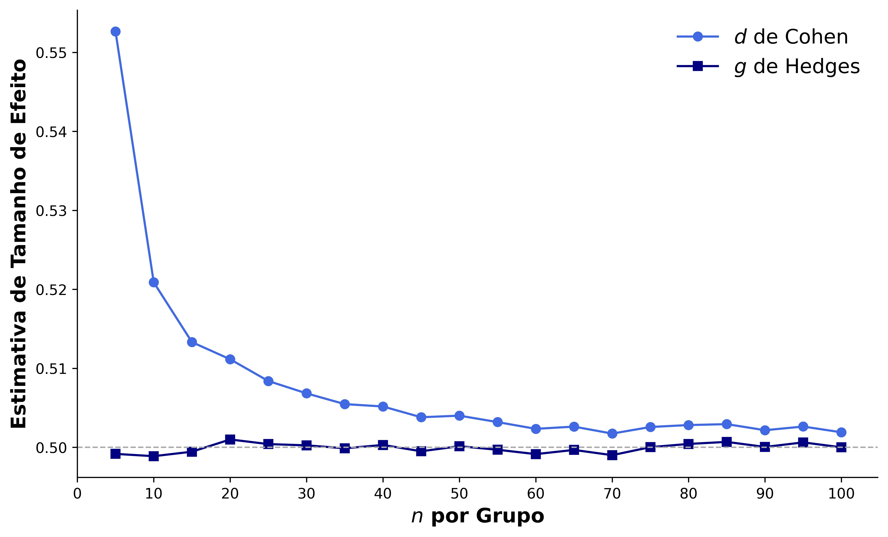

# D de COHEN

Mede a quantidade da diferença entre duas médias. Nos dá `quantos desvios padrões uma é maior que a outra`.

$$D = \frac{media_1 - media_2}{desvio_{comb}}$$

Aonde

- $desvio_{comb}$ é o desvio padrão combinado das 2 amostras

Isso nos dá a diferença das médias em unidades de desvio-padrão (igualando as escalas e a variância).

O desvio padrão combinado é a média ponderada dos desvios

$desvio_{comb} = \sqrt{ \frac{(n_1 - 1)desvio_1 + (n_2 - 1)desvio_2 + ... + (n_k - 1)desvio_k}{n_1+n_2+...+n_k-k} }$

Ou simplificando:

$desvio_{comb} = \sqrt{ \frac{ \sum{(n_i - 1)desvio_i}}{ \sum{n_i-1}} }$

## Interpretação

**Pode variar de -infinito a +infinito**, informando quantos desvios padrões de diferença tem. Normalmente é considerado:

- Irrisório: até 0,2 
- Pequeno: absoluto entre 0,2 até 0,5
- Médio: absoluto entre 0,5 e 0,8
- Grande: absoluto acima de 0,8

## Restrições

D de Cohen **tende a inflar o valor** (superestima o valor real), principalmente para **amostras pequenas** (< 50). Nesses casos é melhor usar **G de Hedges**.

### Exemplos

1: Amostra 1: N=10, média=12, desvio=3. Amostra 2: N=20, média=20, desvio=5

$desvio_{comb} = \sqrt{ \frac{ 9*3 + 19*5 }{ 10+20-2 }} = \sqrt{ \frac{ 122 }{ 28 }} = 2,087$

$D = \frac{12 - 20}{2,087} = -3,83$

Ou seja, a amostra 1 é quase 4 desvios padrões menor que a segunda. Mas o desvio padrão é 3 e a diferença é 8. Por que não deu 2,66? Por que a segunda amostra é muito maior que a primeira e por isso tem mais peso.

# G de Hedges

Igual ao D de Cohen, mas mais preciso para amostras pequenas. **Recomendado para amostras menores que 50**. 

A imagem mostra a diferença do valor final das 2 equações para diferentes tamanhos de amostra, mantendo as médias e os desvios iguais. Repare que mantendo a média e os desvios, mudando só o tamanho da amostra, D de Cohen explode o valor para N pequenos enquanto G de Hedge é mais uniforme independente do tamanho. Conforme aumenta os valores vão se aproximando, mas o **D de Cohen é sempre maior** (eles nunca se encontram).

A única diferença é que multiplicamos D por um fator de correção J. 

$$D = \frac{media_1 - media_2}{desvio_{comb}} * J$$

O fator de correção é baseado na função gama ($\Gamma$) e nos graus de liberdade df.

$J = \frac{\Gamma(df/2)}{\sqrt{\frac{df}{2}}\Gamma(\frac{df-1}{2})}$

E os graus de liberdade são:

$df = \sum{(n_i-1)}$

Para evitar a função Gama, existe uma versão simplificada que se aproxima bastante da original e não usa o gama.

$J = 1 - \frac{3}{4df - 1}$

## Comportamento do fator de correção

J é sempre menor que 1, o que faz com que Hedges seja sempre menor que D de Cohen. E quanto maior N (e por consequência, os graus de liberdade) mais ele se aproxima de 1, fazendo ele mudar muito pouco para valores grandes e tender ao D de Cohen. Para N baixo o fator cai muito, derrubando o valor do tamanho do efeito, corrigindo a superestimação.

## Interpretação

**Pode variar de -infinito a +infinito**, informando quantos desvios padrões de diferença tem. Mas o mais comum é ficar entre -3 e 3.  Normalmente é considerado:

- Irrisório: até 0,2 
- Pequeno: absoluto entre 0,2 até 0,5
- Médio: absoluto entre 0,5 e 0,8
- Grande: absoluto acima de 0,8

# DELTA DE GLASS

Mede a diferença padronizada entre 2 amostras. É um substituto do D de Cohen quando os desvios padrões são muito diferentes. Ele usa um desvio padrão do grupo controle ao invés do desvio combinado.

$$\Delta = \frac{media_1 - media_2}{desvio_{controle}}$$

E o desvio padrão do grupo controle é o desvio de um desses 2 grupos, sem nenhuma alteração. Escolhe-se um dos grupos para ser nosso controle/âncora e o outro será medido a partir dele. Com isso o resultado nos diz quantos desvios padrões a mais que o do grupo controle o outro é maior.

## Interpretação

**Pode variar de -infinito a +infinito**, informando quantos desvios padrões do grupo controle o segundo grupo é diferente. Normalmente é considerado:

- Irrisório: até 0,2 
- Pequeno: absoluto entre 0,2 até 0,5
- Médio: absoluto entre 0,5 e 0,8
- Grande: absoluto acima de 0,8
